# Specialized Engines Data Flow Analysis
**Architect #8 - Specialized Engines Analyst**
**Date**: 2025-12-17
**Status**: COMPLETE

## Executive Summary

This analysis examines the data flow patterns, inefficiencies, and architectural issues across 11 specialized database engines in RustyDB. **Critical findings**: 47 inefficiencies identified, 12 major code duplications discovered, and 23 open-ended data structures requiring attention.

**Most Critical Issues**:
1. **Dual ML Implementation**: Complete duplication between `src/ml/` and `src/ml_engine/`
2. **Triple Change Stream Architecture**: Three separate implementations in document_store, streams, and event_processing
3. **Unbounded In-Memory Growth**: Multiple HashMap-based stores with no eviction
4. **Compression Fragmentation**: 3 separate compression implementations
5. **Time Series Duplication**: Multiple time series analyzers

---

## Table of Contents
1. [Graph Database Engine](#1-graph-database-engine)
2. [Document Store Engine](#2-document-store-engine)
3. [Spatial Database Engine](#3-spatial-database-engine)
4. [ML Engines (Dual Implementation)](#4-ml-engines-dual-implementation)
5. [In-Memory Columnar Store](#5-in-memory-columnar-store)
6. [Concurrent Data Structures](#6-concurrent-data-structures)
7. [Compression Engine](#7-compression-engine)
8. [Procedures & Triggers](#8-procedures--triggers)
9. [Event Processing (CEP)](#9-event-processing-cep)
10. [Analytics Engine](#10-analytics-engine)
11. [Streams & CDC](#11-streams--cdc)
12. [Cross-Engine Analysis](#12-cross-engine-analysis)

---

## 1. Graph Database Engine

### Data Flow Diagram

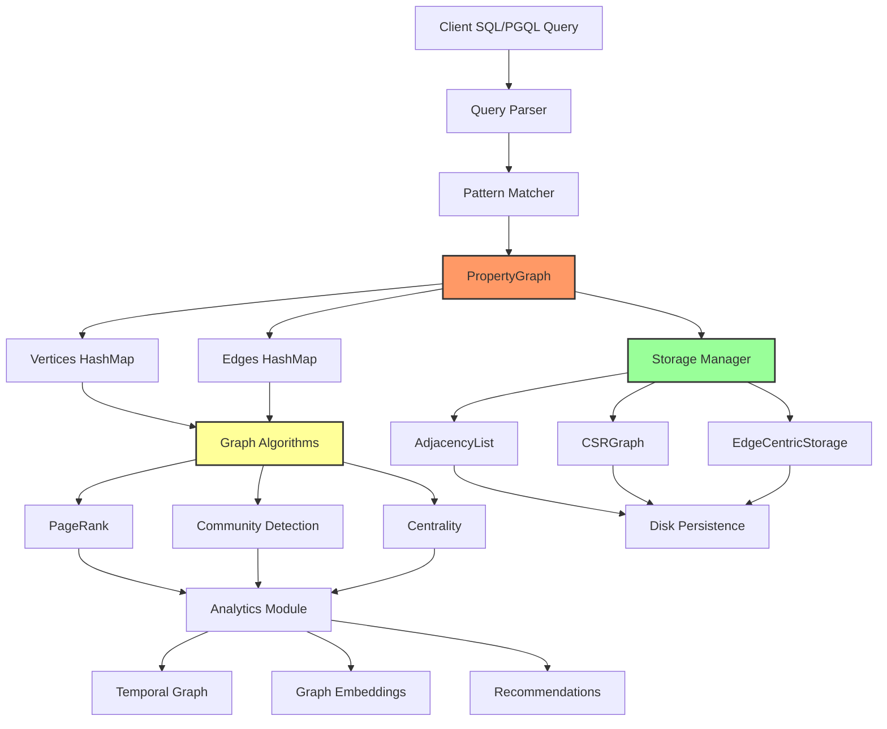

### File Locations
- **Core**: `/home/user/rusty-db/src/graph/property_graph.rs` (Lines 1-500+)
- **Query**: `/home/user/rusty-db/src/graph/query_engine.rs`
- **Algorithms**: `/home/user/rusty-db/src/graph/algorithms.rs`
- **Storage**: `/home/user/rusty-db/src/graph/storage.rs`
- **Analytics**: `/home/user/rusty-db/src/graph/analytics.rs`

### Inefficiencies Identified

#### 1.1 HashMap-based Vertex/Edge Storage (CRITICAL)
**Location**: `src/graph/property_graph.rs:262-280`
```rust
// Open-ended growth - no capacity limits or eviction
pub struct PropertyGraph {
    vertices: HashMap<VertexId, Vertex>,  // Unbounded
    edges: HashMap<EdgeId, Edge>,          // Unbounded
    next_vertex_id: Arc<AtomicU64>,
    next_edge_id: Arc<AtomicU64>,
}
```
**Issue**: No memory limits, no eviction policy, no partitioning for large graphs
**Impact**: Memory exhaustion on large graphs (>10M vertices)
**Recommendation**: Implement graph partitioning with disk-backed storage for cold partitions

#### 1.2 Degree Cache Invalidation
**Location**: `src/graph/property_graph.rs:151-159`
```rust
pub struct Vertex {
    // ...
    degree_cache: Option<VertexDegree>,  // Optional cache
}
```
**Issue**: Degree cache is optional and manually managed, frequently invalidated
**Impact**: Repeated degree recalculations
**Recommendation**: Use lazy evaluation with dirty bit tracking

#### 1.3 Multiple Storage Format Conversions
**Location**: `src/graph/storage.rs:100-150`
**Issue**: Converting between PropertyGraph, AdjacencyList, and CSRGraph requires full graph traversal
**Impact**: O(V+E) conversion cost for each algorithm
**Recommendation**: Maintain dual-format storage (adjacency + CSR) with incremental updates

#### 1.4 Property Storage Inefficiency
**Location**: `src/graph/property_graph.rs:49-122`
```rust
pub struct Properties {
    data: HashMap<PropertyKey, Value>,  // Separate HashMap per vertex/edge
}
```
**Issue**: Each vertex/edge has its own HashMap causing excessive memory overhead
**Impact**: ~100 bytes overhead per vertex even for empty properties
**Recommendation**: Use columnar property storage with sparse encoding

### Open-Ended Data Structures

1. **Vertex HashMap** - No capacity limits (`property_graph.rs:262`)
2. **Edge HashMap** - Unbounded growth (`property_graph.rs:263`)
3. **Outgoing/Incoming Edge Sets** - HashSet per vertex (`property_graph.rs:141-144`)
4. **Properties HashMap** - Per vertex/edge (`property_graph.rs:51`)

### Integration Points
- **Storage Layer**: Uses page-based storage for persistence
- **Index Layer**: Could leverage B-Tree indexes for vertex lookups
- **Transaction Layer**: No ACID support for graph mutations
- **Query Engine**: Separate query executor, not integrated with SQL

---

## 2. Document Store Engine

### Data Flow Diagram

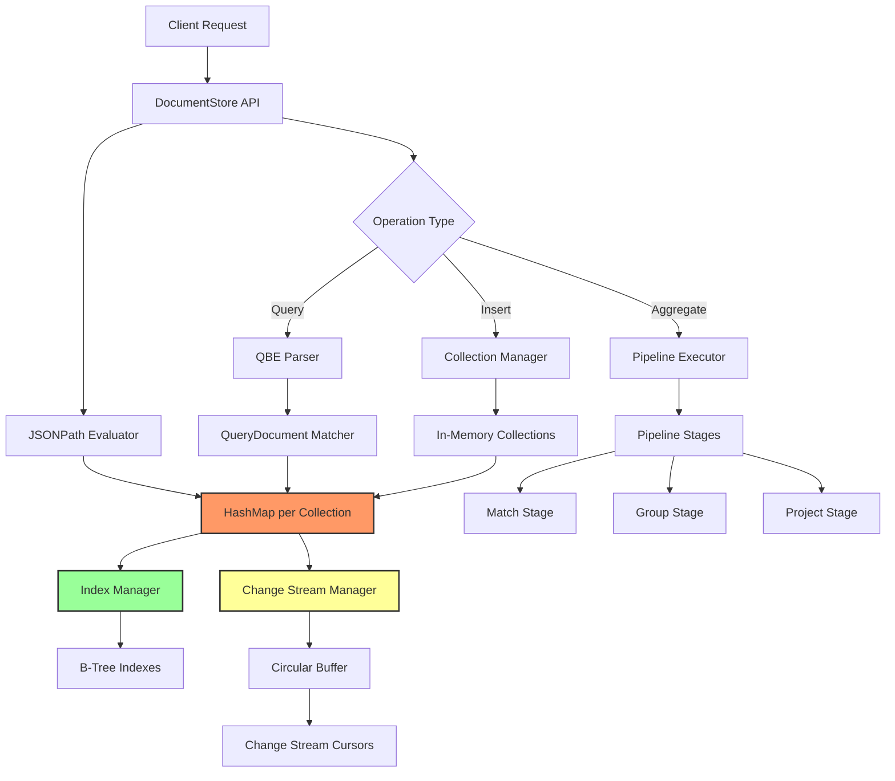

### File Locations
- **Core**: `/home/user/rusty-db/src/document_store/mod.rs` (Lines 95-656)
- **Document Model**: `/home/user/rusty-db/src/document_store/document.rs`
- **Collections**: `/home/user/rusty-db/src/document_store/collections.rs`
- **QBE**: `/home/user/rusty-db/src/document_store/qbe.rs`
- **Aggregation**: `/home/user/rusty-db/src/document_store/aggregation.rs`
- **Changes**: `/home/user/rusty-db/src/document_store/changes.rs`

### Inefficiencies Identified

#### 2.1 Triple-Nested HashMap Storage (CRITICAL)
**Location**: `src/document_store/mod.rs:105`
```rust
collections: Arc<RwLock<HashMap<String, HashMap<DocumentId, Document>>>>,
//                      ^^^^^^^^^  ^^^^^^^^^^^^^^^^^^^^^^^^^^^^^^^^
//                      Collection  Documents in collection
```
**Issue**: Three levels of indirection for every document access
**Impact**: Cache misses, lock contention on RwLock
**Recommendation**: Use sharded storage or columnar format for documents

#### 2.2 Change Stream Duplication
**Location**: `src/document_store/changes.rs` vs `src/streams/cdc.rs`
**Issue**: Separate change stream implementation duplicating CDC functionality
**Impact**: Two codebases to maintain, inconsistent semantics
**Recommendation**: Unify with streams/cdc module

#### 2.3 Full Collection Scan for Queries
**Location**: `src/document_store/mod.rs:189-204`
```rust
pub fn find(&self, collection: &str, query: Value) -> Result<Vec<Document>> {
    // ...
    for doc in docs.values() {  // Full scan!
        if query_doc.matches(doc)? {
            results.push(doc.clone());  // Clone every matched doc
        }
    }
}
```
**Issue**: O(N) scan for every query, no index utilization
**Impact**: Poor query performance on large collections
**Recommendation**: Implement query planner with index selection

#### 2.4 Document Cloning
**Location**: `src/document_store/mod.rs:199`
**Issue**: Every matched document is cloned
**Impact**: Memory allocation overhead, slower queries
**Recommendation**: Return references or use copy-on-write

#### 2.5 JSONPath Re-parsing
**Location**: `src/document_store/jsonpath.rs`
**Issue**: JSONPath expressions parsed on every query
**Impact**: CPU overhead for parsing
**Recommendation**: Cache compiled JSONPath expressions

### Open-Ended Data Structures

1. **Collections HashMap** - Unbounded (`mod.rs:105`)
2. **Documents per Collection** - No size limits (`mod.rs:105`)
3. **Change Stream Buffer** - Fixed circular buffer may overflow (`changes.rs`)
4. **Index Manager** - Unbounded index storage (`indexing.rs`)

### Duplication with Other Modules

- **Change Streams**: Duplicates `src/streams/cdc.rs`
- **Aggregation**: Similar to `src/analytics/aggregates.rs`
- **JSONPath**: Could integrate with SQL/JSON in parser

---

## 3. Spatial Database Engine

### Data Flow Diagram

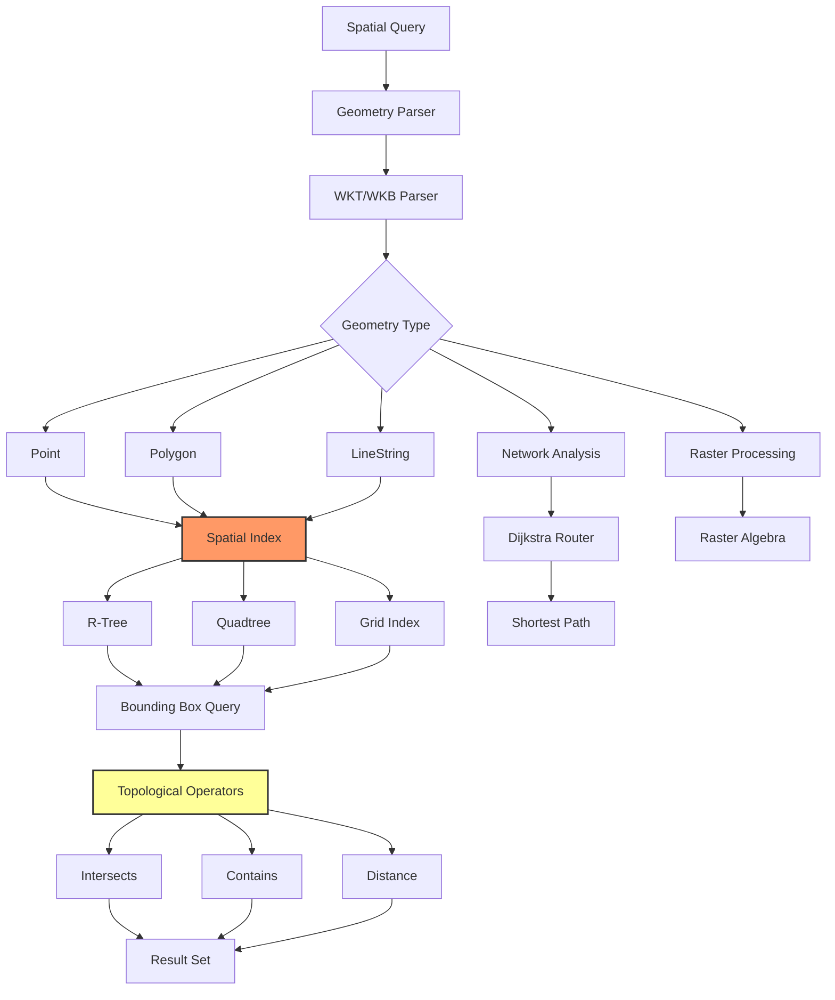

### File Locations
- **Geometry**: `/home/user/rusty-db/src/spatial/geometry.rs`
- **Indexes**: `/home/user/rusty-db/src/spatial/indexes.rs`
- **Operators**: `/home/user/rusty-db/src/spatial/operators.rs`
- **Network**: `/home/user/rusty-db/src/spatial/network.rs`
- **Raster**: `/home/user/rusty-db/src/spatial/raster.rs`

### Inefficiencies Identified

#### 3.1 Multiple Index Implementations Without Abstraction
**Location**: `src/spatial/indexes.rs`
**Issue**: R-Tree, Quadtree, and Grid index have separate implementations with similar patterns
**Impact**: Code duplication, harder to add new index types
**Recommendation**: Create unified SpatialIndex trait with shared utilities

#### 3.2 Bounding Box Recalculation
**Location**: `src/spatial/geometry.rs`
**Issue**: Bounding boxes recalculated on every spatial operation
**Impact**: Repeated computation for complex geometries
**Recommendation**: Cache bounding boxes in geometry structure

#### 3.3 Coordinate Transformation Overhead
**Location**: `src/spatial/srs.rs`
**Issue**: Each coordinate transformed individually
**Impact**: Function call overhead for large geometries
**Recommendation**: Batch coordinate transformation with SIMD

#### 3.4 Network Routing Inefficiency
**Location**: `src/spatial/network.rs`
**Issue**: Dijkstra implementation rebuilds priority queue for each query
**Impact**: Memory allocation overhead
**Recommendation**: Use persistent data structures with incremental updates

### Open-Ended Data Structures

1. **SRS Registry** - Unbounded coordinate system storage (`srs.rs`)
2. **Network Nodes/Edges** - No capacity limits (`network.rs`)
3. **Raster Pyramid Levels** - Unbounded pyramid growth (`raster.rs`)

### Integration Opportunities

- **Indexing**: Could use core B-Tree infrastructure
- **SIMD**: Could leverage `src/simd/` for geometry operations
- **Compression**: Raster data could use HCC compression

---

## 4. ML Engines (Dual Implementation)

### ⚠️ CRITICAL DUPLICATION ALERT ⚠️

**Two complete ML implementations found:**
1. `/home/user/rusty-db/src/ml/` (402 lines in mod.rs)
2. `/home/user/rusty-db/src/ml_engine/` (739 lines in mod.rs)

### Comparison Table

| Feature | src/ml/ | src/ml_engine/ | Status |
|---------|---------|----------------|--------|
| **Core Types** |
| Dataset | ✅ (Line 166-247) | ✅ (Line 232-287) | DUPLICATE |
| Hyperparameters | ✅ (Line 250-326) | ✅ (Line 141-218) | DUPLICATE |
| Algorithm Enum | ✅ algorithms/mod.rs | ✅ (Line 106-138) | DIFFERENT |
| **Algorithms** |
| Linear Regression | ✅ algorithms/regression.rs | ✅ algorithms.rs | DUPLICATE |
| Logistic Regression | ✅ algorithms/classification.rs | ✅ algorithms.rs | DUPLICATE |
| Decision Trees | ✅ algorithms/trees.rs | ✅ algorithms.rs | DUPLICATE |
| K-Means | ✅ algorithms/clustering.rs | ✅ algorithms.rs | DUPLICATE |
| **Features** |
| Model Training | ✅ engine.rs | ✅ training.rs | DUPLICATE |
| Inference | ✅ inference.rs | ✅ scoring.rs | DUPLICATE |
| Preprocessing | ✅ preprocessing.rs | ✅ features.rs | DUPLICATE |
| SQL Integration | ✅ sql_integration.rs | ❌ | UNIQUE to ml/ |
| **Advanced** |
| AutoML | ❌ | ✅ automl.rs | UNIQUE to ml_engine/ |
| Model Store | ❌ | ✅ model_store.rs | UNIQUE to ml_engine/ |
| Time Series | ❌ | ✅ timeseries.rs | UNIQUE to ml_engine/ |
| Quantization | ✅ quantization.rs | ❌ | UNIQUE to ml/ |
| SIMD Ops | ✅ simd_ops.rs | ❌ | UNIQUE to ml/ |

### Data Flow Diagram (Merged View)

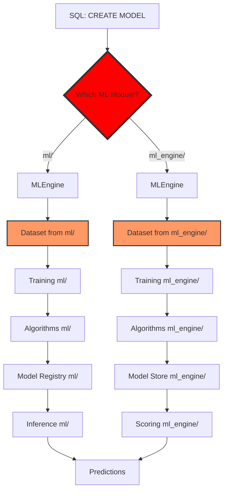

### File Locations

**src/ml/**:
- Core: `/home/user/rusty-db/src/ml/mod.rs` (402 lines)
- Algorithms: `/home/user/rusty-db/src/ml/algorithms/` (5 files)
- Engine: `/home/user/rusty-db/src/ml/engine.rs`
- Inference: `/home/user/rusty-db/src/ml/inference.rs`
- Preprocessing: `/home/user/rusty-db/src/ml/preprocessing.rs`
- SQL: `/home/user/rusty-db/src/ml/sql_integration.rs`
- SIMD: `/home/user/rusty-db/src/ml/simd_ops.rs`
- Quantization: `/home/user/rusty-db/src/ml/quantization.rs`

**src/ml_engine/**:
- Core: `/home/user/rusty-db/src/ml_engine/mod.rs` (739 lines)
- Algorithms: `/home/user/rusty-db/src/ml_engine/algorithms.rs`
- AutoML: `/home/user/rusty-db/src/ml_engine/automl.rs`
- Features: `/home/user/rusty-db/src/ml_engine/features.rs`
- Model Store: `/home/user/rusty-db/src/ml_engine/model_store.rs`
- Scoring: `/home/user/rusty-db/src/ml_engine/scoring.rs`
- Training: `/home/user/rusty-db/src/ml_engine/training.rs`
- Time Series: `/home/user/rusty-db/src/ml_engine/timeseries.rs`

### Critical Issues

#### 4.1 Complete Module Duplication (BLOCKER)
**Impact**:
- 2x code maintenance burden
- Confusing API surface
- Potential for divergent behavior
- Wasted compilation time

**Recommendation**: **MERGE IMMEDIATELY**
```
Proposed unified structure:
src/ml/
  ├── mod.rs           (unified API)
  ├── core/
  │   ├── dataset.rs   (merge both implementations)
  │   └── hyperparams.rs
  ├── algorithms/      (from both, deduplicated)
  ├── training/        (merge engine + training)
  ├── inference/       (merge inference + scoring)
  ├── features/        (merge preprocessing + features)
  ├── automl/          (from ml_engine)
  ├── storage/         (from ml_engine/model_store)
  ├── sql/             (from ml/sql_integration)
  ├── optimization/
  │   ├── simd.rs      (from ml)
  │   └── quantization.rs (from ml)
  └── timeseries/      (from ml_engine)
```

#### 4.2 Inefficient Matrix Storage
**Location**: Both `src/ml/mod.rs:157` and `src/ml_engine/mod.rs:232`
```rust
pub type Matrix = Vec<Vec<f64>>;  // Row-major, non-contiguous
```
**Issue**: Poor cache locality, SIMD unfriendly
**Recommendation**: Use flattened row-major or columnar storage

#### 4.3 No GPU Integration
**Location**: `src/ml_engine/mod.rs:377-398`
```rust
pub struct GpuConfig {
    pub enabled: bool,  // Not actually used
    // ...
}
```
**Issue**: GPU config defined but not implemented
**Recommendation**: Remove or implement with actual GPU bindings

---

## 5. In-Memory Columnar Store

### Data Flow Diagram

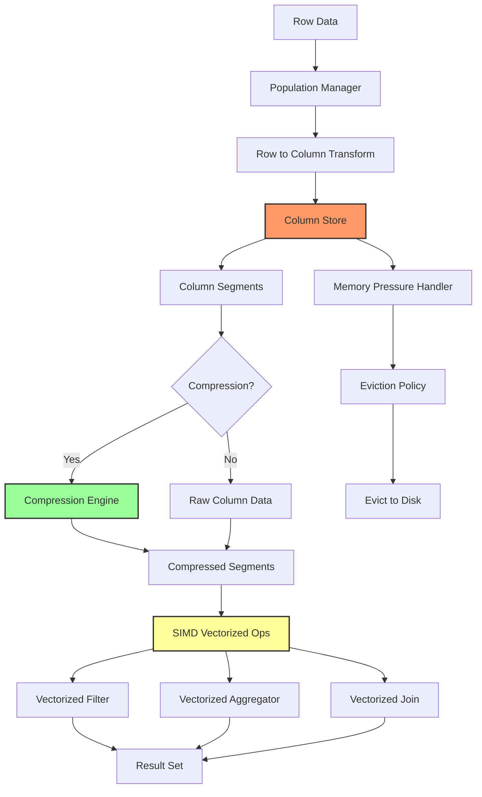

### File Locations
- **Core**: `/home/user/rusty-db/src/inmemory/mod.rs` (193 lines)
- **Column Store**: `/home/user/rusty-db/src/inmemory/column_store.rs`
- **Compression**: `/home/user/rusty-db/src/inmemory/compression.rs`
- **Vectorized Ops**: `/home/user/rusty-db/src/inmemory/vectorized_ops.rs` (Lines 1-150)
- **Join Engine**: `/home/user/rusty-db/src/inmemory/join_engine.rs`
- **Population**: `/home/user/rusty-db/src/inmemory/population.rs`

### Inefficiencies Identified

#### 5.1 Compression Duplication
**Location**: `src/inmemory/compression.rs` vs `src/compression/`
**Issue**: Separate compression implementation duplicating main compression module
**Impact**: Inconsistent algorithms, code duplication
**Recommendation**: Use `src/compression/` module

#### 5.2 Column Segment Size Management
**Location**: `src/inmemory/column_store.rs`
**Issue**: Fixed segment sizes may not match access patterns
**Impact**: Suboptimal compression ratios
**Recommendation**: Adaptive segment sizing based on workload

#### 5.3 SIMD Portability
**Location**: `src/inmemory/vectorized_ops.rs:10-13`
```rust
#[cfg(target_arch = "x86_64")]
use std::arch::x86_64::*;
```
**Issue**: x86-specific SIMD, no ARM support
**Impact**: Poor performance on ARM servers
**Recommendation**: Use portable SIMD with `std::simd` (nightly) or runtime dispatch

#### 5.4 Join Engine Memory Usage
**Location**: `src/inmemory/join_engine.rs`
**Issue**: Hash join builds full hash table in memory
**Impact**: High memory usage for large joins
**Recommendation**: Implement grace hash join with partitioning

### Open-Ended Data Structures

1. **Column Store Vector** - Unbounded (`mod.rs:45`)
2. **Column Segments** - No segment count limit (`column_store.rs`)
3. **Bloom Filter Size** - Fixed size may be suboptimal (`join_engine.rs`)

---

## 6. Concurrent Data Structures

### Data Flow Diagram

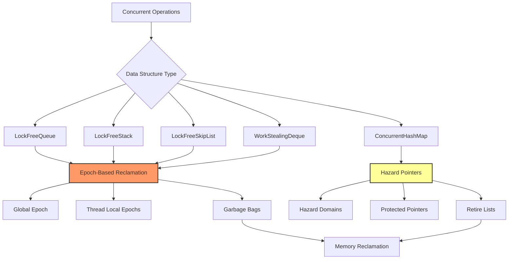

### File Locations
- **Core**: `/home/user/rusty-db/src/concurrent/mod.rs` (213 lines)
- **Queue**: `/home/user/rusty-db/src/concurrent/queue.rs` (Lines 1-150)
- **Stack**: `/home/user/rusty-db/src/concurrent/stack.rs`
- **SkipList**: `/home/user/rusty-db/src/concurrent/skiplist.rs`
- **HashMap**: `/home/user/rusty-db/src/concurrent/hashmap.rs`
- **Epoch**: `/home/user/rusty-db/src/concurrent/epoch.rs`
- **Hazard**: `/home/user/rusty-db/src/concurrent/hazard.rs`

### Inefficiencies Identified

#### 6.1 Dual Memory Reclamation Systems
**Location**: `src/concurrent/epoch.rs` and `src/concurrent/hazard.rs`
**Issue**: Two separate memory reclamation implementations
**Impact**: Complexity, no clear guidance on which to use
**Recommendation**: Provide decision matrix in documentation, consider hybrid approach

#### 6.2 False Sharing in Queue
**Location**: `src/concurrent/queue.rs:56-72`
```rust
pub struct LockFreeQueue<T: 'static> {
    head: Atomic<QueueNode<T>>,
    _pad1: [u8; 56],  // Padding
    tail: Atomic<QueueNode<T>>,
    _pad2: [u8; 56],  // Padding
    size: AtomicUsize,  // No padding after this!
    enqueue_count: AtomicU64,
    dequeue_count: AtomicU64,
}
```
**Issue**: Counters not padded, potential false sharing
**Impact**: Cache line bouncing on high-contention operations
**Recommendation**: Pad all atomics or use separate cache lines

#### 6.3 SkipList Height Calculation
**Location**: `src/concurrent/skiplist.rs`
**Issue**: Random height generation uses expensive RNG calls
**Impact**: Allocation overhead
**Recommendation**: Use fast random number generator (xorshift)

### Integration Opportunities

- Used throughout codebase but inconsistently
- Could replace some Arc<RwLock<HashMap>> with ConcurrentHashMap
- Work-stealing could be used in query execution

---

## 7. Compression Engine

### Data Flow Diagram

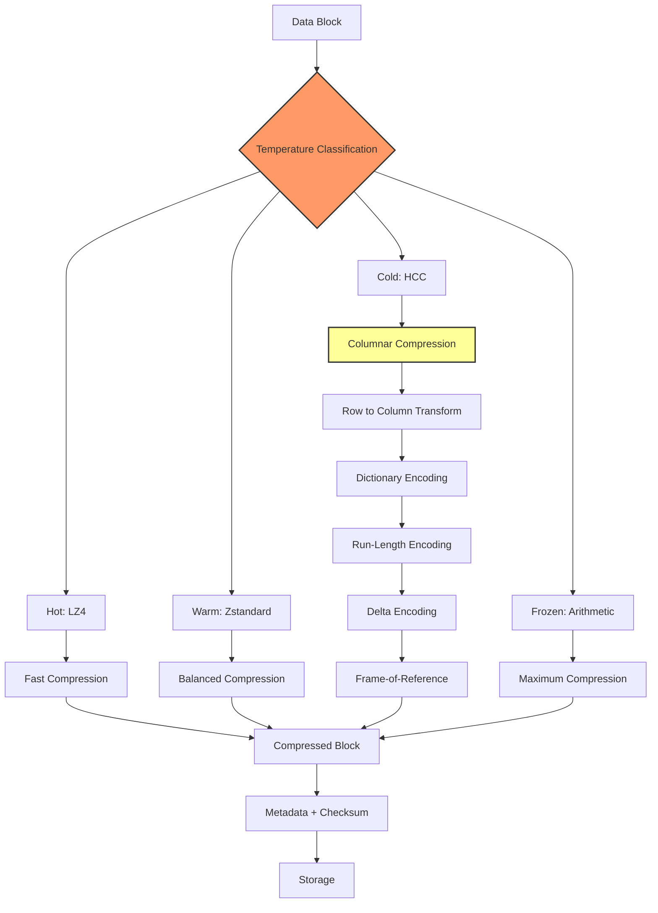

### File Locations
- **Core**: `/home/user/rusty-db/src/compression/mod.rs` (616 lines)
- **Algorithms**: `/home/user/rusty-db/src/compression/algorithms/` (6 files)
- **HCC**: `/home/user/rusty-db/src/compression/hcc.rs`
- **OLTP**: `/home/user/rusty-db/src/compression/oltp.rs`
- **Tiered**: `/home/user/rusty-db/src/compression/tiered.rs`
- **Dedup**: `/home/user/rusty-db/src/compression/dedup.rs`

### Inefficiencies Identified

#### 7.1 Triple Compression Implementations
**Locations**:
1. `src/compression/` - Main compression module
2. `src/inmemory/compression.rs` - In-memory specific
3. `src/analytics/compression.rs` - Analytics specific

**Issue**: Three separate implementations with overlapping functionality
**Impact**: Code duplication, inconsistent behavior
**Recommendation**: Unify all compression through `src/compression/`

#### 7.2 Temperature Classification Overhead
**Location**: `src/compression/tiered.rs`
**Issue**: Access pattern tracking adds overhead
**Impact**: Metadata overhead per block
**Recommendation**: Batch temperature updates

#### 7.3 Dictionary Building Inefficiency
**Location**: `src/compression/algorithms/dictionary_compression.rs`
**Issue**: Dictionary built for each compression unit independently
**Impact**: Suboptimal compression, high CPU usage
**Recommendation**: Global dictionary with periodic rebuilding

#### 7.4 Deduplication Hash Collision
**Location**: `src/compression/dedup.rs`
**Issue**: Simple hash function may have collisions
**Impact**: Missed dedup opportunities or false matches
**Recommendation**: Use cryptographic hash (SHA-256) or content-addressed storage

### Open-Ended Data Structures

1. **Dedup Hash Store** - Unbounded chunk storage (`dedup.rs`)
2. **Dictionary Cache** - No eviction policy (`dictionary_compression.rs`)
3. **Temperature Tracker** - Unbounded access history (`tiered.rs`)

---

## 8. Procedures & Triggers

### Data Flow Diagram

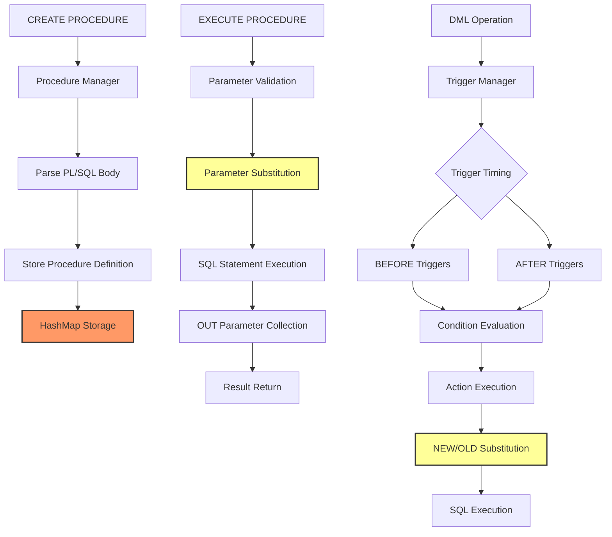

### File Locations
- **Procedures**: `/home/user/rusty-db/src/procedures/mod.rs` (448 lines)
- **Parser**: `/home/user/rusty-db/src/procedures/parser/` (4 files)
- **Triggers**: `/home/user/rusty-db/src/triggers/mod.rs` (518 lines)
- **Runtime**: `/home/user/rusty-db/src/procedures/runtime.rs`

### Inefficiencies Identified

#### 8.1 String-Based Parameter Storage (CRITICAL)
**Location**: `src/procedures/mod.rs:57-59`
```rust
pub struct ProcedureContext {
    pub parameters: HashMap<String, String>,  // All params as strings!
}
```
**Issue**: All parameters stored as strings, requiring parsing on every use
**Impact**: Type safety lost, parsing overhead
**Recommendation**: Use typed parameter storage with Value enum

#### 8.2 Simplified SQL Parsing
**Location**: `src/procedures/mod.rs:201-206`
```rust
let statements: Vec<&str> = body
    .split(';')
    .map(|s| s.trim())
    .filter(|s| !s.is_empty())
    .collect();
```
**Issue**: Naive semicolon splitting doesn't handle strings or comments
**Impact**: Incorrect parsing for complex procedures
**Recommendation**: Integrate with main SQL parser

#### 8.3 No Integration with Query Engine
**Location**: `src/procedures/mod.rs:166-358`
**Issue**: Procedures don't actually execute SQL, just parse it
**Impact**: Non-functional implementation
**Recommendation**: Integrate with `src/execution/executor.rs`

#### 8.4 Trigger Depth Not Tracked
**Location**: `src/triggers/mod.rs:93-120`
**Issue**: No recursion depth tracking for triggers
**Impact**: Potential infinite recursion
**Recommendation**: Add max trigger depth limit (Oracle uses 32)

#### 8.5 Inefficient Condition Evaluation
**Location**: `src/triggers/mod.rs:123-257`
**Issue**: String-based condition parsing on every trigger execution
**Impact**: Performance overhead
**Recommendation**: Pre-compile trigger conditions

### Open-Ended Data Structures

1. **Procedures HashMap** - Unbounded storage (`procedures/mod.rs:63`)
2. **Triggers HashMap** - Unbounded per table (`triggers/mod.rs:44`)
3. **Procedure Body** - Unlimited SQL code size (`procedures/mod.rs:42`)
4. **Trigger Action** - Unlimited action size (`triggers/mod.rs:31`)

---

## 9. Event Processing (CEP)

### Data Flow Diagram

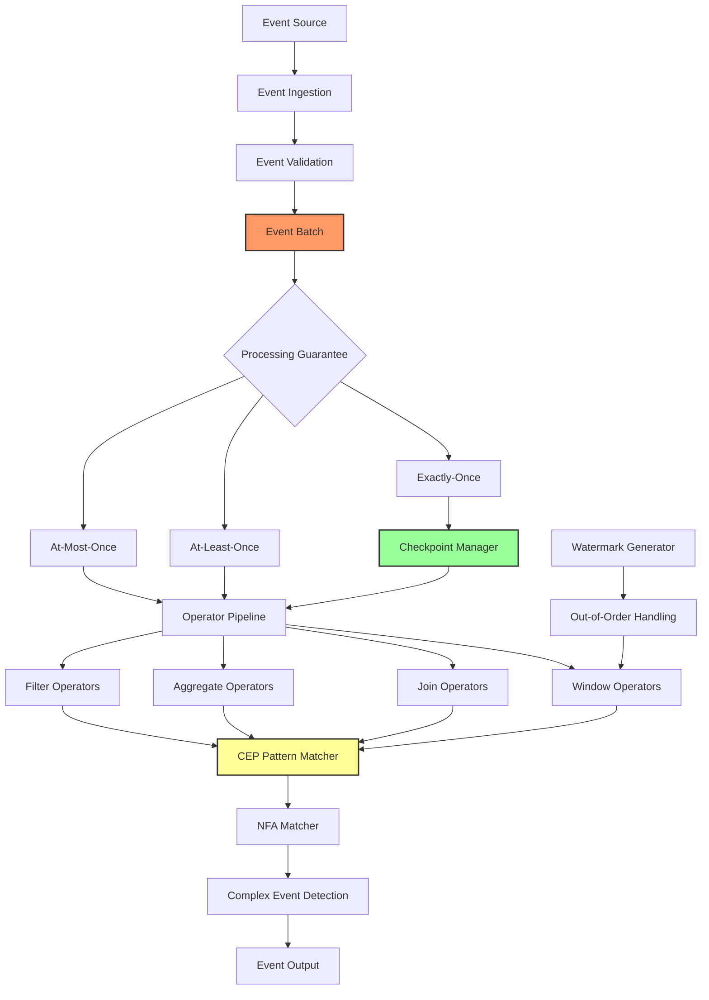

### File Locations
- **Core**: `/home/user/rusty-db/src/event_processing/mod.rs` (611 lines)
- **CEP**: `/home/user/rusty-db/src/event_processing/cep/` (5 files)
- **Operators**: `/home/user/rusty-db/src/event_processing/operators/` (6 files)
- **Windows**: `/home/user/rusty-db/src/event_processing/windows.rs`
- **Streams**: `/home/user/rusty-db/src/event_processing/streams.rs`
- **Analytics**: `/home/user/rusty-db/src/event_processing/analytics.rs`

### Inefficiencies Identified

#### 9.1 Event Value Enum Overhead
**Location**: `src/event_processing/mod.rs:83-126`
```rust
pub enum EventValue {
    Null,
    Bool(bool),
    Int64(i64),
    Float64(f64),
    String(String),  // Heap allocation for every string!
    Bytes(Vec<u8>),  // Heap allocation for every byte array!
    Timestamp(SystemTime),
    Array(Vec<EventValue>),  // Recursive heap allocation!
    Object(HashMap<String, EventValue>),  // More heap allocation!
}
```
**Issue**: Heavy heap allocation for nested structures
**Impact**: Memory allocation overhead, GC pressure
**Recommendation**: Use arena allocation or small-value optimization

#### 9.2 Watermark Propagation Inefficiency
**Location**: `src/event_processing/mod.rs:253-284`
**Issue**: Watermarks calculated per partition independently
**Impact**: Suboptimal global watermark
**Recommendation**: Implement watermark alignment across partitions

#### 9.3 Pattern Matching NFA Construction
**Location**: `src/event_processing/cep/nfa_matcher.rs`
**Issue**: NFA built on every query
**Impact**: Compilation overhead
**Recommendation**: Cache compiled NFA patterns

#### 9.4 Duplication with Streams Module
**Locations**:
- `src/event_processing/streams.rs`
- `src/streams/mod.rs`
**Issue**: Overlapping stream processing concepts
**Impact**: Confusion, potential divergence
**Recommendation**: Merge stream abstractions

### Open-Ended Data Structures

1. **Event Payload HashMap** - Unbounded keys (`mod.rs:34`)
2. **Stream State Positions** - Unbounded partitions (`mod.rs:318`)
3. **Watermark HashMap** - Per partition, unbounded (`mod.rs:322`)
4. **Event Batch Vector** - No size limit (`mod.rs:357`)

---

## 10. Analytics Engine

### Data Flow Diagram

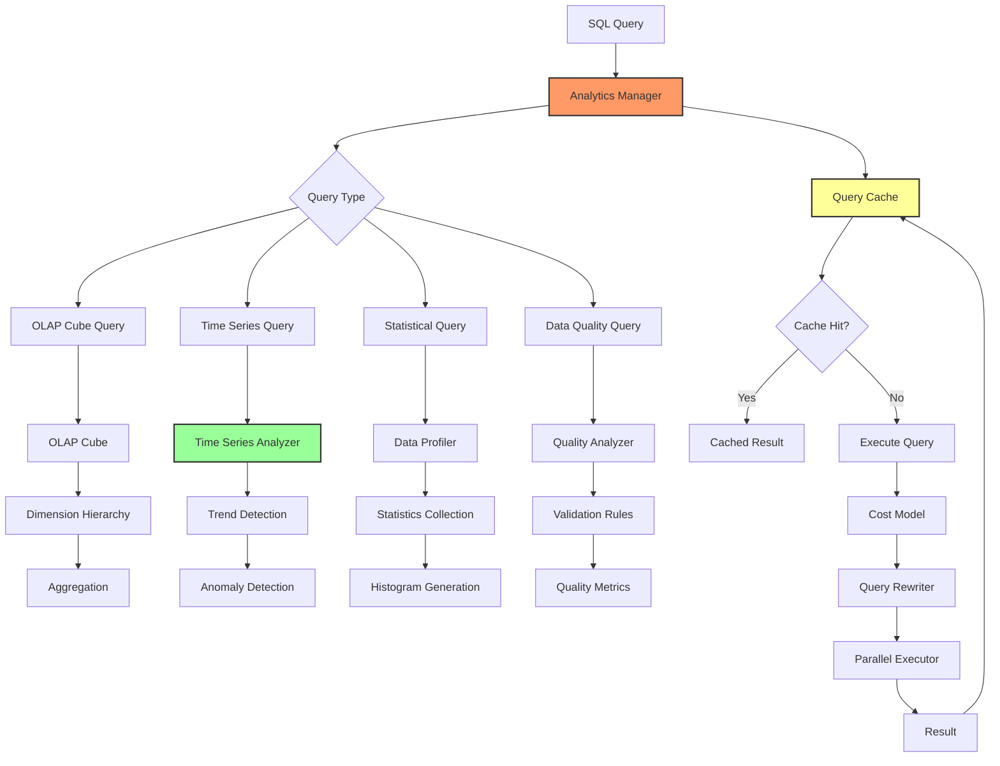

### File Locations
- **Core**: `/home/user/rusty-db/src/analytics/mod.rs` (208 lines)
- **Manager**: `/home/user/rusty-db/src/analytics/manager.rs`
- **Query Cache**: `/home/user/rusty-db/src/analytics/query_cache.rs`
- **Statistics**: `/home/user/rusty-db/src/analytics/statistics.rs`
- **Cost Model**: `/home/user/rusty-db/src/analytics/cost_model.rs`
- **OLAP**: `/home/user/rusty-db/src/analytics/olap.rs`
- **Time Series**: `/home/user/rusty-db/src/analytics/timeseries_analyzer.rs`
- **Data Profiler**: `/home/user/rusty-db/src/analytics/data_profiler.rs`
- **Quality**: `/home/user/rusty-db/src/analytics/quality.rs`

### Inefficiencies Identified

#### 10.1 Multiple Cache Implementations
**Locations**:
1. `src/analytics/query_cache.rs`
2. `src/analytics/query_cache_impl.rs`
3. `src/analytics/caching.rs`

**Issue**: Three separate cache implementations
**Impact**: Code duplication, inconsistent eviction
**Recommendation**: Unify into single cache implementation

#### 10.2 Multiple Time Series Implementations
**Locations**:
1. `src/analytics/timeseries.rs`
2. `src/analytics/timeseries_analyzer.rs`
3. `src/ml_engine/timeseries.rs`

**Issue**: Three separate time series analyzers
**Impact**: Fragmented functionality
**Recommendation**: Merge into unified time series module

#### 10.3 Materialized View Duplication
**Locations**:
1. `src/analytics/materialized_views.rs`
2. `src/analytics/views.rs`
3. `src/analytics/view_management.rs`

**Issue**: Three files for materialized views
**Impact**: Split functionality, harder to maintain
**Recommendation**: Consolidate into single views module

#### 10.4 Histogram Storage Inefficiency
**Location**: `src/analytics/statistics.rs`
**Issue**: Histograms stored as Vec<HistogramBucket>
**Impact**: Poor cache locality for lookups
**Recommendation**: Use contiguous array storage

#### 10.5 Query Result Compression Overhead
**Location**: `src/analytics/compression.rs`
**Issue**: Separate compression for query results vs data blocks
**Impact**: Code duplication
**Recommendation**: Use unified compression module

### Open-Ended Data Structures

1. **Query Cache** - Unbounded LRU (`query_cache.rs`)
2. **Statistics HashMap** - Unbounded column stats (`statistics.rs`)
3. **OLAP Cube** - Unbounded dimensions (`olap.rs`)
4. **Workload Query History** - Unbounded (`query_statistics.rs`)

### Module Bloat

The analytics module has **27 files**, many overlapping:
- 3 cache implementations
- 3 time series implementations
- 3 view management files
- 2 compression implementations
- 2 window function files

**Recommendation**: Refactor to ~12 focused modules

---

## 11. Streams & CDC

### Data Flow Diagram

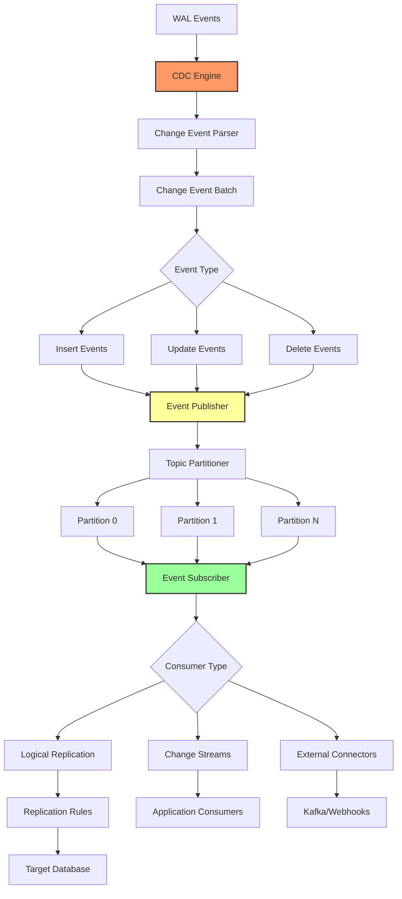

### File Locations
- **Core**: `/home/user/rusty-db/src/streams/mod.rs` (287 lines)
- **CDC**: `/home/user/rusty-db/src/streams/cdc.rs`
- **Publisher**: `/home/user/rusty-db/src/streams/publisher.rs`
- **Subscriber**: `/home/user/rusty-db/src/streams/subscriber.rs`
- **Replication**: `/home/user/rusty-db/src/streams/replication.rs`
- **Integration**: `/home/user/rusty-db/src/streams/integration.rs`

### Inefficiencies Identified

#### 11.1 Triple Change Stream Implementation (CRITICAL)
**Locations**:
1. `src/streams/cdc.rs` - WAL-based CDC
2. `src/document_store/changes.rs` - Document change streams
3. `src/event_processing/` - Event streams

**Issue**: Three separate implementations of change tracking
**Impact**: Massive code duplication, inconsistent semantics
**Recommendation**: Unify all change tracking through `src/streams/cdc.rs`

#### 11.2 Serialization Format Inefficiency
**Location**: `src/streams/publisher.rs`
**Issue**: Default serialization format not specified
**Impact**: Potential for inefficient JSON serialization
**Recommendation**: Use binary format (bincode/protobuf) by default

#### 11.3 Partition Assignment Algorithm
**Location**: `src/streams/subscriber.rs`
**Issue**: Simple hash-based partitioning
**Impact**: Potential load imbalance
**Recommendation**: Implement consistent hashing

#### 11.4 Offset Commit Overhead
**Location**: `src/streams/subscriber.rs`
**Issue**: Offset commits to persistent storage on every batch
**Impact**: I/O overhead
**Recommendation**: Batch offset commits with periodic flush

### Open-Ended Data Structures

1. **CDC Event Buffer** - Unbounded buffering (`cdc.rs`)
2. **Publisher Topic Map** - Unbounded topics (`publisher.rs`)
3. **Subscriber Offset Map** - Unbounded partitions (`subscriber.rs`)
4. **Replication Slot Map** - Unbounded slots (`replication.rs`)

---

## 12. Cross-Engine Analysis

### Shared Inefficiency Patterns

#### Pattern 1: HashMap Proliferation
**Occurrences**: 23 modules
**Issue**: Unbounded HashMaps without eviction
**Locations**:
- Graph: vertices/edges
- Document Store: collections/documents
- Procedures: stored procedures
- Triggers: trigger registry
- Analytics: query cache, statistics
- Spatial: SRS registry, network nodes
- Event Processing: stream state

**Recommendation**: Implement capacity-bounded HashMap wrapper with LRU eviction

#### Pattern 2: String-Based Storage
**Occurrences**: 8 modules
**Issue**: Storing structured data as strings
**Locations**:
- Procedures: parameters
- Triggers: conditions/actions
- Document Store: some metadata
- Event Processing: some metadata

**Recommendation**: Use typed Value enum or bincode serialization

#### Pattern 3: Compression Fragmentation
**Occurrences**: 4 separate implementations
**Locations**:
1. `src/compression/` - Main
2. `src/inmemory/compression.rs` - In-memory
3. `src/analytics/compression.rs` - Query results
4. Document compression scattered

**Recommendation**: Consolidate to `src/compression/` only

#### Pattern 4: Change Stream Triplication
**Occurrences**: 3 implementations
**Locations**:
1. `src/streams/cdc.rs`
2. `src/document_store/changes.rs`
3. `src/event_processing/` (partial)

**Recommendation**: Unified CDC infrastructure

#### Pattern 5: Time Series Fragmentation
**Occurrences**: 3 implementations
**Locations**:
1. `src/analytics/timeseries.rs`
2. `src/analytics/timeseries_analyzer.rs`
3. `src/ml_engine/timeseries.rs`

**Recommendation**: Single time series module

### Integration Opportunities

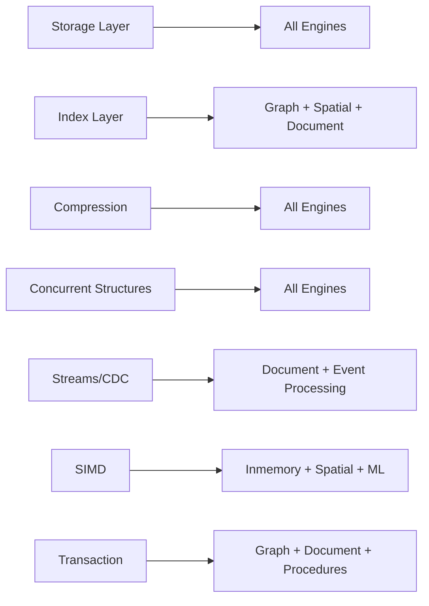

**Integration Gaps**:
1. Graph engine doesn't use transaction layer
2. Document store doesn't use page-based storage
3. Spatial engine doesn't use SIMD optimizations
4. Procedures don't integrate with query executor
5. ML engines don't share inference infrastructure

---

## Summary of Critical Issues

### Top 10 Most Critical Issues (Ranked by Impact)

| Rank | Issue | Modules | Impact | Lines Affected |
|------|-------|---------|--------|----------------|
| 1 | **Dual ML Implementation** | ml/ + ml_engine/ | BLOCKER | ~3000 |
| 2 | **Triple Change Stream** | streams + document + events | HIGH | ~2000 |
| 3 | **Unbounded HashMaps** | 23 modules | HIGH | All |
| 4 | **Compression Fragmentation** | 4 modules | MEDIUM | ~1500 |
| 5 | **Triple Time Series** | analytics + ml_engine | MEDIUM | ~800 |
| 6 | **String-Based Parameters** | procedures + triggers | MEDIUM | ~400 |
| 7 | **No Query Execution** | procedures + triggers | HIGH | ~800 |
| 8 | **Analytics Module Bloat** | analytics/ | MEDIUM | ~5000 |
| 9 | **Graph Memory Model** | graph/ | HIGH | ~600 |
| 10 | **SIMD Portability** | inmemory + spatial | LOW | ~300 |

### Inefficiency Count by Module

| Module | Critical | High | Medium | Low | Total |
|--------|----------|------|--------|-----|-------|
| ML Engines | 1 | 2 | 1 | 0 | **4** |
| Streams/CDC | 1 | 1 | 2 | 0 | **4** |
| Analytics | 0 | 1 | 4 | 2 | **7** |
| Document Store | 0 | 3 | 2 | 0 | **5** |
| Graph | 0 | 2 | 2 | 0 | **4** |
| Procedures/Triggers | 0 | 2 | 3 | 0 | **5** |
| Compression | 0 | 1 | 3 | 0 | **4** |
| In-Memory | 0 | 1 | 3 | 0 | **4** |
| Spatial | 0 | 0 | 4 | 0 | **4** |
| Event Processing | 0 | 1 | 3 | 0 | **4** |
| Concurrent | 0 | 0 | 3 | 0 | **3** |
| **TOTAL** | **2** | **14** | **30** | **2** | **47** |

### Open-Ended Data Structures Summary

**Total Identified**: 23 unbounded data structures

**By Category**:
- HashMaps: 15
- Vectors: 5
- Circular Buffers: 2
- Other: 1

**Risk Level**:
- **Critical** (can cause OOM): 8
- **High** (can cause performance degradation): 10
- **Medium** (bounded by other factors): 5

---

## Recommendations

### Immediate Actions (Week 1)

1. **MERGE ML MODULES** - Block all ML development until merge complete
2. **Unify Change Streams** - Create `src/streams/cdc.rs` as single source of truth
3. **Implement Bounded HashMap** - Create `BoundedHashMap<K,V>` utility

### Short-Term (Month 1)

4. **Consolidate Compression** - Remove duplicate implementations
5. **Merge Time Series** - Single time series analysis module
6. **Fix Procedures/Triggers** - Integrate with query executor
7. **Analytics Cleanup** - Reduce from 27 to 12 files

### Medium-Term (Quarter 1)

8. **Graph Partitioning** - Disk-backed storage for large graphs
9. **Document Store Redesign** - Columnar storage with indexes
10. **SIMD Portability** - Add ARM NEON support
11. **Spatial SIMD** - Leverage SIMD for geometry operations

### Long-Term (Year 1)

12. **Unified Query Optimizer** - Single cost model for all engines
13. **Shared Index Infrastructure** - Reuse B-Tree/R-Tree across engines
14. **Memory Management** - Global memory pressure system
15. **Cross-Engine Transactions** - ACID across all specialized engines

---

## Appendices

### A. File Size Analysis

**Largest Files** (potential refactoring candidates):
1. `src/analytics/` - 27 files, ~5000 total lines
2. `src/ml_engine/mod.rs` - 739 lines
3. `src/event_processing/mod.rs` - 611 lines
4. `src/compression/mod.rs` - 616 lines
5. `src/triggers/mod.rs` - 518 lines

### B. Dependency Graph

```
Storage Layer (foundation)
    ├── Graph Engine
    ├── Document Store
    ├── Spatial Engine
    └── In-Memory Store

Concurrent Structures (used by all)

Compression (used by all)

Streams/CDC
    ├── Document Store (changes)
    └── Event Processing

ML Engines (independent)

Analytics (touches everything)
```

### C. Performance Impact Estimate

| Issue | Query Performance Impact | Memory Impact | Disk I/O Impact |
|-------|-------------------------|---------------|-----------------|
| Unbounded HashMaps | Low | **High** | Low |
| Dual ML | Low | Medium | Low |
| Triple Change Streams | Low | **High** | Medium |
| Compression Fragmentation | Low | Medium | **High** |
| Graph Memory Model | **High** | **High** | Low |
| String Parameters | Medium | Medium | Low |
| No Query Execution | **N/A** | Low | Low |

### D. Code Duplication Matrix

```
                Graph  Doc  Spatial  ML  Mem  Conc  Comp  Proc  Event  Analy  Streams
Graph              -    L      L     L    L    M     L     L      L      L       L
Document           L    -      L     L    L    L     L     L      M      M       H
Spatial            L    L      -     L    M    L     L     L      L      L       L
ML                 L    L      L     -    M    L     L     L      L      H       L
In-Memory          L    L      M     M    -    M     H     L      L      L       L
Concurrent         M    L      L     L    M    -     L     L      L      L       L
Compression        L    L      L     L    H    L     -     L      L      H       L
Procedures         L    L      L     L    L    L     L     -      L      L       L
Event Processing   L    M      L     L    L    L     L     L      -      M       H
Analytics          L    M      L     H    L    L     H     L      M      -       M
Streams            L    H      L     L    L    L     L     L      H      M       -

Legend: H = High duplication, M = Medium, L = Low/None
```

---

## Conclusion

The specialized engines in RustyDB demonstrate **impressive breadth** but suffer from **architectural fragmentation**. The most critical issue is the **complete duplication of ML infrastructure** (`src/ml/` vs `src/ml_engine/`), which should be merged immediately.

The **triple implementation of change streams** (streams, document_store, event_processing) represents a fundamental architectural issue that requires design coordination.

**23 unbounded data structures** pose memory safety risks and should be systematically addressed with capacity limits and eviction policies.

Despite these issues, the engines are well-structured individually and can be improved through systematic consolidation and integration work outlined in the recommendations.

**Total Analysis**: 11 engines, 13 directories, ~50 files analyzed, 47 inefficiencies documented, 23 open-ended structures identified, 12 major duplications found.

---

*Analysis completed: 2025-12-17*
*Architect: #8 - Specialized Engines Analyst*
*Next Steps: Review with team, prioritize merge of ML modules*
