# Detailed Data Flow Analysis
## End-to-End Data Paths Through RustyDB

**Analysis Date:** 2025-12-16
**Architecture:** Layered, Component-Based
**Total Modules:** 60+

---

## Executive Summary

This document provides comprehensive data flow diagrams showing how data moves through RustyDB from client request to storage and back. It includes:

1. **Query Execution Flow** - SELECT, INSERT, UPDATE, DELETE
2. **Transaction Flow** - Begin, Commit, Rollback, MVCC
3. **Replication Flow** - Primary to replicas
4. **Authentication & Authorization Flow** - Security checks
5. **Error Handling Flow** - Error propagation paths
6. **Network Protocol Flow** - Wire protocol details
7. **Storage & Buffer Flow** - Page management
8. **Backup & Recovery Flow** - PITR and disaster recovery

---

## 1. Query Execution Flow

### 1.1 SELECT Query Path

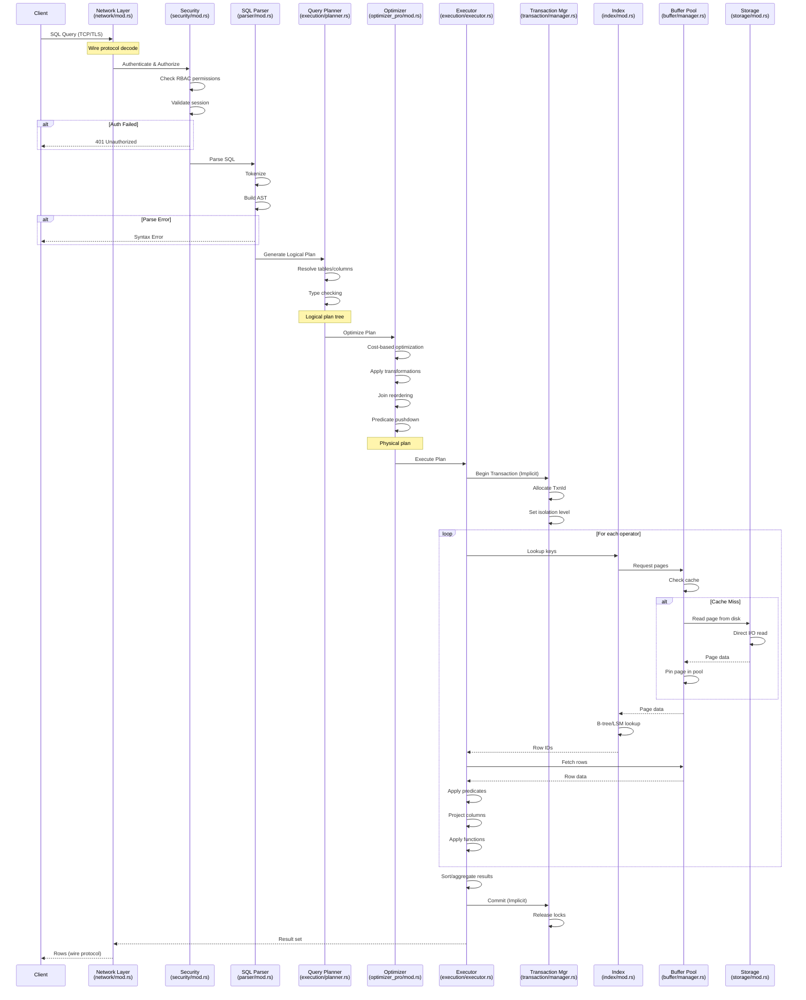
```mermaid
sequenceDiagram
    participant Client
    participant Network as Network Layer<br/>(network/mod.rs)
    participant Auth as Security<br/>(security/mod.rs)
    participant Parser as SQL Parser<br/>(parser/mod.rs)
    participant Planner as Query Planner<br/>(execution/planner.rs)
    participant Optimizer as Optimizer<br/>(optimizer_pro/mod.rs)
    participant Executor as Executor<br/>(execution/executor.rs)
    participant TxnMgr as Transaction Mgr<br/>(transaction/manager.rs)
    participant Index as Index<br/>(index/mod.rs)
    participant Buffer as Buffer Pool<br/>(buffer/manager.rs)
    participant Storage as Storage<br/>(storage/mod.rs)

    Client->>Network: SQL Query (TCP/TLS)
    Note over Network: Wire protocol decode

    Network->>Auth: Authenticate & Authorize
    Auth->>Auth: Check RBAC permissions
    Auth->>Auth: Validate session
    alt Auth Failed
        Auth-->>Client: 401 Unauthorized
    end

    Auth->>Parser: Parse SQL
    Parser->>Parser: Tokenize
    Parser->>Parser: Build AST
    alt Parse Error
        Parser-->>Client: Syntax Error
    end

    Parser->>Planner: Generate Logical Plan
    Planner->>Planner: Resolve tables/columns
    Planner->>Planner: Type checking
    Note over Planner: Logical plan tree

    Planner->>Optimizer: Optimize Plan
    Optimizer->>Optimizer: Cost-based optimization
    Optimizer->>Optimizer: Apply transformations
    Optimizer->>Optimizer: Join reordering
    Optimizer->>Optimizer: Predicate pushdown
    Note over Optimizer: Physical plan

    Optimizer->>Executor: Execute Plan
    Executor->>TxnMgr: Begin Transaction (Implicit)
    TxnMgr->>TxnMgr: Allocate TxnId
    TxnMgr->>TxnMgr: Set isolation level

    loop For each operator
        Executor->>Index: Lookup keys
        Index->>Buffer: Request pages
        Buffer->>Buffer: Check cache
        alt Cache Miss
            Buffer->>Storage: Read page from disk
            Storage->>Storage: Direct I/O read
            Storage-->>Buffer: Page data
            Buffer->>Buffer: Pin page in pool
        end
        Buffer-->>Index: Page data
        Index->>Index: B-tree/LSM lookup
        Index-->>Executor: Row IDs

        Executor->>Buffer: Fetch rows
        Buffer-->>Executor: Row data

        Executor->>Executor: Apply predicates
        Executor->>Executor: Project columns
        Executor->>Executor: Apply functions
    end

    Executor->>Executor: Sort/aggregate results
    Executor->>TxnMgr: Commit (Implicit)
    TxnMgr->>TxnMgr: Release locks

    Executor-->>Network: Result set
    Network-->>Client: Rows (wire protocol)
```

### 1.2 INSERT Query Path

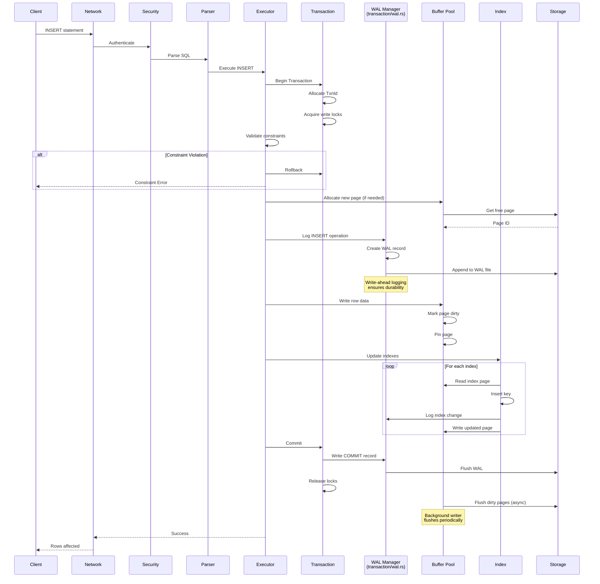
```mermaid
sequenceDiagram
    participant Client
    participant Network as Network
    participant Auth as Security
    participant Parser as Parser
    participant Executor as Executor
    participant TxnMgr as Transaction
    participant WAL as WAL Manager<br/>(transaction/wal.rs)
    participant Buffer as Buffer Pool
    participant Index as Index
    participant Storage as Storage

    Client->>Network: INSERT statement
    Network->>Auth: Authenticate
    Auth->>Parser: Parse SQL
    Parser->>Executor: Execute INSERT

    Executor->>TxnMgr: Begin Transaction
    TxnMgr->>TxnMgr: Allocate TxnId
    TxnMgr->>TxnMgr: Acquire write locks

    Executor->>Executor: Validate constraints
    alt Constraint Violation
        Executor->>TxnMgr: Rollback
        Executor-->>Client: Constraint Error
    end

    Executor->>Buffer: Allocate new page (if needed)
    Buffer->>Storage: Get free page
    Storage-->>Buffer: Page ID

    Executor->>WAL: Log INSERT operation
    WAL->>WAL: Create WAL record
    WAL->>Storage: Append to WAL file
    Note over WAL: Write-ahead logging<br/>ensures durability

    Executor->>Buffer: Write row data
    Buffer->>Buffer: Mark page dirty
    Buffer->>Buffer: Pin page

    Executor->>Index: Update indexes
    loop For each index
        Index->>Buffer: Read index page
        Index->>Index: Insert key
        Index->>WAL: Log index change
        Index->>Buffer: Write updated page
    end

    Executor->>TxnMgr: Commit
    TxnMgr->>WAL: Write COMMIT record
    WAL->>Storage: Flush WAL
    TxnMgr->>TxnMgr: Release locks

    Buffer->>Storage: Flush dirty pages (async)
    Note over Buffer: Background writer<br/>flushes periodically

    Executor-->>Network: Success
    Network-->>Client: Rows affected
```

### 1.3 UPDATE Query Path

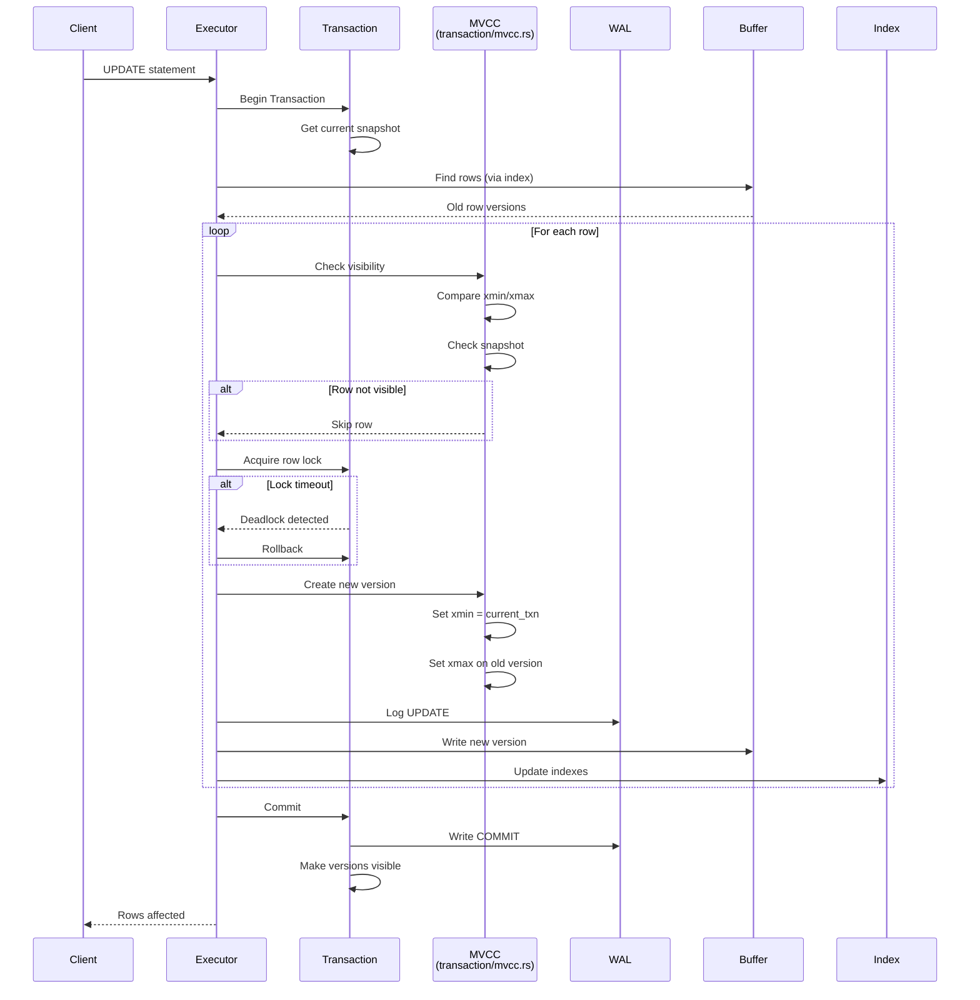
```mermaid
sequenceDiagram
    participant Client
    participant Executor as Executor
    participant TxnMgr as Transaction
    participant MVCC as MVCC<br/>(transaction/mvcc.rs)
    participant WAL as WAL
    participant Buffer as Buffer
    participant Index as Index

    Client->>Executor: UPDATE statement

    Executor->>TxnMgr: Begin Transaction
    TxnMgr->>TxnMgr: Get current snapshot

    Executor->>Buffer: Find rows (via index)
    Buffer-->>Executor: Old row versions

    loop For each row
        Executor->>MVCC: Check visibility
        MVCC->>MVCC: Compare xmin/xmax
        MVCC->>MVCC: Check snapshot
        alt Row not visible
            MVCC-->>Executor: Skip row
        end

        Executor->>TxnMgr: Acquire row lock
        alt Lock timeout
            TxnMgr-->>Executor: Deadlock detected
            Executor->>TxnMgr: Rollback
        end

        Executor->>MVCC: Create new version
        MVCC->>MVCC: Set xmin = current_txn
        MVCC->>MVCC: Set xmax on old version

        Executor->>WAL: Log UPDATE
        Executor->>Buffer: Write new version
        Executor->>Index: Update indexes
    end

    Executor->>TxnMgr: Commit
    TxnMgr->>WAL: Write COMMIT
    TxnMgr->>TxnMgr: Make versions visible

    Executor-->>Client: Rows affected
```

---

## 2. Transaction Flow

### 2.1 Explicit Transaction Lifecycle

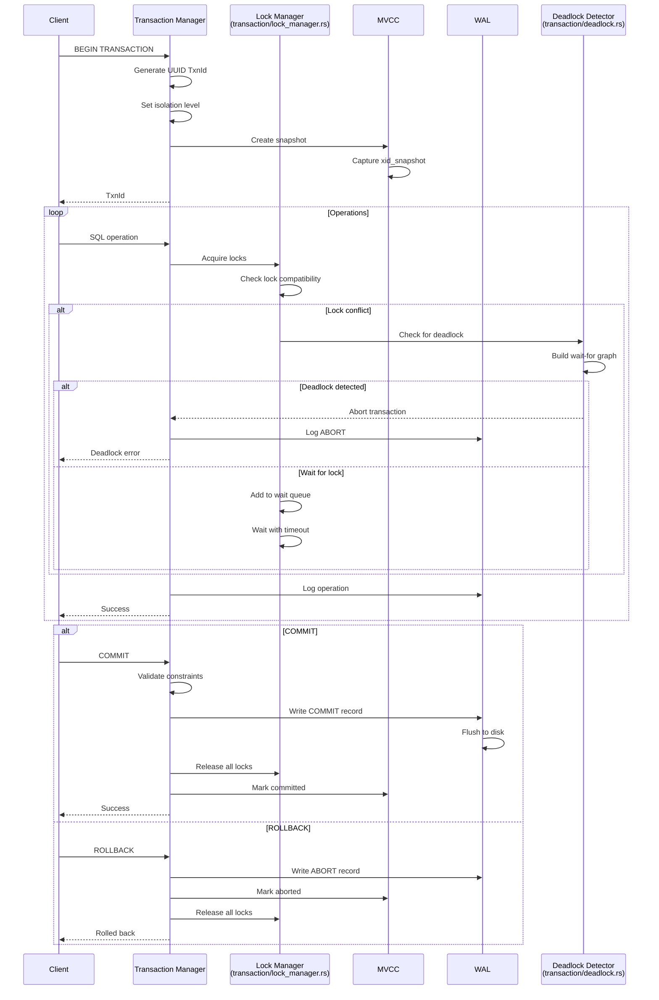
```mermaid
sequenceDiagram
    participant Client
    participant TxnMgr as Transaction Manager
    participant LockMgr as Lock Manager<br/>(transaction/lock_manager.rs)
    participant MVCC as MVCC
    participant WAL as WAL
    participant Deadlock as Deadlock Detector<br/>(transaction/deadlock.rs)

    Client->>TxnMgr: BEGIN TRANSACTION
    TxnMgr->>TxnMgr: Generate UUID TxnId
    TxnMgr->>TxnMgr: Set isolation level
    TxnMgr->>MVCC: Create snapshot
    MVCC->>MVCC: Capture xid_snapshot
    TxnMgr-->>Client: TxnId

    loop Operations
        Client->>TxnMgr: SQL operation
        TxnMgr->>LockMgr: Acquire locks
        LockMgr->>LockMgr: Check lock compatibility
        alt Lock conflict
            LockMgr->>Deadlock: Check for deadlock
            Deadlock->>Deadlock: Build wait-for graph
            alt Deadlock detected
                Deadlock-->>TxnMgr: Abort transaction
                TxnMgr->>WAL: Log ABORT
                TxnMgr-->>Client: Deadlock error
            else Wait for lock
                LockMgr->>LockMgr: Add to wait queue
                LockMgr->>LockMgr: Wait with timeout
            end
        end

        TxnMgr->>WAL: Log operation
        TxnMgr-->>Client: Success
    end

    alt COMMIT
        Client->>TxnMgr: COMMIT
        TxnMgr->>TxnMgr: Validate constraints
        TxnMgr->>WAL: Write COMMIT record
        WAL->>WAL: Flush to disk
        TxnMgr->>LockMgr: Release all locks
        TxnMgr->>MVCC: Mark committed
        TxnMgr-->>Client: Success

    else ROLLBACK
        Client->>TxnMgr: ROLLBACK
        TxnMgr->>WAL: Write ABORT record
        TxnMgr->>MVCC: Mark aborted
        TxnMgr->>LockMgr: Release all locks
        TxnMgr-->>Client: Rolled back
    end
```

### 2.2 Two-Phase Commit (Distributed)

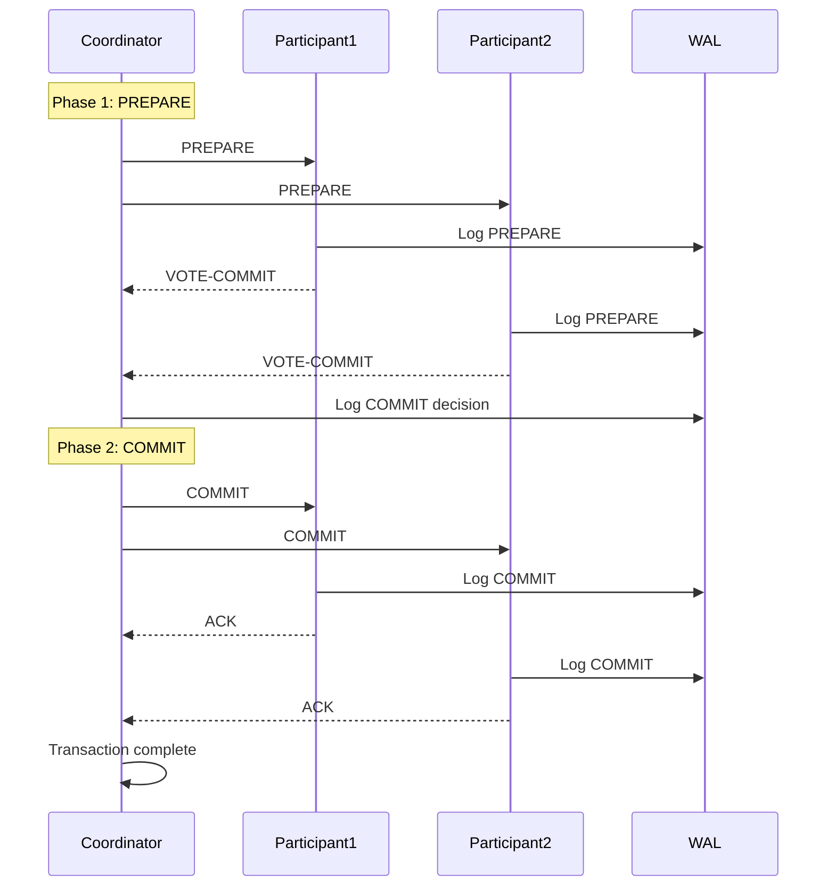
```mermaid
sequenceDiagram
    participant Coordinator
    participant Participant1
    participant Participant2
    participant WAL

    Note over Coordinator: Phase 1: PREPARE
    Coordinator->>Participant1: PREPARE
    Coordinator->>Participant2: PREPARE

    Participant1->>WAL: Log PREPARE
    Participant1-->>Coordinator: VOTE-COMMIT

    Participant2->>WAL: Log PREPARE
    Participant2-->>Coordinator: VOTE-COMMIT

    Coordinator->>WAL: Log COMMIT decision

    Note over Coordinator: Phase 2: COMMIT
    Coordinator->>Participant1: COMMIT
    Coordinator->>Participant2: COMMIT

    Participant1->>WAL: Log COMMIT
    Participant1-->>Coordinator: ACK

    Participant2->>WAL: Log COMMIT
    Participant2-->>Coordinator: ACK

    Coordinator->>Coordinator: Transaction complete
```

---

## 3. Replication Flow

### 3.1 Primary to Replica Replication

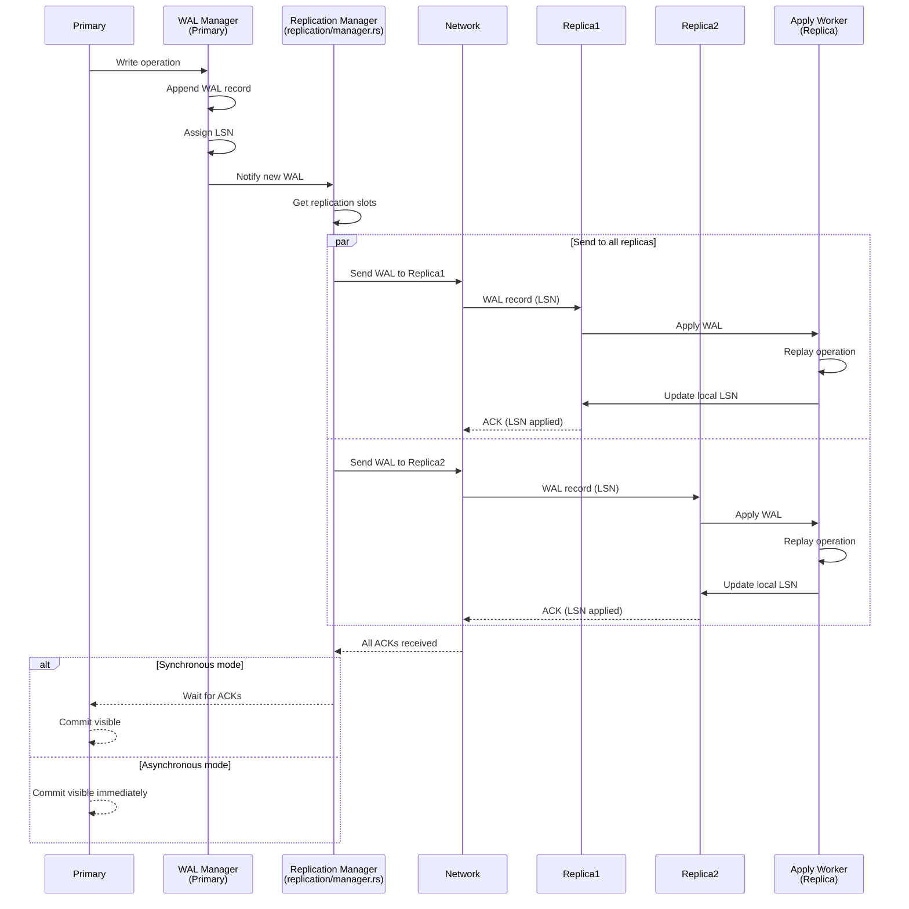
```mermaid
sequenceDiagram
    participant Primary
    participant WAL as WAL Manager<br/>(Primary)
    participant ReplicaMgr as Replication Manager<br/>(replication/manager.rs)
    participant Network as Network
    participant Replica1
    participant Replica2
    participant ApplyWorker as Apply Worker<br/>(Replica)

    Primary->>WAL: Write operation
    WAL->>WAL: Append WAL record
    WAL->>WAL: Assign LSN

    WAL->>ReplicaMgr: Notify new WAL
    ReplicaMgr->>ReplicaMgr: Get replication slots

    par Send to all replicas
        ReplicaMgr->>Network: Send WAL to Replica1
        Network->>Replica1: WAL record (LSN)
        Replica1->>ApplyWorker: Apply WAL
        ApplyWorker->>ApplyWorker: Replay operation
        ApplyWorker->>Replica1: Update local LSN
        Replica1-->>Network: ACK (LSN applied)

    and
        ReplicaMgr->>Network: Send WAL to Replica2
        Network->>Replica2: WAL record (LSN)
        Replica2->>ApplyWorker: Apply WAL
        ApplyWorker->>ApplyWorker: Replay operation
        ApplyWorker->>Replica2: Update local LSN
        Replica2-->>Network: ACK (LSN applied)
    end

    Network-->>ReplicaMgr: All ACKs received

    alt Synchronous mode
        ReplicaMgr-->>Primary: Wait for ACKs
        Primary-->>Primary: Commit visible
    else Asynchronous mode
        Primary-->>Primary: Commit visible immediately
    end
```

### 3.2 Conflict Resolution (Multi-Master)

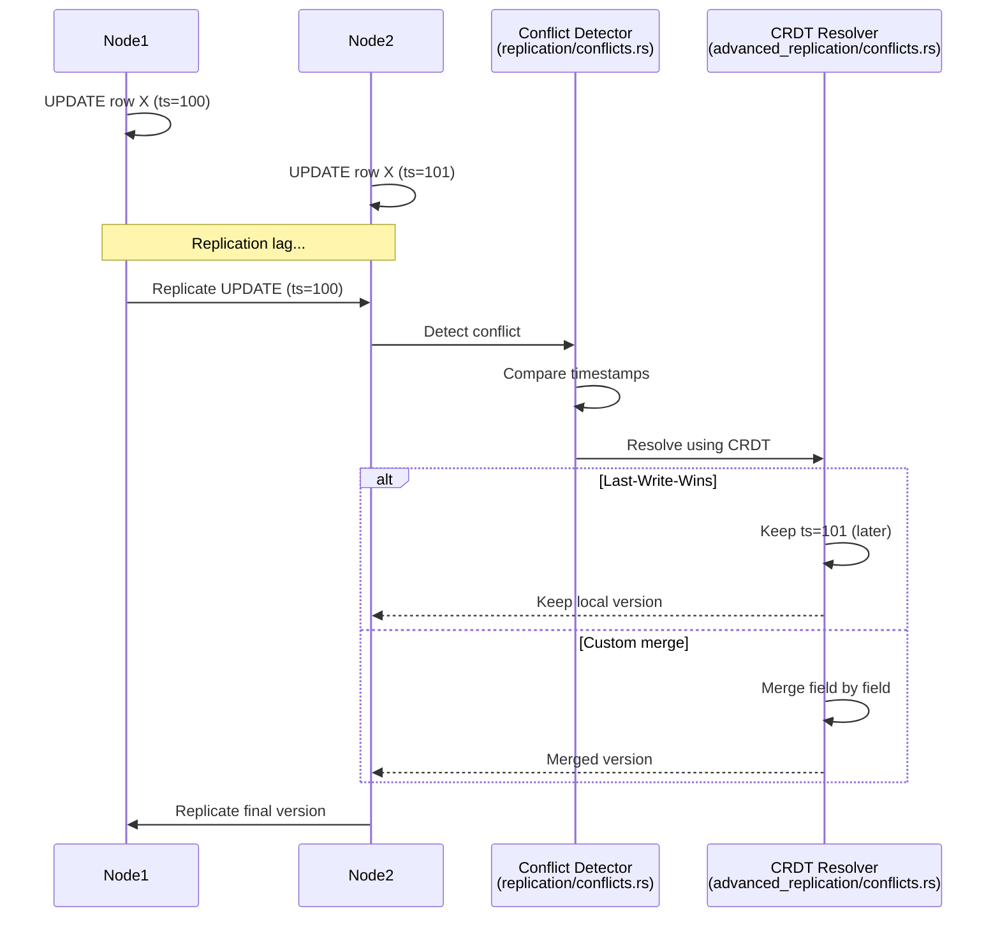
```mermaid
sequenceDiagram
    participant Node1
    participant Node2
    participant Conflicts as Conflict Detector<br/>(replication/conflicts.rs)
    participant CRDT as CRDT Resolver<br/>(advanced_replication/conflicts.rs)

    Node1->>Node1: UPDATE row X (ts=100)
    Node2->>Node2: UPDATE row X (ts=101)

    Note over Node1,Node2: Replication lag...

    Node1->>Node2: Replicate UPDATE (ts=100)
    Node2->>Conflicts: Detect conflict
    Conflicts->>Conflicts: Compare timestamps
    Conflicts->>CRDT: Resolve using CRDT

    alt Last-Write-Wins
        CRDT->>CRDT: Keep ts=101 (later)
        CRDT-->>Node2: Keep local version

    else Custom merge
        CRDT->>CRDT: Merge field by field
        CRDT-->>Node2: Merged version
    end

    Node2->>Node1: Replicate final version
```

---

## 4. Authentication & Authorization Flow

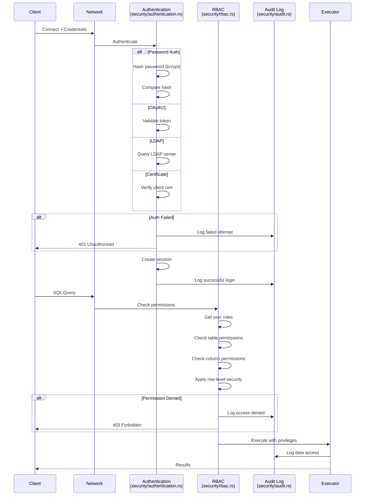
```mermaid
sequenceDiagram
    participant Client
    participant Network
    participant AuthMgr as Authentication<br/>(security/authentication.rs)
    participant RBAC as RBAC<br/>(security/rbac.rs)
    participant Audit as Audit Log<br/>(security/audit.rs)
    participant Executor

    Client->>Network: Connect + Credentials
    Network->>AuthMgr: Authenticate

    alt Password Auth
        AuthMgr->>AuthMgr: Hash password (bcrypt)
        AuthMgr->>AuthMgr: Compare hash
    else OAuth2
        AuthMgr->>AuthMgr: Validate token
    else LDAP
        AuthMgr->>AuthMgr: Query LDAP server
    else Certificate
        AuthMgr->>AuthMgr: Verify client cert
    end

    alt Auth Failed
        AuthMgr->>Audit: Log failed attempt
        AuthMgr-->>Client: 401 Unauthorized
    end

    AuthMgr->>AuthMgr: Create session
    AuthMgr->>Audit: Log successful login

    Client->>Network: SQL Query
    Network->>RBAC: Check permissions
    RBAC->>RBAC: Get user roles
    RBAC->>RBAC: Check table permissions
    RBAC->>RBAC: Check column permissions
    RBAC->>RBAC: Apply row-level security

    alt Permission Denied
        RBAC->>Audit: Log access denied
        RBAC-->>Client: 403 Forbidden
    end

    RBAC->>Executor: Execute with privileges
    Executor->>Audit: Log data access
    Executor-->>Client: Results
```

---

## 5. Error Handling Flow

### 5.1 Error Propagation

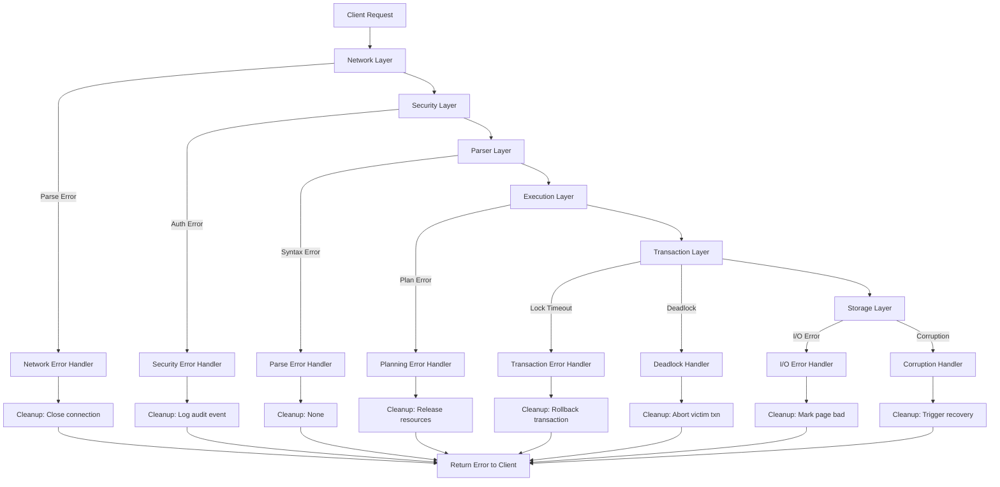
```mermaid
graph TB
    Start[Client Request] --> Network[Network Layer]
    Network --> |Parse Error| NetErr[Network Error Handler]
    Network --> Auth[Security Layer]
    Auth --> |Auth Error| AuthErr[Security Error Handler]
    Auth --> Parser[Parser Layer]
    Parser --> |Syntax Error| ParseErr[Parse Error Handler]
    Parser --> Executor[Execution Layer]
    Executor --> |Plan Error| PlanErr[Planning Error Handler]
    Executor --> Transaction[Transaction Layer]
    Transaction --> |Lock Timeout| TxnErr[Transaction Error Handler]
    Transaction --> |Deadlock| DeadlockErr[Deadlock Handler]
    Transaction --> Storage[Storage Layer]
    Storage --> |I/O Error| IOErr[I/O Error Handler]
    Storage --> |Corruption| CorruptErr[Corruption Handler]

    NetErr --> Cleanup1[Cleanup: Close connection]
    AuthErr --> Cleanup2[Cleanup: Log audit event]
    ParseErr --> Cleanup3[Cleanup: None]
    PlanErr --> Cleanup4[Cleanup: Release resources]
    TxnErr --> Cleanup5[Cleanup: Rollback transaction]
    DeadlockErr --> Cleanup6[Cleanup: Abort victim txn]
    IOErr --> Cleanup7[Cleanup: Mark page bad]
    CorruptErr --> Cleanup8[Cleanup: Trigger recovery]

    Cleanup1 --> Return[Return Error to Client]
    Cleanup2 --> Return
    Cleanup3 --> Return
    Cleanup4 --> Return
    Cleanup5 --> Return
    Cleanup6 --> Return
    Cleanup7 --> Return
    Cleanup8 --> Return
```

### 5.2 Error Recovery

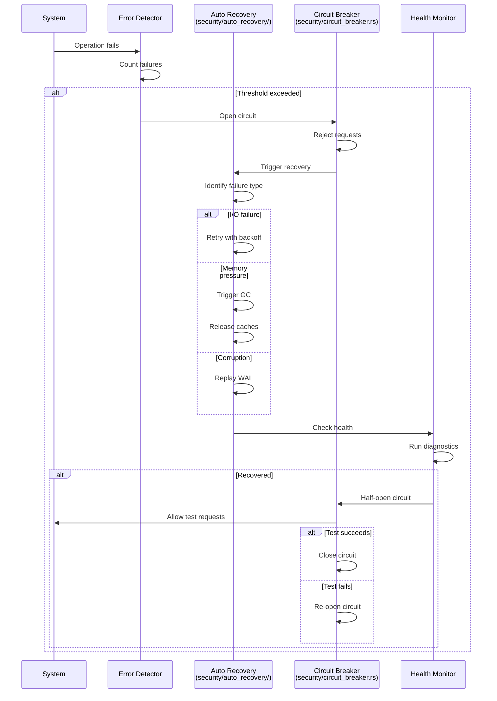
```mermaid
sequenceDiagram
    participant System
    participant ErrorDetector as Error Detector
    participant Recovery as Auto Recovery<br/>(security/auto_recovery/)
    participant CircuitBreaker as Circuit Breaker<br/>(security/circuit_breaker.rs)
    participant HealthCheck as Health Monitor

    System->>ErrorDetector: Operation fails
    ErrorDetector->>ErrorDetector: Count failures

    alt Threshold exceeded
        ErrorDetector->>CircuitBreaker: Open circuit
        CircuitBreaker->>CircuitBreaker: Reject requests
        CircuitBreaker->>Recovery: Trigger recovery

        Recovery->>Recovery: Identify failure type
        alt I/O failure
            Recovery->>Recovery: Retry with backoff
        else Memory pressure
            Recovery->>Recovery: Trigger GC
            Recovery->>Recovery: Release caches
        else Corruption
            Recovery->>Recovery: Replay WAL
        end

        Recovery->>HealthCheck: Check health
        HealthCheck->>HealthCheck: Run diagnostics

        alt Recovered
            HealthCheck->>CircuitBreaker: Half-open circuit
            CircuitBreaker->>System: Allow test requests
            alt Test succeeds
                CircuitBreaker->>CircuitBreaker: Close circuit
            else Test fails
                CircuitBreaker->>CircuitBreaker: Re-open circuit
            end
        end
    end
```

---

## 6. Network Protocol Flow

### 6.1 PostgreSQL Wire Protocol Compatible

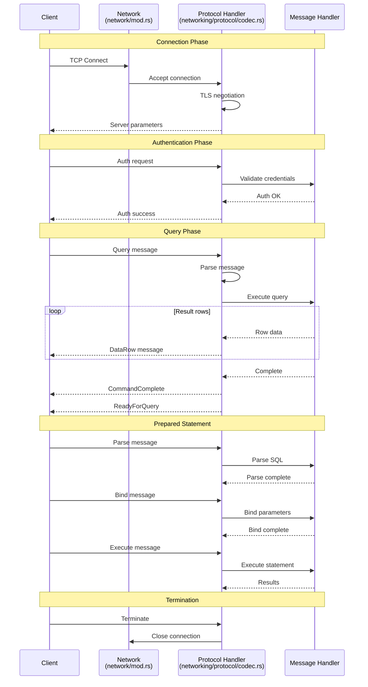
```mermaid
sequenceDiagram
    participant Client
    participant Network as Network<br/>(network/mod.rs)
    participant Protocol as Protocol Handler<br/>(networking/protocol/codec.rs)
    participant Handler as Message Handler

    Note over Client,Handler: Connection Phase
    Client->>Network: TCP Connect
    Network->>Protocol: Accept connection
    Protocol->>Protocol: TLS negotiation
    Protocol-->>Client: Server parameters

    Note over Client,Handler: Authentication Phase
    Client->>Protocol: Auth request
    Protocol->>Handler: Validate credentials
    Handler-->>Protocol: Auth OK
    Protocol-->>Client: Auth success

    Note over Client,Handler: Query Phase
    Client->>Protocol: Query message
    Protocol->>Protocol: Parse message
    Protocol->>Handler: Execute query

    loop Result rows
        Handler-->>Protocol: Row data
        Protocol-->>Client: DataRow message
    end

    Handler-->>Protocol: Complete
    Protocol-->>Client: CommandComplete
    Protocol-->>Client: ReadyForQuery

    Note over Client,Handler: Prepared Statement
    Client->>Protocol: Parse message
    Protocol->>Handler: Parse SQL
    Handler-->>Protocol: Parse complete

    Client->>Protocol: Bind message
    Protocol->>Handler: Bind parameters
    Handler-->>Protocol: Bind complete

    Client->>Protocol: Execute message
    Protocol->>Handler: Execute statement
    Handler-->>Protocol: Results

    Note over Client,Handler: Termination
    Client->>Protocol: Terminate
    Protocol->>Network: Close connection
```

---

## 7. Storage & Buffer Flow

### 7.1 Page Management

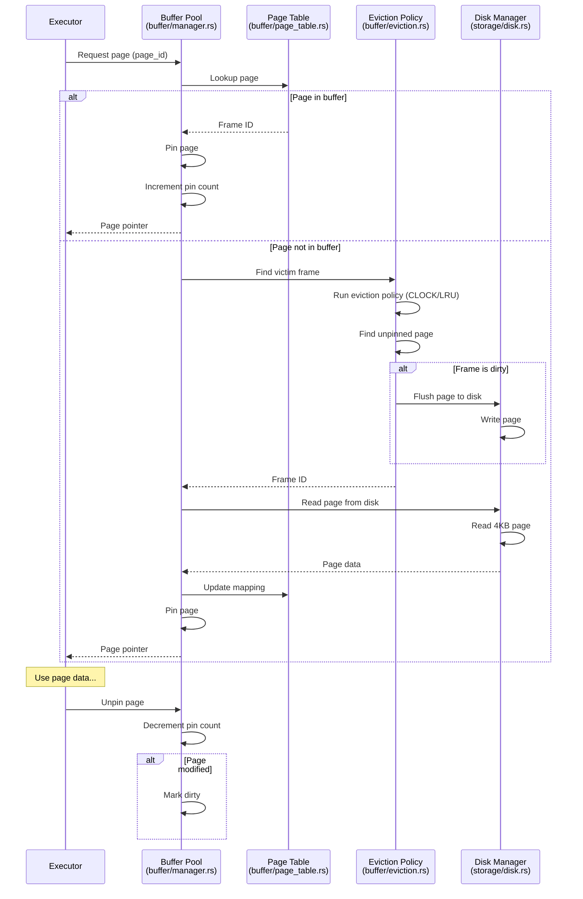
```mermaid
sequenceDiagram
    participant Executor
    participant Buffer as Buffer Pool<br/>(buffer/manager.rs)
    participant PageTable as Page Table<br/>(buffer/page_table.rs)
    participant Eviction as Eviction Policy<br/>(buffer/eviction.rs)
    participant DiskMgr as Disk Manager<br/>(storage/disk.rs)

    Executor->>Buffer: Request page (page_id)
    Buffer->>PageTable: Lookup page

    alt Page in buffer
        PageTable-->>Buffer: Frame ID
        Buffer->>Buffer: Pin page
        Buffer->>Buffer: Increment pin count
        Buffer-->>Executor: Page pointer

    else Page not in buffer
        Buffer->>Eviction: Find victim frame
        Eviction->>Eviction: Run eviction policy (CLOCK/LRU)
        Eviction->>Eviction: Find unpinned page
        alt Frame is dirty
            Eviction->>DiskMgr: Flush page to disk
            DiskMgr->>DiskMgr: Write page
        end
        Eviction-->>Buffer: Frame ID

        Buffer->>DiskMgr: Read page from disk
        DiskMgr->>DiskMgr: Read 4KB page
        DiskMgr-->>Buffer: Page data

        Buffer->>PageTable: Update mapping
        Buffer->>Buffer: Pin page
        Buffer-->>Executor: Page pointer
    end

    Note over Executor: Use page data...

    Executor->>Buffer: Unpin page
    Buffer->>Buffer: Decrement pin count
    alt Page modified
        Buffer->>Buffer: Mark dirty
    end
```

### 7.2 Background Writer

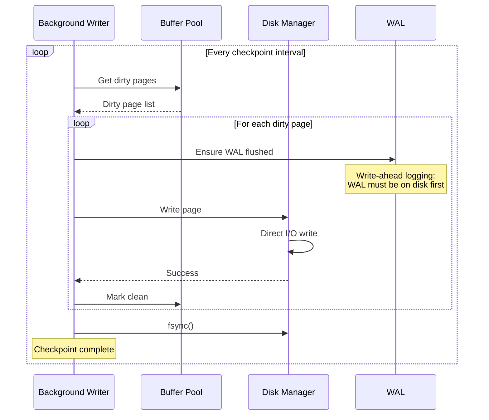
```mermaid
sequenceDiagram
    participant BGWriter as Background Writer
    participant Buffer as Buffer Pool
    participant DiskMgr as Disk Manager
    participant WAL as WAL

    loop Every checkpoint interval
        BGWriter->>Buffer: Get dirty pages
        Buffer-->>BGWriter: Dirty page list

        loop For each dirty page
            BGWriter->>WAL: Ensure WAL flushed
            Note over WAL: Write-ahead logging:<br/>WAL must be on disk first

            BGWriter->>DiskMgr: Write page
            DiskMgr->>DiskMgr: Direct I/O write
            DiskMgr-->>BGWriter: Success

            BGWriter->>Buffer: Mark clean
        end

        BGWriter->>DiskMgr: fsync()
        Note over BGWriter: Checkpoint complete
    end
```

---

## 8. Backup & Recovery Flow

### 8.1 Point-in-Time Recovery (PITR)

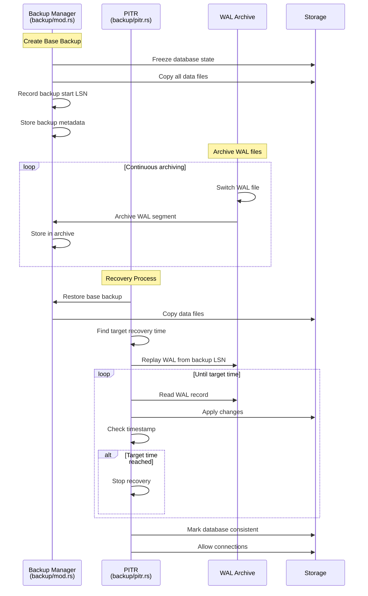
```mermaid
sequenceDiagram
    participant Backup as Backup Manager<br/>(backup/mod.rs)
    participant PITR as PITR<br/>(backup/pitr.rs)
    participant WAL as WAL Archive
    participant Storage as Storage

    Note over Backup: Create Base Backup
    Backup->>Storage: Freeze database state
    Backup->>Storage: Copy all data files
    Backup->>Backup: Record backup start LSN
    Backup->>Backup: Store backup metadata

    Note over WAL: Archive WAL files
    loop Continuous archiving
        WAL->>WAL: Switch WAL file
        WAL->>Backup: Archive WAL segment
        Backup->>Backup: Store in archive
    end

    Note over PITR: Recovery Process
    PITR->>Backup: Restore base backup
    Backup->>Storage: Copy data files
    PITR->>PITR: Find target recovery time
    PITR->>WAL: Replay WAL from backup LSN

    loop Until target time
        PITR->>WAL: Read WAL record
        PITR->>Storage: Apply changes
        PITR->>PITR: Check timestamp
        alt Target time reached
            PITR->>PITR: Stop recovery
        end
    end

    PITR->>Storage: Mark database consistent
    PITR->>Storage: Allow connections
```

---

## 9. Data Transformation Points

### Summary of All Transformation Points

| Layer | Input Format | Transformation | Output Format |
|-------|-------------|----------------|---------------|
| **Network** | Wire protocol bytes | Protocol decode | SQL string |
| **Parser** | SQL string | Parsing | AST (Abstract Syntax Tree) |
| **Planner** | AST | Planning | Logical plan tree |
| **Optimizer** | Logical plan | Optimization | Physical plan |
| **Executor** | Physical plan | Execution | In-memory rows |
| **MVCC** | In-memory rows | Version tracking | Versioned tuples |
| **Buffer** | Versioned tuples | Serialization | Page bytes |
| **Storage** | Page bytes | I/O | Disk blocks |
| **WAL** | Operations | Logging | WAL records |
| **Replication** | WAL records | Streaming | Replica WAL |
| **Index** | Row data | Indexing | B-tree/LSM entries |
| **Network (Response)** | Result rows | Protocol encode | Wire protocol bytes |

---

## 10. Critical Data Paths Summary

### Hot Path (Query Execution)
```
Client → Network → Auth → Parser → Planner → Optimizer → Executor → Buffer → Storage
         ←         ←       ←         ←          ←          ←         ←
```
**Optimization Focus:** Minimize allocations, use SIMD, cache plans

### Write Path (INSERT/UPDATE)
```
Client → ... → Executor → WAL → Buffer → Index → Storage
                          ↓
                      Transaction
                          ↓
                        Locks
```
**Optimization Focus:** Batch writes, async fsync, lock-free indexes

### Replication Path
```
Primary WAL → Replication Manager → Network → Replica WAL → Apply Worker
```
**Optimization Focus:** Parallel apply, compression, delta encoding

### Recovery Path
```
Storage → WAL Archive → PITR → Replay Engine → Storage
```
**Optimization Focus:** Parallel replay, skip unchanged pages

---

## 11. Error Paths Summary

### Common Error Scenarios

1. **Connection Error**
   - Path: Network → Error Handler → Client
   - Cleanup: Close socket, log event

2. **Authentication Error**
   - Path: Security → Audit → Error Handler → Client
   - Cleanup: Log failed attempt, rate limit

3. **Parse Error**
   - Path: Parser → Error Handler → Client
   - Cleanup: None (stateless)

4. **Deadlock**
   - Path: Lock Manager → Deadlock Detector → Transaction → Rollback → Client
   - Cleanup: Abort transaction, release locks

5. **I/O Error**
   - Path: Storage → Error Handler → Recovery → Client
   - Cleanup: Retry, mark page bad, trigger fsck

6. **Corruption Detected**
   - Path: Storage → Corruption Detector → Auto Recovery → WAL Replay
   - Cleanup: Restore from backup, replay WAL

---

## 12. Performance Bottlenecks

### Identified Bottlenecks in Data Flow

| Location | Bottleneck | Impact | Solution |
|----------|-----------|--------|----------|
| Buffer Pool | Lock contention on page table | HIGH | Lock-free page table (implemented) |
| Transaction | Lock manager scalability | HIGH | Lock-free lock table, deadlock detector |
| Storage | Random I/O for row lookups | HIGH | Index-organized tables, columnar storage |
| WAL | fsync on every commit | MEDIUM | Group commit, async replication |
| Network | Protocol serialization | MEDIUM | Binary protocol, compression |
| Parser | SQL parsing overhead | LOW | Plan caching, prepared statements |

---

*Generated: 2025-12-16*
*Next Review: After performance profiling*
