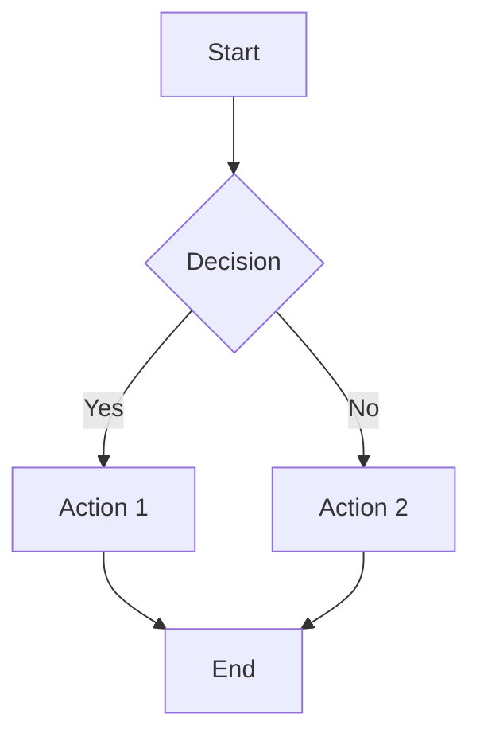

# RustyDB Architecture Diagrams

**Purpose**: Comprehensive visual documentation of RustyDB's architecture, data flows, and system interactions
**Created**: 2025-12-17
**Maintained By**: Architecture Analysis Team

## Overview

This directory contains architecture diagrams, data flow visualizations, and analysis documentation for all major subsystems of RustyDB. The diagrams are organized by functional domain to facilitate understanding and maintenance of the codebase.

## Directory Structure

```
diagrams/
├── README.md                    # This file
├── MASTER_FINDINGS.md          # Aggregated issues and recommendations
├── storage/                    # Storage Layer diagrams
│   └── ANALYSIS.md            # Storage layer analysis
├── transaction/               # Transaction Layer diagrams
│   └── ANALYSIS.md            # Transaction layer analysis
├── query/                     # Query Processing diagrams
│   └── ANALYSIS.md            # Query processing analysis
├── index/                     # Index & SIMD diagrams
│   └── ANALYSIS.md            # Index & SIMD analysis
├── network/                   # Networking & API diagrams
│   └── ANALYSIS.md            # Network & API analysis
├── security/                  # Security diagrams
│   └── ANALYSIS.md            # Security analysis
├── clustering/                # Clustering & Replication diagrams
│   └── ANALYSIS.md            # Clustering & replication analysis
└── specialized/               # Specialized Engines diagrams
    └── ANALYSIS.md            # Specialized engines analysis
```

## Diagram Types

Each subdirectory may contain the following types of diagrams:

### 1. Architecture Diagrams
- **Purpose**: Show high-level component organization
- **Format**: Mermaid graph or flowchart
- **Naming**: `architecture_*.md`
- **Content**: Components, layers, boundaries, interfaces

### 2. Data Flow Diagrams
- **Purpose**: Illustrate how data moves through the system
- **Format**: Mermaid flowchart or sequence diagram
- **Naming**: `dataflow_*.md`
- **Content**: Data sources, transformations, storage, outputs

### 3. Sequence Diagrams
- **Purpose**: Show interaction sequences between components
- **Format**: Mermaid sequence diagram
- **Naming**: `sequence_*.md`
- **Content**: Temporal ordering of operations

### 4. State Diagrams
- **Purpose**: Represent state machines and transitions
- **Format**: Mermaid state diagram
- **Naming**: `state_*.md`
- **Content**: States, transitions, events, guards

### 5. Dependency Graphs
- **Purpose**: Show module dependencies and relationships
- **Format**: Mermaid graph
- **Naming**: `dependencies_*.md`
- **Content**: Modules, dependencies, circular dependencies

### 6. Entity-Relationship Diagrams
- **Purpose**: Show data model relationships
- **Format**: Mermaid ER diagram
- **Naming**: `er_*.md`
- **Content**: Entities, attributes, relationships

## Subsystem Documentation

### Storage Layer (`storage/`)
Covers: `storage/`, `buffer/`, `memory/`, `io/`

**Key Diagrams**:
- Page layout and structure
- Buffer pool management flow
- Memory allocation strategies
- I/O operation sequences
- Partitioning architecture

### Transaction Layer (`transaction/`)
Covers: `transaction/`

**Key Diagrams**:
- MVCC version chain management
- Transaction lifecycle state machine
- Lock manager operation flow
- WAL write and recovery process
- Isolation level implementations

### Query Processing (`query/`)
Covers: `parser/`, `execution/`, `optimizer_pro/`

**Key Diagrams**:
- SQL parsing pipeline
- Query execution plan generation
- Cost-based optimization flow
- Parallel execution coordination
- CTE execution strategy

### Index & SIMD (`index/`)
Covers: `index/`, `simd/`

**Key Diagrams**:
- Index structure comparisons (B-Tree, LSM, Hash, R-Tree)
- SIMD operation pipelines
- Index selection decision tree
- Vectorized aggregation flow

### Networking & API (`network/`)
Covers: `network/`, `api/`, `pool/`

**Key Diagrams**:
- Network protocol layers
- Connection lifecycle
- API request/response flow
- GraphQL query execution
- Connection pool management

### Security (`security/`)
Covers: `security/`, `security_vault/`

**Key Diagrams**:
- Security module integration
- Authentication/authorization flow
- Encryption pipeline
- Audit logging architecture
- Threat detection workflow

### Clustering & Replication (`clustering/`)
Covers: `clustering/`, `rac/`, `replication/`, `advanced_replication/`, `backup/`

**Key Diagrams**:
- Raft consensus protocol flow
- Cache Fusion operation sequence
- Replication topology
- Conflict resolution decision tree
- Backup and recovery process

### Specialized Engines (`specialized/`)
Covers: `graph/`, `document_store/`, `spatial/`, `ml/`, `inmemory/`, and all remaining modules

**Key Diagrams**:
- Graph traversal algorithms
- Document store indexing
- ML model execution pipeline
- Lock-free data structure operations
- Stream processing flow

## Diagram Format Standards

### Mermaid Syntax
All diagrams should use Mermaid syntax for consistency and renderability in Markdown viewers.

Example:


### Naming Conventions
- Use lowercase with underscores: `data_flow_storage.md`
- Include subsystem prefix: `storage_architecture.md`
- Be descriptive: `transaction_mvcc_version_chain.md`

### Documentation Requirements
Each diagram file should include:
1. **Title**: Clear, descriptive title
2. **Purpose**: What the diagram illustrates
3. **Scope**: What modules/components are covered
4. **Diagram**: The Mermaid diagram code
5. **Legend**: Explanation of symbols/colors (if needed)
6. **Notes**: Important observations, caveats, or related diagrams

## Analysis Documentation

Each subdirectory contains an `ANALYSIS.md` file with:
- **Overview**: Summary of the subsystem
- **Key Components**: Major components and their responsibilities
- **Data Flows**: Critical data flow paths
- **Inefficiencies**: Identified performance issues
- **Duplications**: Redundant code or logic
- **Open-ended Segments**: Unbounded allocations, missing limits
- **Recommendations**: Proposed improvements
- **Diagrams Index**: List of all diagrams in the directory

## Contributing

When adding or updating diagrams:

1. **Validate Mermaid syntax**: Use a Mermaid live editor to verify
2. **Keep diagrams focused**: One concept per diagram
3. **Update ANALYSIS.md**: Reference new diagrams in the analysis doc
4. **Cross-reference**: Link related diagrams
5. **Update MASTER_FINDINGS.md**: Add critical issues to the master list

## Tools

### Recommended Mermaid Editors
- [Mermaid Live Editor](https://mermaid.live/)
- VS Code with Mermaid extension
- GitHub/GitLab (renders Mermaid natively)

### Diagram Guidelines
- **Complexity**: Keep diagrams simple; break complex systems into multiple diagrams
- **Readability**: Use clear labels and consistent styling
- **Hierarchy**: Show appropriate level of detail for the audience
- **Currency**: Update diagrams when code changes

## Master Findings

Critical issues, duplications, and recommendations across all subsystems are consolidated in `MASTER_FINDINGS.md`. This file serves as the executive summary for the entire analysis effort.

## References

- **CLAUDE.md**: Project build and development instructions
- **.scratchpad/ANALYSIS_COORDINATION.md**: Analysis coordination and agent assignments
- **docs/ARCHITECTURE.md**: Detailed architecture documentation

---

**Last Updated**: 2025-12-17
**Maintainer**: Architecture Analysis Team
