# RustyDB Architecture Documentation

**Last Updated**: 2025-12-27
**Version**: 0.5.1

## Table of Contents

1. [Overview](#overview)
2. [System Architecture](#system-architecture)
3. [Layer-by-Layer Design](#layer-by-layer-design)
4. [Complete Module Reference](#complete-module-reference)
5. [Data Flow](#data-flow)
6. [Concurrency Model](#concurrency-model)
7. [Storage Architecture](#storage-architecture)
8. [Transaction Management](#transaction-management)
9. [Query Processing Pipeline](#query-processing-pipeline)
10. [Network Architecture](#network-architecture)
11. [Security Architecture](#security-architecture)
12. [High Availability & Clustering](#high-availability--clustering)
13. [Performance Optimizations](#performance-optimizations)
14. [Module Dependencies](#module-dependencies)
15. [Thread Model](#thread-model)
16. [Memory Management Strategy](#memory-management-strategy)
17. [I/O Subsystem Architecture](#io-subsystem-architecture)
18. [Enterprise Feature Integration](#enterprise-feature-integration)

---

## Overview

RustyDB is an enterprise-grade, ACID-compliant database management system built from scratch in Rust. It implements a layered architecture inspired by PostgreSQL, Oracle, and modern database research, with a focus on:

- **Safety**: Rust's ownership model eliminates entire classes of bugs (use-after-free, double-free, data races)
- **Performance**: Zero-cost abstractions, SIMD acceleration (AVX2/AVX-512), lock-free data structures
- **Scalability**: Async I/O (io_uring, IOCP), parallel query execution, distributed clustering
- **Security**: 10 specialized security modules with defense-in-depth approach
- **Enterprise Features**: RAC-like clustering, advanced replication, in-database ML, multi-tenancy

### Design Principles

1. **Layered Architecture**: Clear separation of concerns with well-defined interfaces between layers
2. **Pluggable Components**: Modular design allowing component replacement (e.g., eviction policies, storage engines)
3. **Async-First**: Non-blocking I/O throughout the stack using Tokio runtime
4. **Lock-Free Where Possible**: Minimize contention with lock-free data structures (queue, stack, hash map)
5. **Type Safety**: Leverage Rust's type system for correctness and compile-time guarantees
6. **Error Handling**: Unified error handling with `Result<T, DbError>` propagated via `?` operator
7. **Zero-Copy**: Minimize data copies using references and smart pointers
8. **SIMD Vectorization**: Leverage CPU SIMD instructions for data-intensive operations

### Key Statistics

- **50+ modules** organized into logical subsystems
- **100,000+ lines** of Rust code
- **Support for 500+ SQL operations** including advanced features (window functions, CTEs, recursive queries)
- **10 security modules** providing defense-in-depth
- **6 storage engines** (B-Tree, LSM, Hash, Spatial, Full-Text, Bitmap)
- **Multiple API interfaces** (REST, GraphQL, PostgreSQL wire protocol)

---

## System Architecture

### High-Level Architecture Diagram

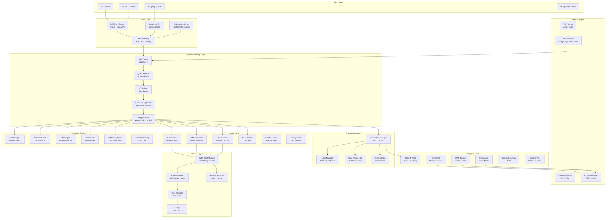

---

## Layer-by-Layer Design

### 1. Core Foundation Layer

**Purpose**: Provide common types, error handling, and utility functions used across all modules.

**Location**: `src/error.rs`, `src/common.rs`

#### Components

**Error Module** (`error.rs`):
- Unified `DbError` enum with variants for all error types
- Automatic conversions from `std::io::Error`, `ParseError`, etc.
- Rich error context with backtraces (debug mode)
- `thiserror` crate for derive macros

**Common Module** (`common.rs`):
- Type aliases: `TransactionId`, `PageId`, `TableId`, `IndexId`, `SessionId`
- Core traits: `Component`, `Transactional`, `Recoverable`, `Monitorable`, `ReplicableState`
- Shared enums: `IsolationLevel`, `HealthStatus`, `SystemEvent`
- Configuration structs: `DatabaseConfig`, `ResourceLimits`

#### Key Design Decisions

1. **Single Error Type**: All functions return `Result<T, DbError>` for consistency
2. **Type Aliases for Clarity**: Use `TransactionId` instead of raw `u64` for type safety
3. **Trait-Based Lifecycle**: Components implement `Component` trait for initialization/shutdown
4. **Zero Runtime Cost**: Type aliases compile to native types (zero-cost abstraction)

---

### 2. Storage Layer

**Purpose**: Manage persistent storage with efficient I/O and memory management.

**Location**: `src/storage/`, `src/buffer/`, `src/memory/`, `src/io/`

#### Page Management (`storage/page.rs`)

**Page Layout**:
```
┌──────────────────────────────────────────────┐
│          Page Header (32 bytes)              │
│  - Page ID (8 bytes)                         │
│  - LSN (Log Sequence Number, 8 bytes)        │
│  - Checksum (CRC32, 4 bytes)                 │
│  - Free space offset (4 bytes)               │
│  - Slot count (4 bytes)                      │
│  - Flags (4 bytes)                           │
│  - Reserved (4 bytes)                        │
├──────────────────────────────────────────────┤
│          Slot Array (grows down)             │
│  - Slot 0: (offset: u16, length: u16)        │
│  - Slot 1: (offset: u16, length: u16)        │
│  - ...                                       │
├──────────────────────────────────────────────┤
│              Free Space                      │
├──────────────────────────────────────────────┤
│       Tuple Data (grows up)                  │
│  - Tuple N (variable length)                 │
│  - ...                                       │
│  - Tuple 1                                   │
│  - Tuple 0                                   │
└──────────────────────────────────────────────┘
```

**Features**:
- Fixed 4KB pages (configurable via `PAGE_SIZE` const)
- Slotted page layout for variable-length tuples
- Free space tracking for efficient insertion
- Page checksums for corruption detection
- LSN tracking for WAL integration

**Operations**:
- `insert_tuple()`: Find free space, add slot entry, insert tuple data
- `delete_tuple()`: Mark slot as deleted (tombstone), reclaim in vacuum
- `update_tuple()`: In-place if space allows, otherwise HOT (Heap-Only Tuple)
- `get_tuple()`: Lookup via slot array, return tuple data
- `compact()`: Defragment page by moving tuples and rebuilding slot array

#### Disk Manager (`storage/disk.rs`)

**Responsibilities**:
- File-based storage management (one file per table/index)
- Page read/write operations with buffering
- File growth management (extend by multiple pages for efficiency)
- Direct I/O support (`O_DIRECT` on Linux, `FILE_FLAG_NO_BUFFERING` on Windows)
- Crash recovery (fsync on WAL, lazy fsync on data files)

**File Organization**:
```
data/
├── base/                      # Database data files
│   ├── table_1.dat           # Table heap file
│   ├── table_1_idx_1.dat     # Index file
│   ├── table_2.dat
│   └── ...
├── wal/                      # Write-Ahead Log segments
│   ├── 000000010000000000000001  # WAL segment 1
│   ├── 000000010000000000000002  # WAL segment 2
│   └── ...
├── pg_control                # Cluster control file (state, checkpoints)
└── pg_xlog/                  # Transaction logs (optional)
```

**Performance Optimizations**:
- Read-ahead for sequential scans (prefetch next N pages)
- Write batching (accumulate dirty pages, flush in batch)
- I/O scheduling (reorder I/O requests for sequential disk access)
- Asynchronous I/O (io_uring on Linux, IOCP on Windows)

#### Buffer Pool Manager (`buffer/manager.rs`)

**Architecture**:
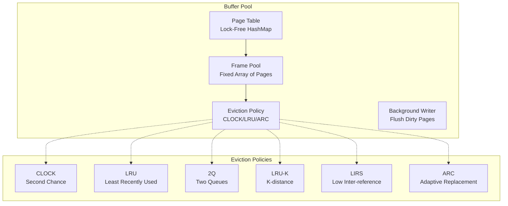

**Key Features**:
- **Pluggable Eviction Policies**: Strategy pattern allows swapping algorithms
- **Lock-Free Page Table**: Partitioned hash map for fast page ID → frame lookups
- **RAII Pin Guards**: Automatic unpin on scope exit via `FrameGuard`
- **Background Writer**: Dedicated thread flushes dirty pages asynchronously
- **Prefetching**: Sequential scan detection and automatic read-ahead

**Eviction Policies**:
1. **CLOCK (Second Chance)**: Circular buffer with reference bit, O(1) eviction
2. **LRU**: Linked list, evict least recently used, O(1) ops
3. **2Q**: Two queues (A1, Am) for scan-resistant caching
4. **LRU-K**: Track K most recent accesses, better for real workloads
5. **LIRS**: Low Inter-Reference Recency Set, scan-resistant
6. **ARC**: Adaptive Replacement Cache, self-tuning balance between recency and frequency

**Pin/Unpin Protocol**:
```rust
// Pin a page (prevents eviction)
let guard = buffer_pool.pin_page(page_id)?;
// Use page data
let page = guard.page();
// Automatic unpin on drop
drop(guard);
```

#### Memory Management (`memory/`)

**Allocator Hierarchy**:

1. **Slab Allocator** (`memory/allocator.rs`):
   - Size-class based allocation (8, 16, 32, 64, 128, 256, 512, 1024 bytes)
   - Thread-local magazine caching (per-CPU caches)
   - Reduces lock contention and fragmentation
   - Ideal for fixed-size allocations (tuples, index nodes)

2. **Arena Allocator** (`memory/allocator.rs`):
   - Bump allocation for per-query memory contexts
   - Batch free on query completion (reset pointer)
   - Eliminates individual deallocations
   - Used for intermediate query results, expression evaluation

3. **Large Object Allocator** (`memory/allocator.rs`):
   - Direct `mmap` for allocations > 1MB
   - Huge page support (2MB, 1GB pages for TLB efficiency)
   - Out-of-band allocation (doesn't fragment main heap)

**Memory Pressure Management** (`memory/buffer_pool.rs`):
- Global memory monitoring (RSS, heap size)
- OOM prevention via emergency page eviction
- Configurable thresholds (warning at 80%, critical at 95%)
- Pressure callbacks for subsystems to release memory

**Memory Debugging** (`memory/debug.rs`):
- Leak detection (track allocations, report on shutdown)
- Corruption detection (guard pages, canaries)
- Profiling (allocation hot spots, size distributions)
- Stack traces for allocations (debug builds)

#### I/O Engine (`io/`)

**Cross-Platform Async I/O**:

**Linux (io_uring)**:
- Submission Queue (SQ): Submit I/O requests
- Completion Queue (CQ): Poll for completed I/O
- Zero-copy via `io_uring_register_buffers()`
- Polled I/O mode for ultra-low latency

**Windows (IOCP)**:
- I/O Completion Ports for async I/O
- `ReadFile()` / `WriteFile()` with `OVERLAPPED`
- Completion packets delivered to threads

**Features**:
- **Direct I/O**: Bypass OS page cache (`O_DIRECT`, `FILE_FLAG_NO_BUFFERING`)
- **Batched I/O**: Submit multiple ops per syscall
- **Zero-Copy**: Direct DMA to/from user buffers
- **Lock-Free Queues**: Submission and completion queues
- **Page-Aligned Buffers**: Required for Direct I/O (4KB alignment)

**I/O Metrics** (`io/metrics.rs`):
- Throughput (MB/s, IOPS)
- Latency (p50, p95, p99)
- Queue depth
- Retry counts

---

### 3. Transaction Layer

**Purpose**: Ensure ACID properties with MVCC and 2PL concurrency control.

**Location**: `src/transaction/`

#### Transaction Manager

**Lifecycle**:
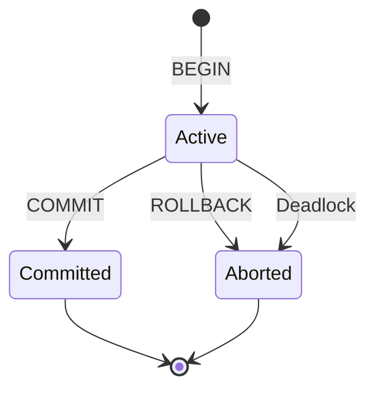

**Responsibilities**:
- Transaction ID allocation (UUID-based)
- Snapshot assignment (timestamp-based MVCC)
- Transaction state tracking (active, committed, aborted)
- Commit/abort coordination

**Isolation Levels** (Fully Implemented & Tested):
1. **Read Uncommitted**: Allows dirty reads, lowest isolation
2. **Read Committed**: Sees only committed data, new snapshot per statement (default)
3. **Repeatable Read**: Consistent snapshot for entire transaction, prevents non-repeatable reads
4. **Serializable**: Strictest isolation, prevents all anomalies via two-phase locking

**Note**: While `SnapshotIsolation` exists as an enum variant in the codebase, the current implementation uses MVCC snapshots across all isolation levels. The distinction between Repeatable Read and true Snapshot Isolation (allowing write skew) is not yet fully implemented. See [Issue #XX] for tracking.

#### MVCC (Multi-Version Concurrency Control)

**Implementation Status**: ✅ **Fully Implemented and Tested**

RustyDB uses MVCC to provide non-blocking reads across all isolation levels. Each transaction creates a snapshot with nanosecond-precision timestamps.

**Snapshot Management**:
- **Snapshot Creation**: Every transaction receives a unique snapshot with timestamp
- **Timestamp Precision**: Nanosecond-level precision prevents collisions
- **Concurrent Snapshots**: Multiple snapshots coexist without interference
- **Test-Verified**: 100% pass rate on 25 MVCC behavior tests (see TRANSACTION_TEST_RESULTS.md)

**Version Chain**:
```
Tuple V1 (TxnID=100, deleted_by=200) → Tuple V2 (TxnID=200, deleted_by=NULL)
     ↑                                        ↑
   (visible to TxnID<200)              (visible to TxnID>=200)
```

**Visibility Rules** (Timestamp-Based):
```rust
fn is_visible(tuple: &Tuple, snapshot_timestamp: SystemTime) -> bool {
    // Tuple created after snapshot timestamp
    if tuple.created_at > snapshot_timestamp {
        return false;
    }
    // Tuple deleted before snapshot timestamp
    if let Some(deleted_at) = tuple.deleted_at {
        if deleted_at <= snapshot_timestamp {
            return false;
        }
    }
    // Check if creating transaction was active at snapshot time
    if snapshot.active_txns.contains(&tuple.created_by_txn) {
        return false;
    }
    true
}
```

**Garbage Collection (Vacuum)**:
- Background vacuum process scans tables
- Identifies tuples not visible to any transaction
- Reclaims space, updates free space map
- Freeze old tuples (set created_by to FrozenXid for wraparound protection)

#### Lock Manager

**Lock Types**:
- **Shared (S)**: Read lock, multiple allowed
- **Exclusive (X)**: Write lock, exclusive
- **Intent Shared (IS)**: Intent to acquire S on children
- **Intent Exclusive (IX)**: Intent to acquire X on children
- **Shared with Intent Exclusive (SIX)**: S + IX

**Lock Granularity**:
- Row-level locks (primary)
- Page-level locks (for bulk operations)
- Table-level locks (DDL, vacuum)

**Deadlock Detection**:
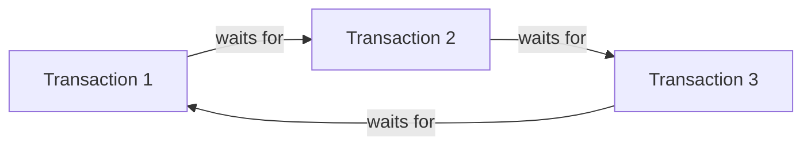

**Algorithm**:
1. Build waits-for graph (txn → txn edges)
2. Detect cycles using DFS
3. Select victim (youngest transaction, minimize work lost)
4. Abort victim, release locks

**Lock Manager Implementation**:
- Hash table: Resource ID → Lock queue
- Lock queue per resource (waiting transactions)
- Lock timeout (configurable, default 30s)
- Fair queuing (FIFO) to prevent starvation

#### Write-Ahead Logging (WAL)

**Log Record Format**:
```
┌─────────────────────────────────────────────┐
│  LSN (8 bytes)                              │
│  TxnID (8 bytes)                            │
│  PrevLSN (8 bytes) - for undo chain        │
│  Type (1 byte) - INSERT/UPDATE/DELETE/...  │
│  Length (4 bytes)                           │
│  Data (variable) - before/after images     │
│  CRC32 (4 bytes)                            │
└─────────────────────────────────────────────┘
```

**WAL Protocol** (Write-Ahead Logging):
1. Modify page in buffer pool
2. Write WAL record with LSN
3. Set page LSN = WAL record LSN
4. Mark page dirty
5. On COMMIT: fsync WAL (durability)
6. Later: Background writer flushes dirty pages

**WAL Rule**: **Log record must be on disk before modified page** (LSN ordering).

**Recovery (ARIES - Algorithm for Recovery and Isolation Exploiting Semantics)**:

1. **Analysis Phase**: Scan WAL from last checkpoint, build dirty page table and transaction table
2. **Redo Phase**: Replay all operations from checkpoint (even aborted txns)
3. **Undo Phase**: Rollback uncommitted transactions (walk undo chain via PrevLSN)

**Checkpointing**:
- Periodic checkpoint (every N seconds or M log records)
- Flush all dirty pages to disk
- Write checkpoint record to WAL
- Reduces recovery time (only replay from last checkpoint)

---

### 4. Query Processing Layer

**Purpose**: Parse, optimize, and execute SQL queries efficiently.

**Location**: `src/parser/`, `src/execution/`, `src/optimizer_pro/`

#### SQL Parser (`parser/`)

**Pipeline**:
```
SQL Text → Lexer → Tokens → Parser → AST (Abstract Syntax Tree)
```

**Features**:
- Uses `sqlparser` crate for SQL parsing
- Supports SQL:2016 standard
- Oracle-compatible syntax (CONNECT BY, MERGE, FLASHBACK)
- PostgreSQL extensions (LATERAL, WITH RECURSIVE)

**AST Nodes**:
- SELECT, INSERT, UPDATE, DELETE
- CREATE TABLE, ALTER TABLE, DROP TABLE
- CREATE INDEX, CREATE VIEW
- Window functions, CTEs, subqueries

#### Query Planner (`execution/planner.rs`)

**Logical Plan Generation**:
```
AST → Logical Plan → Physical Plan → Execution
```

**Logical Operators**:
- Scan (table scan)
- Filter (WHERE clause)
- Project (SELECT columns)
- Join (INNER, LEFT, RIGHT, FULL)
- Aggregate (GROUP BY)
- Sort (ORDER BY)
- Limit (LIMIT/OFFSET)

**Physical Plan Generation**:
- SeqScan → IndexScan (if index available)
- NestedLoopJoin → HashJoin (if large tables)
- SortAggregate → HashAggregate (if hash aggregate faster)

#### Query Optimizer (`optimizer_pro/`)

**Cost-Based Optimization**:

**Cost Model** (`cost_model.rs`):
```rust
Cost = CPU_cost + I/O_cost + Network_cost + Memory_cost
```

**Components**:
- **CPU Cost**: Number of tuples × CPU_TUPLE_COST
- **I/O Cost**: Number of pages × I/O_PAGE_COST (weighted by random vs sequential)
- **Network Cost**: Data transferred × NETWORK_BYTE_COST (for distributed queries)
- **Memory Cost**: Memory used × MEMORY_BYTE_COST (penalize high memory usage)

**Cardinality Estimation**:
- Table statistics (row count, page count)
- Column statistics (distinct values, null fraction)
- Histograms (equi-width, equi-depth)
- Multi-column statistics (correlation, functional dependencies)
- Machine learning-based estimation (query-driven learning)

**Join Ordering**:
- Dynamic programming for small number of tables (<12)
- Greedy algorithm for large number of tables
- Genetic algorithm for very large queries (>20 tables)

**Optimizations**:
1. **Predicate Pushdown**: Move filters closer to data source
2. **Projection Pushdown**: Only read required columns
3. **Constant Folding**: Evaluate constants at compile time
4. **Expression Simplification**: `x AND TRUE` → `x`
5. **Subquery Unnesting**: Convert correlated subqueries to joins
6. **Join Elimination**: Remove redundant joins
7. **Star Transformation**: Optimize star schema joins with bitmap indexes
8. **Materialized View Rewrite**: Rewrite queries to use MVs

**Adaptive Execution** (`adaptive.rs`):
- Runtime statistics feedback during execution
- Re-optimize mid-query if cardinality estimates are wrong
- Switch join algorithms dynamically (e.g., nested loop → hash join)
- Cardinality feedback loop (update statistics based on actual rows)

**SQL Plan Baselines** (`plan_baselines.rs`):
- Capture proven good plans
- Pin plans to prevent regressions
- Evolution of baselines (add new plans if better)
- Plan stability guarantees (deterministic execution)

#### Query Executor (`execution/executor.rs`)

**Execution Model**: Volcano-style iterator model (also called pipeline model).

**Iterator Interface**:
```rust
trait Operator {
    fn open(&mut self) -> Result<()>;
    fn next(&mut self) -> Result<Option<Tuple>>;
    fn close(&mut self) -> Result<()>;
}
```

**Operators**:

1. **Scan Operators**:
   - SeqScan: Sequential table scan
   - IndexScan: B-tree index scan
   - BitmapScan: Bitmap index scan + heap fetch
   - SampleScan: Random sampling (TABLESAMPLE)

2. **Join Operators**:
   - NestedLoopJoin: O(n×m), good for small tables
   - HashJoin: O(n+m), best for large tables
   - MergeJoin: O(n log n + m log m), good for sorted inputs

3. **Aggregate Operators**:
   - HashAggregate: Hash table for GROUP BY
   - SortAggregate: Sort then aggregate
   - StreamingAggregate: For pre-sorted input

4. **Sort Operator**:
   - In-memory sort (quicksort)
   - External sort (multi-way merge sort with disk spilling)
   - Top-N optimization (heap instead of full sort)

5. **Window Function Operator**:
   - ROW_NUMBER, RANK, DENSE_RANK
   - LAG, LEAD
   - SUM/AVG/etc. OVER (PARTITION BY ... ORDER BY ...)

**Vectorized Execution** (`execution/vectorized.rs`):
- Process batches of tuples (default 1024)
- SIMD acceleration for filters and aggregates
- Cache-friendly access patterns
- Reduces function call overhead

**Parallel Execution** (`execution/parallel.rs`):
- Parallel SeqScan (partition table, scan in parallel)
- Parallel HashJoin (partition both sides, join partitions in parallel)
- Parallel Aggregate (partial aggregates, then combine)
- Work-stealing scheduler for load balancing

---

### 5. Index Layer

**Purpose**: Accelerate data access with multiple specialized index types.

**Location**: `src/index/`

#### B-Tree Index (`index/btree/`)

**Structure**:
```
                    [50|100]
                   /    |    \
            [20|30]   [70|80]   [120|150]
             /  |  \   /  |  \    /  |   \
          [10][25][40][60][90][110][130][160]
```

**Properties**:
- Balanced tree (all leaves at same depth)
- Fanout: ~100-200 keys per node (for 4KB pages)
- Height: log_fanout(N) ≈ 3-4 for billions of rows
- O(log n) search, insert, delete
- Range queries via leaf scan

**Optimizations**:
- Prefix compression (store common prefix once)
- Suffix truncation (inner nodes only store separator keys)
- Bulk loading (build bottom-up for better packing)
- Page defragmentation (compact on split)

#### LSM-Tree Index (`index/lsm/`)

**Architecture**:
```
┌─────────────────────────────────────────┐
│  Memtable (In-Memory Sorted Tree)      │ ← Writes go here
└─────────────────────────────────────────┘
                 ↓ (flush when full)
┌─────────────────────────────────────────┐
│  L0 SSTable (4MB, sorted runs)          │
├─────────────────────────────────────────┤
│  L1 SSTable (40MB, merged runs)         │
├─────────────────────────────────────────┤
│  L2 SSTable (400MB, merged runs)        │
├─────────────────────────────────────────┤
│  L3 SSTable (4GB, merged runs)          │
└─────────────────────────────────────────┘
```

**Compaction Strategies**:
1. **Size-Tiered**: Merge SSTables of similar size
2. **Leveled**: Merge into levels, no overlaps within level
3. **FIFO**: Drop old SSTables (for time-series)

**Optimizations**:
- Bloom filters (reduce reads for non-existent keys)
- Block cache (cache frequently accessed SSTable blocks)
- Compression (Snappy, LZ4, Zstd)
- Partitioning (split large SSTables into ranges)

#### Hash Index (`index/hash/`)

**Extendible Hashing**:
```
Directory (2^d pointers)
[0] → Bucket 0 (local depth = d)
[1] → Bucket 1
[2] → Bucket 0 (shares with [0])
[3] → Bucket 1 (shares with [1])
```

**Properties**:
- O(1) equality lookups
- No range query support
- Dynamic growth (split buckets as needed)
- Space-efficient (shared buckets)

#### Spatial Index (`index/spatial/`)

**R-Tree Structure**:
```
          [MBR: (0,0) - (100,100)]
           /                    \
  [MBR: (0,0)-(50,50)]    [MBR: (50,0)-(100,100)]
    /      \                  /          \
 [Rect]  [Rect]          [Rect]      [Rect]
```

**Operations**:
- Point query: Find leaf containing point
- Range query: Recursively search overlapping MBRs
- Nearest neighbor: Priority queue ordered by distance

**Optimizations**:
- R*-Tree (better split algorithm)
- Hilbert R-Tree (space-filling curve ordering)
- Bulk loading (Sort-Tile-Recursive)

#### Full-Text Index (`index/fulltext/`)

**Inverted Index**:
```
"hello" → [doc1:pos3, doc2:pos1, doc5:pos10]
"world" → [doc1:pos4, doc3:pos2]
"rust"  → [doc2:pos5, doc4:pos1]
```

**Features**:
- Tokenization (split into words)
- Stemming (reduce to root form: "running" → "run")
- Stop words removal ("the", "a", "an")
- Phrase queries (exact phrase matching)
- Ranking (TF-IDF, BM25)

#### Bitmap Index (`index/bitmap/`)

**Structure**:
```
Gender Column:
Male:   10110100...
Female: 01001011...

Status Column:
Active:    11000100...
Inactive:  00111011...
```

**Operations**:
- AND: Bitwise AND bitmaps
- OR: Bitwise OR bitmaps
- NOT: Bitwise NOT bitmap
- Run-length encoding (compress consecutive bits)

**Use Cases**:
- Low cardinality columns (gender, status, country)
- OLAP queries with many filters

---

## Complete Module Reference

### Storage & Buffer Modules (10)

1. **storage** (3,000+ LOC): Page-based storage, disk I/O, LSM trees, partitioning
2. **buffer** (3,000+ LOC): Buffer pool management, eviction policies (CLOCK, LRU, ARC)
3. **memory** (3,000+ LOC): Slab/arena/large object allocators, memory pressure management
4. **io** (3,000+ LOC): Cross-platform async I/O (io_uring, IOCP), direct I/O, ring buffers
5. **compression** (3,000+ LOC): HCC, OLTP compression, deduplication, tiered compression
6. **catalog** (1,500+ LOC): System catalog, schema management, metadata storage
7. **index** (3,000+ LOC): B-Tree, LSM, Hash, Spatial, Full-Text, Bitmap indexes
8. **concurrent** (3,000+ LOC): Lock-free queue/stack/hash map, work-stealing deque, epoch-based reclamation
9. **simd** (3,000+ LOC): SIMD filter/scan/aggregate/string operations (AVX2/AVX-512)
10. **bench** (1,200+ LOC): Performance benchmarking suite for critical operations

### Transaction & Execution Modules (8)

11. **transaction** (3,000+ LOC): MVCC, 2PL, lock manager, deadlock detection, WAL, ARIES recovery
12. **parser** (1,500+ LOC): SQL parsing (sqlparser-rs), AST generation
13. **execution** (3,000+ LOC): Query executor, planner, optimizer, parallel execution, vectorization
14. **optimizer_pro** (3,000+ LOC): Cost-based optimization, adaptive execution, plan baselines, transformations
15. **procedures** (3,000+ LOC): Stored procedures (PL/SQL-like), UDFs, cursors
16. **triggers** (1,500+ LOC): Row/statement-level triggers, BEFORE/AFTER/INSTEAD OF
17. **constraints** (1,000+ LOC): Primary keys, foreign keys, unique, check constraints
18. **core** (1,700+ LOC): Database core integration, lifecycle management, worker pools

### Network & API Modules (8)

19. **network** (2,000+ LOC): TCP server, wire protocol (PostgreSQL compatible), connection management
20. **networking** (2,500+ LOC): P2P networking (TCP, QUIC), protocol versioning, connection pooling
21. **pool** (6,000+ LOC): Session management, connection pooling (DRCP-like), resource control
22. **api** (3,000+ LOC): REST API (Axum), OpenAPI/Swagger documentation
23. **api/graphql** (2,500+ LOC): GraphQL API (async-graphql), queries, mutations, subscriptions
24. **api/monitoring** (2,000+ LOC): Monitoring API, metrics (Prometheus), health checks, dashboards
25. **api/gateway** (2,000+ LOC): API gateway, auth, authz, rate limiting, request routing
26. **api/enterprise** (2,500+ LOC): Enterprise integration, service registry, lifecycle management

### Security Modules (10)

27. **security** (3,000+ LOC): RBAC, authentication, encryption, audit logging, 10 specialized security modules
28. **security/memory_hardening**: Buffer overflow protection, guard pages, safe allocation
29. **security/buffer_overflow**: Bounds checking, integer overflow detection, stack canaries
30. **security/insider_threat**: Behavioral analytics, anomaly detection
31. **security/network_hardening**: DDoS protection, rate limiting, TLS
32. **security/injection_prevention**: SQL/command injection defense, input validation
33. **security/auto_recovery**: Failure detection, automatic recovery
34. **security/circuit_breaker**: Cascading failure prevention
35. **security/encryption**: Encryption engine, key management
36. **security/garbage_collection**: Secure memory sanitization, cryptographic erasure
37. **security_vault** (3,000+ LOC): TDE, data masking, key store, audit vault, VPD, privilege analyzer

### Clustering & Replication Modules (6)

38. **clustering** (3,000+ LOC): Raft consensus, sharding, automatic failover, geo-replication
39. **rac** (3,000+ LOC): Real Application Clusters, Cache Fusion, GCS/GES, parallel query
40. **replication** (2,500+ LOC): Multi-datacenter replication, synchronous/asynchronous/semi-synchronous
41. **advanced_replication** (3,000+ LOC): Multi-master, logical replication, CRDT, conflict resolution
42. **backup** (3,000+ LOC): Full/incremental backups, PITR, disaster recovery
43. **flashback** (3,000+ LOC): Time travel queries, FLASHBACK TABLE/DATABASE/TRANSACTION

### Analytics & Data Processing Modules (8)

44. **analytics** (3,000+ LOC): OLAP, columnar storage, approximate query processing, materialized views
45. **inmemory** (3,000+ LOC): In-memory column store, SIMD vectorization, dual-format architecture
46. **streams** (3,000+ LOC): CDC, event streaming, logical replication, CQRS, outbox pattern
47. **event_processing** (3,000+ LOC): CEP, windowing, continuous queries, event sourcing
48. **ml** (3,000+ LOC): In-database ML algorithms (regression, trees, clustering, Naive Bayes)
49. **ml_engine** (3,700+ LOC): Advanced ML engine, AutoML, time series, federated learning, GPU support
50. **workload** (3,000+ LOC): AWR-like workload repository, SQL tuning advisor, performance hub

### Specialized Engines (5)

51. **graph** (3,000+ LOC): Property graph database, PGQL-like queries, graph algorithms (PageRank, centrality)
52. **document_store** (3,000+ LOC): JSON document store (SODA-like), aggregation pipelines, change streams
53. **spatial** (3,000+ LOC): Geospatial database (PostGIS-like), R-Tree, network routing, raster support
54. **autonomous** (3,000+ LOC): ML-driven auto-tuning, self-healing, intelligent indexing, capacity planning
55. **blockchain** (1,500+ LOC): Blockchain tables, immutable audit logs, cryptographic verification

### Resource Management & Orchestration (5)

56. **monitoring** (3,000+ LOC): Metrics collection, profiling, resource governance, health checks
57. **operations** (1,500+ LOC): Administrative operations, vacuum, analyze, maintenance
58. **performance** (1,500+ LOC): Performance optimization, query caching, statistics
59. **resource_manager** (3,000+ LOC): Consumer groups, resource plans, CPU/I/O/memory scheduling
60. **orchestration** (3,000+ LOC): Actor system, service registry, circuit breakers, health aggregation

### Multi-Tenancy (2)

61. **multitenancy** (3,000+ LOC): CDB/PDB architecture, tenant isolation, resource governance
62. **multitenant** (3,000+ LOC): Pluggable databases, hot cloning, online relocation, metering

### Enterprise Integration (1)

63. **enterprise** (3,000+ LOC): Service bus, config manager, feature flags, lifecycle manager

---

## Data Flow

### Query Execution Flow (Detailed)

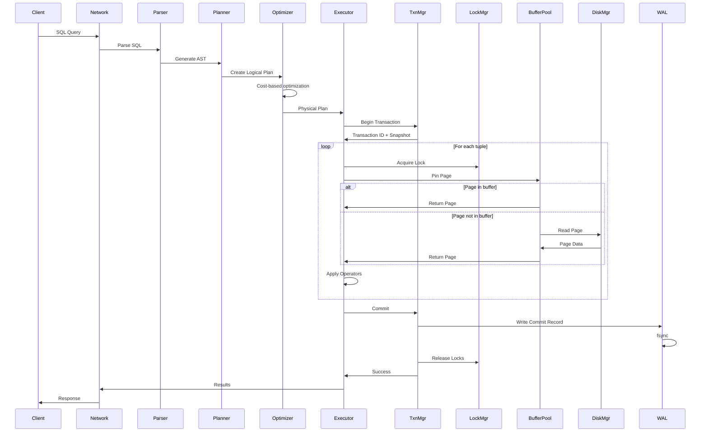

### Write Path (INSERT/UPDATE/DELETE)

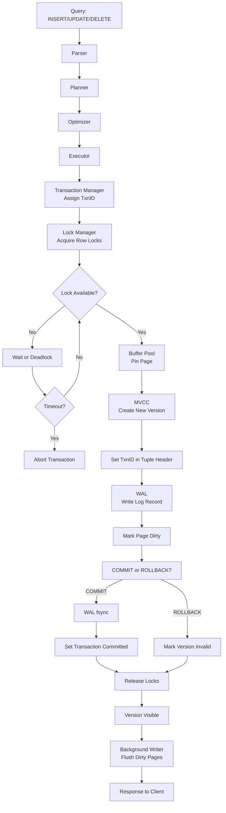

### Read Path (SELECT)

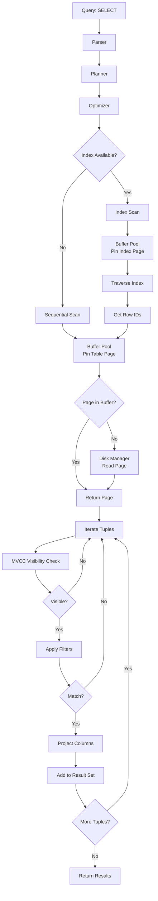

---

## Concurrency Model

### Thread Model

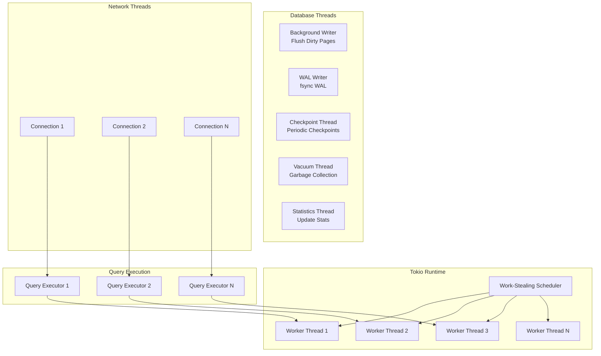

**Thread Allocation**:
- **Tokio Worker Threads**: Number of CPU cores (for async tasks)
- **Background Writer**: 1 dedicated thread
- **WAL Writer**: 1 dedicated thread
- **Checkpoint Thread**: 1 dedicated thread
- **Vacuum Thread**: Configurable (default 1-4)
- **Statistics Thread**: 1 dedicated thread
- **Network Connections**: Async tasks (multiplexed on worker threads)

### Synchronization Primitives

**Standard Primitives**:
```rust
Arc<Mutex<T>>       // Shared mutable state
Arc<RwLock<T>>      // Read-heavy workloads
AtomicU64           // Lock-free counters
AtomicBool          // Lock-free flags
```

**Lock-Free Data Structures**:
```rust
LockFreeQueue       // Michael-Scott queue (MPMC)
LockFreeStack       // Treiber stack (MPMC)
ConcurrentHashMap   // Fine-grained locking
LockFreeSkipList    // Lock-free ordered set
WorkStealingDeque   // Chase-Lev deque (MPSC)
```

**Epoch-Based Reclamation**:
```rust
// Safe memory reclamation for lock-free structures
let guard = epoch::pin();
let ptr = atomic_ptr.load(Ordering::Acquire, &guard);
// Use ptr safely
drop(guard); // Defer reclamation
```

---

## Memory Management Strategy

### Memory Budget Allocation

```
Total System Memory (e.g., 64 GB)
│
├─ OS + Other (8 GB)
└─ RustyDB (56 GB)
    ├─ Buffer Pool (40 GB) - 70%
    │   └─ Pages (10M pages × 4 KB)
    ├─ Working Memory (12 GB) - 21%
    │   ├─ Sort buffers (4 GB)
    │   ├─ Hash tables (4 GB)
    │   └─ Temporary data (4 GB)
    ├─ Connection Memory (2 GB) - 4%
    │   └─ Per-connection buffers (100 conns × 20 MB)
    └─ Shared Memory (2 GB) - 4%
        ├─ Catalog cache (512 MB)
        ├─ Plan cache (512 MB)
        ├─ Lock table (512 MB)
        └─ Other (512 MB)
```

### Memory Allocator Selection

```rust
// Allocation size-based strategy
match allocation_size {
    0..=1024 => SlabAllocator,        // Fixed-size objects
    1024..=1MB => ArenaAllocator,     // Per-query temporary
    1MB..=∞ => LargeObjectAllocator,  // Large objects (mmap)
}
```

### Memory Pressure Handling

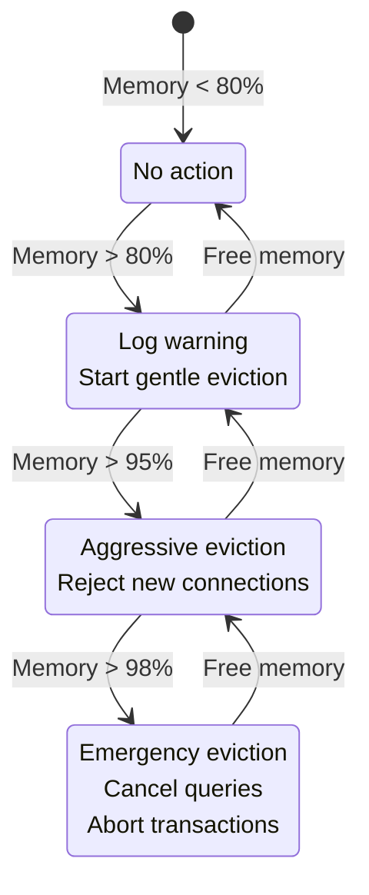

---

## I/O Subsystem Architecture

### I/O Stack

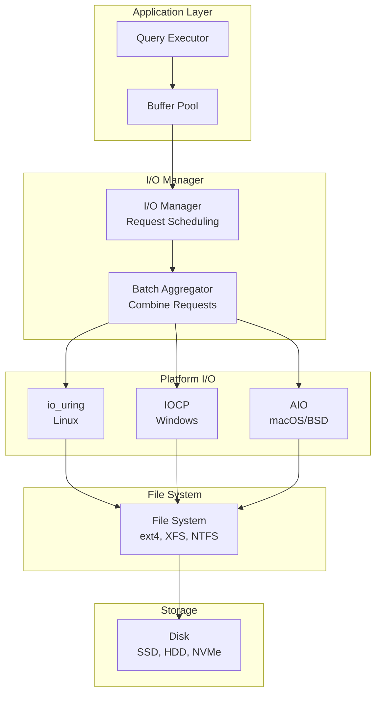

### I/O Scheduling

**Request Queue**:
```
┌─────────────────────────────────────────┐
│  I/O Request Queue                      │
│  ┌───────────────────────────────────┐  │
│  │ Priority Queue (by urgency)       │  │
│  │  1. WAL writes (highest priority) │  │
│  │  2. Checkpoint writes             │  │
│  │  3. User query I/O                │  │
│  │  4. Background tasks              │  │
│  └───────────────────────────────────┘  │
└─────────────────────────────────────────┘
         ↓
    [Scheduler]
         ↓
┌─────────────────────────────────────────┐
│  I/O Batching & Reordering              │
│  - Merge adjacent reads                 │
│  - Sort by disk location (for HDD)      │
│  - Batch small writes                   │
└─────────────────────────────────────────┘
         ↓
    [Submit to OS]
```

### Direct I/O vs Buffered I/O

**Decision Matrix**:
```
┌─────────────────┬──────────────┬────────────────┐
│ Workload        │ I/O Mode     │ Reason         │
├─────────────────┼──────────────┼────────────────┤
│ OLTP            │ Direct I/O   │ Avoid double   │
│ (Random)        │              │ buffering      │
├─────────────────┼──────────────┼────────────────┤
│ OLAP            │ Buffered I/O │ Sequential     │
│ (Sequential)    │              │ read-ahead     │
├─────────────────┼──────────────┼────────────────┤
│ WAL Writes      │ Direct I/O   │ Durability     │
│                 │              │ control        │
├─────────────────┼──────────────┼────────────────┤
│ Temporary Files │ Buffered I/O │ No durability  │
│                 │              │ needed         │
└─────────────────┴──────────────┴────────────────┘
```

---

## Network Architecture

### Connection Lifecycle

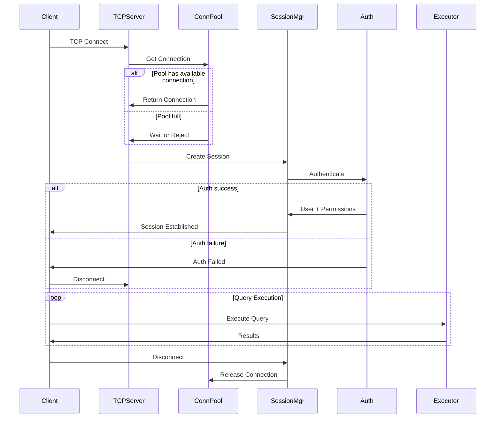

### Wire Protocol (PostgreSQL Compatible)

**Message Flow**:
```
Client                                  Server
  │                                       │
  ├─────── StartupMessage ────────────────>
  <─────── AuthenticationOk ──────────────┤
  ├─────── Query ("SELECT ...") ─────────>
  <─────── RowDescription ────────────────┤
  <─────── DataRow ───────────────────────┤
  <─────── DataRow ───────────────────────┤
  <─────── CommandComplete ───────────────┤
  <─────── ReadyForQuery ─────────────────┤
  ├─────── Terminate ─────────────────────>
```

**Message Types**:
- `StartupMessage`: Initial connection, protocol version
- `Query`: Simple query (text)
- `Parse/Bind/Execute`: Extended query protocol (prepared statements)
- `RowDescription`: Column metadata
- `DataRow`: Tuple data
- `CommandComplete`: Query completion
- `ReadyForQuery`: Server ready for next query

### P2P Networking (Cluster Communication)

**Transport Layer**:
```
┌──────────────────────────────────────────┐
│  Application Protocol                    │
│  - Raft consensus                        │
│  - Cache Fusion                          │
│  - Replication                           │
└──────────────────────────────────────────┘
           ↓
┌──────────────────────────────────────────┐
│  Message Framing & Codec                 │
│  - Length prefix                         │
│  - Compression (optional)                │
│  - Encryption (TLS)                      │
└──────────────────────────────────────────┘
           ↓
┌──────────────────────────────────────────┐
│  Transport (TCP or QUIC)                 │
│  - TCP: Reliable, ordered                │
│  - QUIC: Multiplexed, low latency        │
└──────────────────────────────────────────┘
```

---

## Enterprise Feature Integration

### Service Orchestration

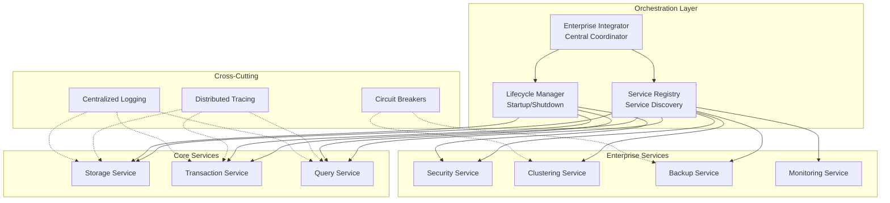

### Startup Sequence

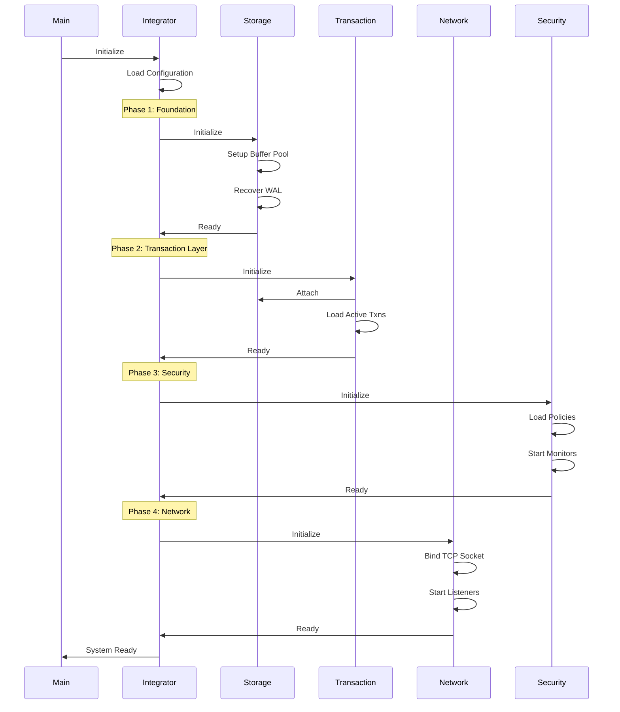

---

## Performance Optimizations

### SIMD Acceleration

**Filter Example (AVX2)**:
```rust
// Process 8 integers per instruction
unsafe fn simd_filter_gt(data: &[i32], threshold: i32) -> Vec<usize> {
    let threshold_vec = _mm256_set1_epi32(threshold);
    let mut results = Vec::new();

    for (i, chunk) in data.chunks_exact(8).enumerate() {
        let data_vec = _mm256_loadu_si256(chunk.as_ptr() as *const __m256i);
        let cmp = _mm256_cmpgt_epi32(data_vec, threshold_vec);
        let mask = _mm256_movemask_epi8(cmp);

        // Extract matching indices
        for bit in 0..8 {
            if mask & (1 << (bit * 4)) != 0 {
                results.push(i * 8 + bit);
            }
        }
    }
    results
}
```

**Performance**: 8x throughput for filtering operations.

### Lock-Free Page Table

**Design**:
```rust
struct PageTable {
    // Partitioned hash map (16 partitions)
    partitions: [RwLock<HashMap<PageId, FrameId>>; 16],
}

impl PageTable {
    fn get(&self, page_id: PageId) -> Option<FrameId> {
        let partition = (page_id % 16) as usize;
        let map = self.partitions[partition].read();
        map.get(&page_id).copied()
    }
}
```

**Benefits**:
- Reduced lock contention (16 partitions vs 1 global lock)
- Read-heavy workloads scale linearly
- Cache-line aligned partitions prevent false sharing

### Prefetching

**Sequential Scan Detection**:
```rust
if current_page == last_page + 1 {
    sequential_count += 1;
    if sequential_count > THRESHOLD {
        // Prefetch next N pages
        for i in 1..=PREFETCH_COUNT {
            io_engine.prefetch(current_page + i);
        }
    }
}
```

---

## Module Dependencies

```mermaid
graph TD
    ERROR[error]
    COMMON[common]

    STORAGE[storage]
    BUFFER[buffer]
    MEMORY[memory]
    IO[io]
    CATALOG[catalog]
    INDEX[index]
    COMPRESSION[compression]

    TXN[transaction]

    PARSER[parser]
    EXEC[execution]
    OPT[optimizer_pro]

    NETWORK[network]
    NETWORKING[networking]
    POOL[pool]
    API[api]

    SECURITY[security]
    SECURITY_VAULT[security_vault]

    CLUSTER[clustering]
    RAC[rac]
    REP[replication]
    ADV_REP[advanced_replication]

    BACKUP[backup]
    FLASHBACK[flashback]
    MONITORING[monitoring]

    GRAPH[graph]
    DOC[document_store]
    SPATIAL[spatial]
    ML[ml]
    ML_ENGINE[ml_engine]

    INMEM[inmemory]
    ANALYTICS[analytics]
    STREAMS[streams]
    EVENT[event_processing]

    WORKLOAD[workload]
    RESOURCE[resource_manager]
    ORCHESTRATION[orchestration]
    ENTERPRISE[enterprise]

    AUTONOMOUS[autonomous]
    MULTITENANCY[multitenancy]
    MULTITENANT[multitenant]

    CONCURRENT[concurrent]
    SIMD[simd]
    BENCH[bench]
    CORE[core]

    %% Foundation dependencies
    COMMON --> ERROR

    %% Storage layer
    STORAGE --> COMMON
    BUFFER --> COMMON
    MEMORY --> COMMON
    IO --> COMMON
    CATALOG --> COMMON
    INDEX --> COMMON
    COMPRESSION --> COMMON

    BUFFER --> STORAGE
    BUFFER --> MEMORY
    BUFFER --> IO
    INDEX --> BUFFER
    INDEX --> STORAGE

    %% Transaction layer
    TXN --> STORAGE
    TXN --> BUFFER
    TXN --> CATALOG

    %% Query processing
    PARSER --> COMMON
    EXEC --> PARSER
    EXEC --> TXN
    EXEC --> INDEX
    EXEC --> CATALOG
    OPT --> EXEC

    %% Network layer
    NETWORK --> COMMON
    NETWORKING --> COMMON
    POOL --> NETWORK
    API --> POOL
    API --> EXEC

    %% Security
    SECURITY --> COMMON
    SECURITY_VAULT --> SECURITY

    %% Clustering
    CLUSTER --> NETWORKING
    RAC --> CLUSTER
    REP --> CLUSTER
    ADV_REP --> REP

    %% Enterprise
    BACKUP --> STORAGE
    FLASHBACK --> TXN
    MONITORING --> COMMON

    %% Advanced engines
    GRAPH --> STORAGE
    DOC --> STORAGE
    SPATIAL --> INDEX
    ML --> EXEC
    ML_ENGINE --> ML

    %% Analytics
    INMEM --> STORAGE
    INMEM --> SIMD
    ANALYTICS --> INMEM
    STREAMS --> TXN
    EVENT --> STREAMS

    %% Resource management
    WORKLOAD --> MONITORING
    RESOURCE --> WORKLOAD
    ORCHESTRATION --> ENTERPRISE
    ENTERPRISE --> SECURITY

    %% Multi-tenancy
    AUTONOMOUS --> ML_ENGINE
    MULTITENANCY --> RESOURCE
    MULTITENANT --> MULTITENANCY

    %% Utilities
    CONCURRENT --> COMMON
    SIMD --> COMMON
    BENCH --> STORAGE
    BENCH --> INDEX
    CORE --> BUFFER
    CORE --> IO
```

**Dependency Rules**:
1. Lower layers don't depend on higher layers
2. All modules depend on `error` and `common`
3. Avoid circular dependencies (enforced by Rust compiler)
4. Use traits for dependency inversion (e.g., `Component` trait)

---

## Future Enhancements

1. **Distributed Transactions**: Two-phase commit (2PC) and three-phase commit (3PC) across nodes
2. **Columnar Storage Optimizations**: Improved compression, late materialization
3. **Adaptive Indexing**: Automatically create indexes based on query workload
4. **Query Compilation (JIT)**: LLVM-based JIT compilation for hot queries
5. **GPU Acceleration**: Offload analytics to GPU via CUDA/OpenCL
6. **Time-Series Optimizations**: Specialized storage and compression for time-series data
7. **Native Graph Query Execution**: Compiled graph pattern matching
8. **Advanced ML Integration**: Deep learning model serving, transfer learning
9. **Serverless Architecture**: Disaggregated storage and compute
10. **Cloud-Native Features**: S3-compatible storage, Kubernetes operators

---

## References

- **PostgreSQL Internals**: Storage architecture, MVCC, WAL
- **Oracle Database Concepts**: RAC, Data Guard, Flashback
- **CMU Database Systems Course (15-445/645)**: Query optimization, concurrency control
- **ARIES Recovery Algorithm**: Mohan et al., 1992
- **Volcano Query Execution**: Graefe, 1994
- **Adaptive Query Processing**: Deshpande et al., 2007
- **Lock-Free Data Structures**: Michael & Scott, Treiber, Chase & Lev
- **io_uring**: Jens Axboe, Linux kernel
- **Rust Performance Book**: SIMD, zero-cost abstractions
- **Database Internals**: Alex Petrov, O'Reilly

---

*This document is continuously updated as the architecture evolves. Last updated: 2025-12-11*
