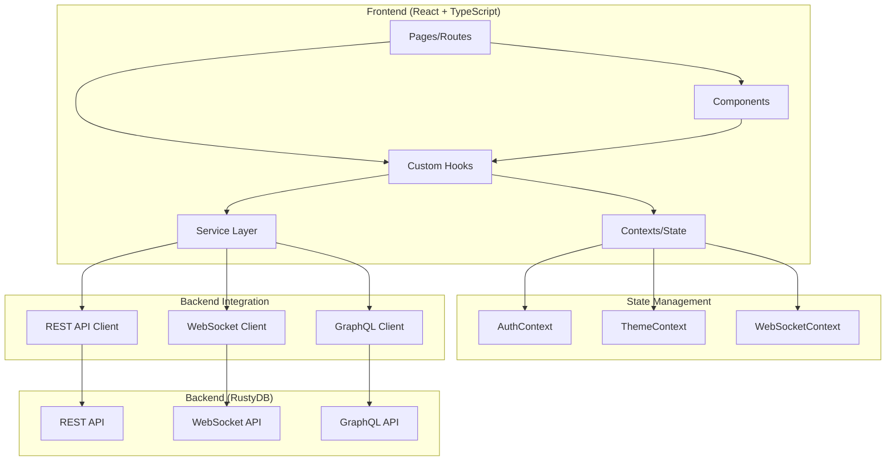
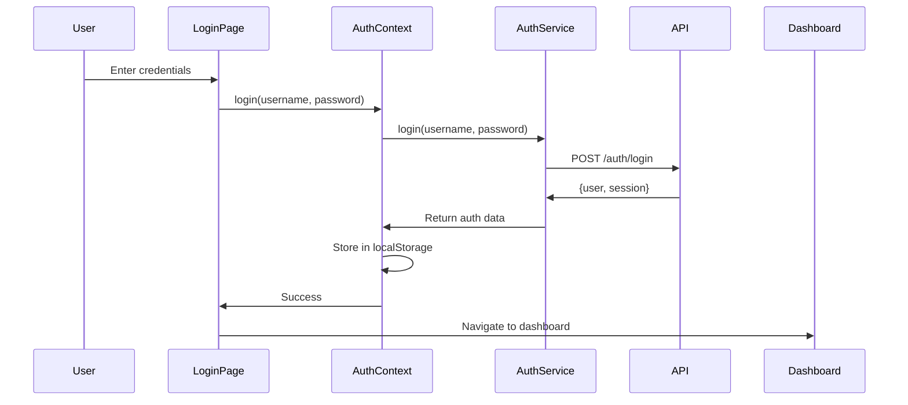

# RustyDB Frontend Guide

**Version**: 1.0.0
**Last Updated**: 2025-12-11
**Framework**: React 18 + TypeScript 5
**Build Tool**: Vite

## Table of Contents

1. [Overview](#overview)
2. [Architecture](#architecture)
3. [Technology Stack](#technology-stack)
4. [Project Structure](#project-structure)
5. [State Management](#state-management)
6. [Service Layer](#service-layer)
7. [Component Hierarchy](#component-hierarchy)
8. [Authentication Flow](#authentication-flow)
9. [Real-Time Updates](#real-time-updates)
10. [Page Descriptions](#page-descriptions)
11. [Theming & Styling](#theming--styling)
12. [Performance Optimization](#performance-optimization)
13. [Testing Strategy](#testing-strategy)
14. [Build & Deployment](#build--deployment)

---

## Overview

The RustyDB frontend is a modern, single-page application (SPA) built with React and TypeScript that provides a comprehensive web interface for database administration, monitoring, and management.

### Key Features

- **Dashboard**: Real-time metrics and system health monitoring
- **Query Editor**: SQL editor with syntax highlighting and auto-completion
- **Schema Management**: Visual table browser and DDL editor
- **User & Role Management**: Complete RBAC administration
- **Monitoring**: Performance metrics, session tracking, slow query analysis
- **Security**: Encryption, data masking, audit log viewer
- **Backup & Recovery**: Backup scheduling and point-in-time recovery
- **Cluster Management**: Multi-node cluster administration
- **Configuration**: Database configuration with hot-reload support

### Design Principles

1. **Type Safety**: Full TypeScript coverage for compile-time safety
2. **Component Reusability**: Shared component library with consistent APIs
3. **Responsive Design**: Mobile-first, responsive layout
4. **Performance**: Code splitting, lazy loading, memoization
5. **Accessibility**: WCAG 2.1 AA compliance
6. **Real-Time**: WebSocket integration for live updates
7. **Error Handling**: Comprehensive error boundaries and user feedback
8. **Testing**: Unit, integration, and E2E testing

---

## Architecture

### High-Level Architecture



### Architecture Layers

1. **Presentation Layer**: React components, pages, layouts
2. **State Management Layer**: React Context + Custom hooks
3. **Business Logic Layer**: Service layer with domain logic
4. **Integration Layer**: API clients (REST, WebSocket, GraphQL)
5. **Infrastructure Layer**: Routing, authentication, error handling

---

## Technology Stack

### Core Technologies

| Technology | Version | Purpose |
|------------|---------|---------|
| React | 18.2+ | UI framework |
| TypeScript | 5.0+ | Type safety |
| Vite | 5.0+ | Build tool & dev server |
| React Router | 6.20+ | Client-side routing |

### UI Libraries

| Library | Purpose |
|---------|---------|
| TailwindCSS | Utility-first CSS framework |
| Headless UI | Unstyled accessible components |
| Framer Motion | Animations |
| React Icons | Icon library |
| Recharts | Charts and graphs |
| Monaco Editor | Code editor (SQL) |
| React Query | Server state management |

### Utilities

| Library | Purpose |
|---------|---------|
| Axios | HTTP client |
| date-fns | Date manipulation |
| Zod | Schema validation |
| React Hook Form | Form management |
| React Error Boundary | Error handling |

---

## Project Structure

```
frontend/
├── public/              # Static assets
├── src/
│   ├── components/      # Reusable components
│   │   ├── common/      # Generic components (Button, Input, Card, etc.)
│   │   ├── layout/      # Layout components (MainLayout, Sidebar, etc.)
│   │   ├── auth/        # Authentication components
│   │   ├── dashboard/   # Dashboard-specific components
│   │   ├── query/       # Query editor components
│   │   ├── schema/      # Schema management components
│   │   ├── cluster/     # Cluster management components
│   │   ├── backup/      # Backup components
│   │   ├── monitoring/  # Monitoring components
│   │   ├── security/    # Security components
│   │   ├── users/       # User management components
│   │   ├── roles/       # Role management components
│   │   ├── resources/   # Resource management components
│   │   └── config/      # Configuration components
│   ├── contexts/        # React contexts
│   │   ├── AuthContext.tsx
│   │   ├── ThemeContext.tsx
│   │   └── WebSocketContext.tsx
│   ├── hooks/           # Custom React hooks
│   │   ├── useAuth.ts
│   │   ├── useTheme.ts
│   │   ├── useWebSocket.ts
│   │   ├── useQuery.ts
│   │   └── usePagination.ts
│   ├── pages/           # Page components (route targets)
│   │   ├── Dashboard.tsx
│   │   ├── QueryEditor.tsx
│   │   ├── TableManagement.tsx
│   │   ├── UserManagement.tsx
│   │   ├── Monitoring.tsx
│   │   ├── Security.tsx
│   │   ├── Cluster.tsx
│   │   ├── Backup.tsx
│   │   └── Configuration.tsx
│   ├── services/        # API service layer
│   │   ├── api.ts       # Base API client
│   │   ├── authService.ts
│   │   ├── queryService.ts
│   │   ├── schemaService.ts
│   │   ├── userService.ts
│   │   ├── monitoringService.ts
│   │   ├── clusterService.ts
│   │   ├── backupService.ts
│   │   └── configService.ts
│   ├── types/           # TypeScript type definitions
│   │   ├── api.ts
│   │   ├── auth.ts
│   │   ├── database.ts
│   │   ├── monitoring.ts
│   │   └── cluster.ts
│   ├── utils/           # Utility functions
│   │   ├── format.ts
│   │   ├── validation.ts
│   │   └── helpers.ts
│   ├── styles/          # Global styles
│   │   └── index.css
│   ├── App.tsx          # Main app component
│   ├── main.tsx         # Entry point
│   └── vite-env.d.ts    # Vite type declarations
├── .env.example         # Environment variables template
├── index.html           # HTML entry point
├── package.json         # Dependencies
├── tailwind.config.js   # TailwindCSS configuration
├── tsconfig.json        # TypeScript configuration
└── vite.config.ts       # Vite configuration
```

---

## State Management

### React Context Architecture

RustyDB uses **React Context API** for global state management instead of Redux for simplicity and better TypeScript integration.

#### AuthContext

Manages authentication state and user session.

**Location**: `src/contexts/AuthContext.tsx`

**State**:
```typescript
interface AuthState {
  user: User | null;
  session: Session | null;
  isAuthenticated: boolean;
  isLoading: boolean;
  error: string | null;
}
```

**Methods**:
```typescript
interface AuthContextType extends AuthState {
  login: (credentials: LoginCredentials) => Promise<void>;
  logout: () => Promise<void>;
  refreshSession: () => Promise<void>;
  updateUser: (user: Partial<User>) => void;
  hasPermission: (resource: string, action: string) => boolean;
  hasRole: (roleName: string) => boolean;
}
```

**Usage**:
```typescript
import { useAuth } from '@/hooks/useAuth';

function MyComponent() {
  const { user, isAuthenticated, login, logout } = useAuth();

  if (!isAuthenticated) {
    return <LoginForm onSubmit={login} />;
  }

  return <div>Welcome, {user.displayName}!</div>;
}
```

**Features**:
- Automatic token refresh
- Session persistence (localStorage)
- Permission checking
- Role-based access control
- Session validation

#### ThemeContext

Manages application theme (light/dark mode).

**Location**: `src/contexts/ThemeContext.tsx`

**State**:
```typescript
interface ThemeState {
  theme: 'light' | 'dark';
  toggleTheme: () => void;
  setTheme: (theme: 'light' | 'dark') => void;
}
```

**Usage**:
```typescript
import { useTheme } from '@/hooks/useTheme';

function ThemeToggle() {
  const { theme, toggleTheme } = useTheme();

  return (
    <button onClick={toggleTheme}>
      {theme === 'light' ? 'Dark Mode' : 'Light Mode'}
    </button>
  );
}
```

**Features**:
- System preference detection
- Theme persistence (localStorage)
- CSS variable updates
- TailwindCSS dark mode integration

#### WebSocketContext

Manages WebSocket connection for real-time updates.

**Location**: `src/contexts/WebSocketContext.tsx`

**State**:
```typescript
interface WebSocketState {
  isConnected: boolean;
  subscribe: (topic: string, callback: (data: any) => void) => void;
  unsubscribe: (topic: string) => void;
  send: (message: any) => void;
}
```

**Usage**:
```typescript
import { useWebSocket } from '@/hooks/useWebSocket';

function RealTimeMetrics() {
  const { subscribe, unsubscribe } = useWebSocket();

  useEffect(() => {
    subscribe('metrics', (data) => {
      console.log('New metrics:', data);
      setMetrics(data);
    });

    return () => unsubscribe('metrics');
  }, []);

  return <MetricsDisplay metrics={metrics} />;
}
```

**Features**:
- Automatic reconnection
- Heartbeat/ping-pong
- Message queue for offline messages
- Topic-based pub/sub

---

## Service Layer

### API Client (`src/services/api.ts`)

Base Axios instance with interceptors.

**Configuration**:
```typescript
const apiClient = axios.create({
  baseURL: import.meta.env.VITE_API_URL || 'http://localhost:8080',
  timeout: 30000,
  headers: {
    'Content-Type': 'application/json',
    'Accept': 'application/json',
  },
});
```

**Request Interceptor**:
```typescript
apiClient.interceptors.request.use((config) => {
  // Add auth token
  const auth = localStorage.getItem('rustydb_auth');
  if (auth) {
    const { session } = JSON.parse(auth);
    config.headers.Authorization = `Bearer ${session.token}`;
  }

  // Add request ID for tracing
  config.headers['X-Request-ID'] = crypto.randomUUID();
  config.headers['X-Request-Time'] = new Date().toISOString();

  return config;
});
```

**Response Interceptor**:
```typescript
apiClient.interceptors.response.use(
  (response) => response,
  async (error) => {
    // Handle 401 (token expired)
    if (error.response?.status === 401) {
      // Attempt token refresh
      try {
        const newToken = await refreshToken();
        // Retry original request
        return apiClient(originalRequest);
      } catch {
        // Redirect to login
        window.location.href = '/login';
      }
    }

    // Handle 429 (rate limit)
    if (error.response?.status === 429) {
      const retryAfter = error.response.headers['retry-after'];
      console.warn(`Rate limited. Retry after ${retryAfter}s`);
    }

    return Promise.reject(error);
  }
);
```

### Service Modules

#### AuthService (`src/services/authService.ts`)

```typescript
export const authService = {
  async login(username: string, password: string): Promise<AuthResponse> {
    const response = await api.post<ApiResponse<AuthResponse>>('/auth/login', {
      username,
      password,
    });
    return response.data.data;
  },

  async logout(): Promise<void> {
    await api.post('/auth/logout');
  },

  async refreshToken(refreshToken: string): Promise<Session> {
    const response = await api.post<ApiResponse<Session>>('/auth/refresh', {
      refreshToken,
    });
    return response.data.data;
  },

  async validateSession(token: string): Promise<boolean> {
    try {
      await api.get('/auth/validate', {
        headers: { Authorization: `Bearer ${token}` },
      });
      return true;
    } catch {
      return false;
    }
  },
};
```

#### QueryService (`src/services/queryService.ts`)

```typescript
export const queryService = {
  async execute(sql: string, params?: any[]): Promise<QueryResult> {
    const response = await api.post<ApiResponse<QueryResult>>('/query', {
      sql,
      params,
    });
    return response.data.data;
  },

  async explain(sql: string, analyze: boolean = false): Promise<QueryPlan> {
    const response = await api.post<ApiResponse<QueryPlan>>('/query/explain', {
      sql,
      analyze,
    });
    return response.data.data;
  },

  async executeBatch(queries: BatchQuery[]): Promise<BatchResult> {
    const response = await api.post<ApiResponse<BatchResult>>('/batch', {
      queries,
      transaction: true,
    });
    return response.data.data;
  },
};
```

#### SchemaService (`src/services/schemaService.ts`)

```typescript
export const schemaService = {
  async listTables(params?: PaginationParams): Promise<PaginatedResponse<Table>> {
    const queryString = buildQueryParams(params);
    const response = await api.get<ApiResponse<Table[]>>(`/tables${queryString}`);
    return response.data;
  },

  async getTable(name: string): Promise<TableDetails> {
    const response = await api.get<ApiResponse<TableDetails>>(`/tables/${name}`);
    return response.data.data;
  },

  async createTable(definition: TableDefinition): Promise<CreateTableResult> {
    const response = await api.post<ApiResponse<CreateTableResult>>('/tables', definition);
    return response.data.data;
  },

  async dropTable(name: string, cascade: boolean = false): Promise<void> {
    await api.delete(`/tables/${name}?cascade=${cascade}`);
  },
};
```

#### MonitoringService (`src/services/monitoringService.ts`)

```typescript
export const monitoringService = {
  async getMetrics(): Promise<Metrics> {
    const response = await api.get<ApiResponse<Metrics>>('/metrics');
    return response.data.data;
  },

  async getSessionStats(): Promise<SessionStats> {
    const response = await api.get<ApiResponse<SessionStats>>('/stats/sessions');
    return response.data.data;
  },

  async getSlowQueries(limit: number = 100): Promise<SlowQuery[]> {
    const response = await api.get<ApiResponse<SlowQuery[]>>(`/stats/queries?limit=${limit}`);
    return response.data.data.slow_queries;
  },

  async getAlerts(status?: AlertStatus): Promise<Alert[]> {
    const query = status ? `?status=${status}` : '';
    const response = await api.get<ApiResponse<{ alerts: Alert[] }>>(`/alerts${query}`);
    return response.data.data.alerts;
  },
};
```

---

## Component Hierarchy

### Component Classification

1. **Page Components**: Top-level route components
2. **Layout Components**: Application structure (header, sidebar, footer)
3. **Feature Components**: Domain-specific components
4. **Common Components**: Reusable UI components
5. **Form Components**: Input, validation, submission

### Common Components

#### Button Component

**Location**: `src/components/common/Button.tsx`

```typescript
interface ButtonProps {
  variant?: 'primary' | 'secondary' | 'danger' | 'ghost';
  size?: 'sm' | 'md' | 'lg';
  disabled?: boolean;
  loading?: boolean;
  icon?: React.ReactNode;
  children: React.ReactNode;
  onClick?: () => void;
}

export function Button({
  variant = 'primary',
  size = 'md',
  disabled = false,
  loading = false,
  icon,
  children,
  onClick,
}: ButtonProps) {
  const baseClasses = 'rounded font-medium transition-colors';
  const variantClasses = {
    primary: 'bg-blue-600 text-white hover:bg-blue-700',
    secondary: 'bg-gray-200 text-gray-900 hover:bg-gray-300',
    danger: 'bg-red-600 text-white hover:bg-red-700',
    ghost: 'bg-transparent text-gray-700 hover:bg-gray-100',
  };
  const sizeClasses = {
    sm: 'px-3 py-1.5 text-sm',
    md: 'px-4 py-2 text-base',
    lg: 'px-6 py-3 text-lg',
  };

  return (
    <button
      className={cn(baseClasses, variantClasses[variant], sizeClasses[size])}
      disabled={disabled || loading}
      onClick={onClick}
    >
      {loading && <Spinner className="mr-2" />}
      {icon && <span className="mr-2">{icon}</span>}
      {children}
    </button>
  );
}
```

#### Card Component

**Location**: `src/components/common/Card.tsx`

```typescript
interface CardProps {
  title?: string;
  subtitle?: string;
  actions?: React.ReactNode;
  children: React.ReactNode;
  className?: string;
}

export function Card({
  title,
  subtitle,
  actions,
  children,
  className,
}: CardProps) {
  return (
    <div className={cn('bg-white dark:bg-gray-800 rounded-lg shadow', className)}>
      {(title || subtitle || actions) && (
        <div className="flex items-center justify-between px-6 py-4 border-b border-gray-200 dark:border-gray-700">
          <div>
            {title && (
              <h3 className="text-lg font-semibold text-gray-900 dark:text-white">
                {title}
              </h3>
            )}
            {subtitle && (
              <p className="mt-1 text-sm text-gray-500 dark:text-gray-400">
                {subtitle}
              </p>
            )}
          </div>
          {actions && <div className="flex items-center gap-2">{actions}</div>}
        </div>
      )}
      <div className="px-6 py-4">{children}</div>
    </div>
  );
}
```

#### Table Component

**Location**: `src/components/common/Table.tsx`

```typescript
interface Column<T> {
  key: keyof T;
  header: string;
  render?: (value: any, row: T) => React.ReactNode;
  sortable?: boolean;
}

interface TableProps<T> {
  columns: Column<T>[];
  data: T[];
  loading?: boolean;
  emptyMessage?: string;
  onRowClick?: (row: T) => void;
}

export function Table<T extends Record<string, any>>({
  columns,
  data,
  loading,
  emptyMessage = 'No data available',
  onRowClick,
}: TableProps<T>) {
  if (loading) {
    return <LoadingSpinner />;
  }

  if (data.length === 0) {
    return (
      <div className="text-center py-12 text-gray-500">
        {emptyMessage}
      </div>
    );
  }

  return (
    <div className="overflow-x-auto">
      <table className="min-w-full divide-y divide-gray-200">
        <thead className="bg-gray-50 dark:bg-gray-700">
          <tr>
            {columns.map((column) => (
              <th
                key={String(column.key)}
                className="px-6 py-3 text-left text-xs font-medium text-gray-500 dark:text-gray-300 uppercase tracking-wider"
              >
                {column.header}
              </th>
            ))}
          </tr>
        </thead>
        <tbody className="bg-white dark:bg-gray-800 divide-y divide-gray-200">
          {data.map((row, index) => (
            <tr
              key={index}
              onClick={() => onRowClick?.(row)}
              className={cn(
                'hover:bg-gray-50 dark:hover:bg-gray-700',
                onRowClick && 'cursor-pointer'
              )}
            >
              {columns.map((column) => (
                <td
                  key={String(column.key)}
                  className="px-6 py-4 whitespace-nowrap text-sm text-gray-900 dark:text-gray-100"
                >
                  {column.render
                    ? column.render(row[column.key], row)
                    : row[column.key]}
                </td>
              ))}
            </tr>
          ))}
        </tbody>
      </table>
    </div>
  );
}
```

### Layout Components

#### MainLayout

**Location**: `src/components/layout/MainLayout.tsx`

```typescript
export function MainLayout() {
  const [sidebarOpen, setSidebarOpen] = useState(true);
  const { user } = useAuth();

  return (
    <div className="flex h-screen bg-gray-100 dark:bg-gray-900">
      {/* Sidebar */}
      <Sidebar open={sidebarOpen} onToggle={() => setSidebarOpen(!sidebarOpen)} />

      {/* Main Content */}
      <div className="flex-1 flex flex-col overflow-hidden">
        {/* Header */}
        <Header user={user} />

        {/* Content Area */}
        <main className="flex-1 overflow-auto p-6">
          <Outlet />
        </main>
      </div>
    </div>
  );
}
```

---

## Authentication Flow

### Login Flow



### Protected Route

```typescript
import { Navigate } from 'react-router-dom';
import { useAuth } from '@/hooks/useAuth';

export function ProtectedRoute({ children }: { children: React.ReactNode }) {
  const { isAuthenticated, isLoading } = useAuth();

  if (isLoading) {
    return <LoadingScreen />;
  }

  if (!isAuthenticated) {
    return <Navigate to="/login" replace />;
  }

  return <>{children}</>;
}
```

### Permission-Based Rendering

```typescript
import { useAuth } from '@/hooks/useAuth';

export function PermissionGate({
  resource,
  action,
  children,
  fallback = null,
}: {
  resource: string;
  action: string;
  children: React.ReactNode;
  fallback?: React.ReactNode;
}) {
  const { hasPermission } = useAuth();

  if (!hasPermission(resource, action)) {
    return <>{fallback}</>;
  }

  return <>{children}</>;
}
```

**Usage**:
```typescript
<PermissionGate resource="users" action="create">
  <Button onClick={handleCreateUser}>Create User</Button>
</PermissionGate>
```

---

## Real-Time Updates

### WebSocket Integration

**Connection Management**:
```typescript
// src/contexts/WebSocketContext.tsx
export function WebSocketProvider({ children }: { children: React.ReactNode }) {
  const [ws, setWs] = useState<WebSocket | null>(null);
  const [isConnected, setIsConnected] = useState(false);
  const subscriptions = useRef<Map<string, Set<Function>>>(new Map());

  useEffect(() => {
    const wsUrl = `${WS_URL}/stream`;
    const socket = new WebSocket(wsUrl);

    socket.onopen = () => {
      console.log('WebSocket connected');
      setIsConnected(true);

      // Authenticate
      const auth = localStorage.getItem('rustydb_auth');
      if (auth) {
        const { session } = JSON.parse(auth);
        socket.send(JSON.stringify({
          type: 'authenticate',
          token: session.token,
        }));
      }
    };

    socket.onmessage = (event) => {
      const message = JSON.parse(event.data);
      const callbacks = subscriptions.current.get(message.topic);
      if (callbacks) {
        callbacks.forEach((callback) => callback(message.data));
      }
    };

    socket.onclose = () => {
      console.log('WebSocket disconnected');
      setIsConnected(false);
      // Reconnect after 5 seconds
      setTimeout(connect, 5000);
    };

    setWs(socket);

    return () => socket.close();
  }, []);

  const subscribe = useCallback((topic: string, callback: Function) => {
    if (!subscriptions.current.has(topic)) {
      subscriptions.current.set(topic, new Set());
    }
    subscriptions.current.get(topic)!.add(callback);

    // Send subscribe message
    ws?.send(JSON.stringify({
      type: 'subscribe',
      topic,
    }));
  }, [ws]);

  const unsubscribe = useCallback((topic: string, callback?: Function) => {
    if (callback) {
      subscriptions.current.get(topic)?.delete(callback);
    } else {
      subscriptions.current.delete(topic);
    }

    // Send unsubscribe message
    ws?.send(JSON.stringify({
      type: 'unsubscribe',
      topic,
    }));
  }, [ws]);

  return (
    <WebSocketContext.Provider value={{ isConnected, subscribe, unsubscribe }}>
      {children}
    </WebSocketContext.Provider>
  );
}
```

**Real-Time Metrics Component**:
```typescript
export function RealTimeMetrics() {
  const [metrics, setMetrics] = useState<Metrics | null>(null);
  const { subscribe, unsubscribe } = useWebSocket();

  useEffect(() => {
    const handleMetrics = (data: Metrics) => {
      setMetrics(data);
    };

    subscribe('metrics', handleMetrics);

    return () => unsubscribe('metrics', handleMetrics);
  }, [subscribe, unsubscribe]);

  if (!metrics) {
    return <LoadingSpinner />;
  }

  return (
    <div className="grid grid-cols-4 gap-4">
      <MetricCard
        title="Queries/sec"
        value={metrics.queries_per_second}
        trend="up"
      />
      <MetricCard
        title="Active Connections"
        value={metrics.active_connections}
      />
      {/* ... more metrics */}
    </div>
  );
}
```

---

## Page Descriptions

### Dashboard (`/`)

**Purpose**: System overview with real-time metrics and health monitoring.

**Components**:
- MetricCard: Display key metrics (QPS, TPS, connections, etc.)
- PerformanceChart: Real-time charts using Recharts
- HealthIndicator: System health status
- ActivityFeed: Recent database events

**Features**:
- Real-time WebSocket updates
- Customizable dashboard layout
- Export metrics as CSV/JSON
- Alerts and notifications

### Query Editor (`/query`)

**Purpose**: SQL query editor with execution and result visualization.

**Components**:
- SqlEditor: Monaco Editor with SQL syntax highlighting
- QueryTabs: Multiple query tabs
- ResultsTable: Query results display
- ExplainPlanViewer: Visual query plan

**Features**:
- Auto-completion
- Query history
- Saved queries
- Export results (CSV, JSON, Excel)
- Query performance stats

### Table Management (`/tables`)

**Purpose**: Database schema browsing and management.

**Components**:
- TableList: List of tables with search/filter
- TableDetails: Column definitions, indexes, constraints
- RelationshipDiagram: ER diagram
- DDLViewer: Show CREATE TABLE statement

**Features**:
- Create/alter/drop tables
- Manage indexes
- View table statistics
- Data browser

### User Management (`/users`)

**Purpose**: User account administration.

**Components**:
- UserTable: List of users
- UserForm: Create/edit user form
- PermissionMatrix: Visual permission editor

**Features**:
- Create/edit/delete users
- Assign roles
- Reset passwords
- View user activity

### Monitoring (`/monitoring`)

**Purpose**: Performance monitoring and diagnostics.

**Components**:
- PerformanceGauges: CPU, memory, disk usage
- SessionTable: Active sessions
- SlowQueryList: Slow query log
- BlockingTree: Lock/wait tree visualization

**Features**:
- Real-time metrics
- Kill sessions
- Performance alerts
- Export reports

### Security (`/security`)

**Purpose**: Security configuration and audit.

**Components**:
- EncryptionKeyCard: Encryption key management
- MaskingPolicyForm: Data masking policies
- AuditLogTable: Audit log viewer
- SecurityEventTimeline: Security events

**Features**:
- Key rotation
- Audit log filtering
- Security policy management
- Compliance reports

### Cluster (`/cluster`)

**Purpose**: Cluster management and monitoring.

**Components**:
- ClusterTopology: Visual cluster topology
- NodeList: Cluster nodes
- ReplicationStatus: Replication lag and status
- FailoverWizard: Manual failover

**Features**:
- Add/remove nodes
- Monitor replication
- Trigger failover
- Cluster health

### Backup (`/backup`)

**Purpose**: Backup and recovery management.

**Components**:
- BackupList: List of backups
- CreateBackupModal: Create backup wizard
- RestoreWizard: Restore from backup
- PointInTimeSelector: PITR selector

**Features**:
- Create backups (full/incremental)
- Schedule backups
- Restore backups
- Point-in-time recovery

### Configuration (`/config`)

**Purpose**: Database configuration management.

**Components**:
- ConfigSection: Grouped configuration options
- ConfigInput: Configuration value editor
- ConfigDiff: Show configuration changes
- RestartBanner: Restart required notification

**Features**:
- Edit configuration
- Configuration validation
- Hot-reload support
- Configuration history

---

## Theming & Styling

### TailwindCSS Configuration

**Location**: `tailwind.config.js`

```javascript
module.exports = {
  content: ['./index.html', './src/**/*.{js,ts,jsx,tsx}'],
  darkMode: 'class', // Use class-based dark mode
  theme: {
    extend: {
      colors: {
        primary: {
          50: '#eff6ff',
          100: '#dbeafe',
          200: '#bfdbfe',
          300: '#93c5fd',
          400: '#60a5fa',
          500: '#3b82f6', // Main brand color
          600: '#2563eb',
          700: '#1d4ed8',
          800: '#1e40af',
          900: '#1e3a8a',
        },
      },
      fontFamily: {
        sans: ['Inter', 'system-ui', 'sans-serif'],
        mono: ['Fira Code', 'monospace'],
      },
    },
  },
  plugins: [
    require('@tailwindcss/forms'),
    require('@tailwindcss/typography'),
  ],
};
```

### Dark Mode Implementation

**Theme Toggle**:
```typescript
export function ThemeToggle() {
  const { theme, toggleTheme } = useTheme();

  useEffect(() => {
    if (theme === 'dark') {
      document.documentElement.classList.add('dark');
    } else {
      document.documentElement.classList.remove('dark');
    }
  }, [theme]);

  return (
    <button
      onClick={toggleTheme}
      className="p-2 rounded-lg hover:bg-gray-100 dark:hover:bg-gray-700"
    >
      {theme === 'light' ? <MoonIcon /> : <SunIcon />}
    </button>
  );
}
```

**Dark Mode Styles**:
```css
/* Light mode */
.bg-white { background-color: white; }
.text-gray-900 { color: #111827; }

/* Dark mode */
.dark .bg-white { background-color: #1f2937; }
.dark .text-gray-900 { color: #f9fafb; }
```

---

## Performance Optimization

### Code Splitting

**Route-Based Code Splitting**:
```typescript
import { lazy, Suspense } from 'react';

const Dashboard = lazy(() => import('./pages/Dashboard'));
const QueryEditor = lazy(() => import('./pages/QueryEditor'));
const TableManagement = lazy(() => import('./pages/TableManagement'));

function App() {
  return (
    <Suspense fallback={<LoadingScreen />}>
      <Routes>
        <Route path="/" element={<Dashboard />} />
        <Route path="/query" element={<QueryEditor />} />
        <Route path="/tables" element={<TableManagement />} />
      </Routes>
    </Suspense>
  );
}
```

### Memoization

**Component Memoization**:
```typescript
import { memo } from 'react';

export const TableRow = memo(function TableRow({ row, onRowClick }) {
  return (
    <tr onClick={() => onRowClick(row)}>
      {/* ... */}
    </tr>
  );
}, (prevProps, nextProps) => {
  // Only re-render if row data changed
  return prevProps.row === nextProps.row;
});
```

**Value Memoization**:
```typescript
import { useMemo } from 'react';

function DataTable({ data, filter }) {
  const filteredData = useMemo(() => {
    return data.filter((item) => item.name.includes(filter));
  }, [data, filter]);

  return <Table data={filteredData} />;
}
```

### Virtual Scrolling

For large datasets, use react-window:

```typescript
import { FixedSizeList } from 'react-window';

function VirtualTable({ data }) {
  const Row = ({ index, style }) => (
    <div style={style}>
      {data[index].name}
    </div>
  );

  return (
    <FixedSizeList
      height={600}
      itemCount={data.length}
      itemSize={50}
      width="100%"
    >
      {Row}
    </FixedSizeList>
  );
}
```

---

## Testing Strategy

### Unit Testing (Vitest + React Testing Library)

**Component Test Example**:
```typescript
import { render, screen, fireEvent } from '@testing-library/react';
import { Button } from '@/components/common/Button';

describe('Button', () => {
  it('renders with children', () => {
    render(<Button>Click me</Button>);
    expect(screen.getByText('Click me')).toBeInTheDocument();
  });

  it('calls onClick when clicked', () => {
    const handleClick = vi.fn();
    render(<Button onClick={handleClick}>Click me</Button>);
    fireEvent.click(screen.getByText('Click me'));
    expect(handleClick).toHaveBeenCalledOnce();
  });

  it('shows loading state', () => {
    render(<Button loading>Click me</Button>);
    expect(screen.getByRole('button')).toBeDisabled();
  });
});
```

### Integration Testing

**Service Test Example**:
```typescript
import { authService } from '@/services/authService';
import { server } from '../mocks/server';
import { rest } from 'msw';

describe('AuthService', () => {
  it('logs in successfully', async () => {
    const result = await authService.login('admin', 'password');
    expect(result.user.username).toBe('admin');
    expect(result.session.token).toBeDefined();
  });

  it('handles login failure', async () => {
    server.use(
      rest.post('/api/v1/auth/login', (req, res, ctx) => {
        return res(ctx.status(401), ctx.json({
          success: false,
          error: { code: 'AUTHENTICATION_FAILED' }
        }));
      })
    );

    await expect(authService.login('admin', 'wrong')).rejects.toThrow();
  });
});
```

### E2E Testing (Playwright)

```typescript
import { test, expect } from '@playwright/test';

test('user can login and view dashboard', async ({ page }) => {
  await page.goto('http://localhost:3000');

  // Login
  await page.fill('input[name="username"]', 'admin');
  await page.fill('input[name="password"]', 'password');
  await page.click('button[type="submit"]');

  // Wait for dashboard
  await expect(page).toHaveURL(/.*dashboard/);
  await expect(page.locator('h1')).toContainText('Dashboard');

  // Check metrics are loaded
  await expect(page.locator('.metric-card')).toHaveCount(4);
});
```

---

## Build & Deployment

### Development

```bash
npm run dev
```

### Production Build

```bash
npm run build
```

**Vite Configuration** (`vite.config.ts`):
```typescript
import { defineConfig } from 'vite';
import react from '@vitejs/plugin-react';
import path from 'path';

export default defineConfig({
  plugins: [react()],
  resolve: {
    alias: {
      '@': path.resolve(__dirname, './src'),
    },
  },
  build: {
    outDir: 'dist',
    sourcemap: true,
    rollupOptions: {
      output: {
        manualChunks: {
          vendor: ['react', 'react-dom', 'react-router-dom'],
          ui: ['@headlessui/react', 'framer-motion'],
          charts: ['recharts'],
          editor: ['monaco-editor'],
        },
      },
    },
  },
  server: {
    port: 3000,
    proxy: {
      '/api': {
        target: 'http://localhost:8080',
        changeOrigin: true,
      },
      '/ws': {
        target: 'ws://localhost:8080',
        ws: true,
      },
    },
  },
});
```

### Docker Deployment

**Dockerfile**:
```dockerfile
# Build stage
FROM node:18-alpine AS builder
WORKDIR /app
COPY package*.json ./
RUN npm ci
COPY . .
RUN npm run build

# Production stage
FROM nginx:alpine
COPY --from=builder /app/dist /usr/share/nginx/html
COPY nginx.conf /etc/nginx/conf.d/default.conf
EXPOSE 80
CMD ["nginx", "-g", "daemon off;"]
```

**nginx.conf**:
```nginx
server {
  listen 80;
  root /usr/share/nginx/html;
  index index.html;

  location / {
    try_files $uri $uri/ /index.html;
  }

  location /api {
    proxy_pass http://rustydb-api:8080;
    proxy_http_version 1.1;
    proxy_set_header Upgrade $http_upgrade;
    proxy_set_header Connection 'upgrade';
    proxy_set_header Host $host;
    proxy_cache_bypass $http_upgrade;
  }

  location /ws {
    proxy_pass http://rustydb-api:8080;
    proxy_http_version 1.1;
    proxy_set_header Upgrade $http_upgrade;
    proxy_set_header Connection "Upgrade";
  }
}
```

---

**For more information, see the React documentation at https://react.dev and TypeScript documentation at https://www.typescriptlang.org/docs/**
