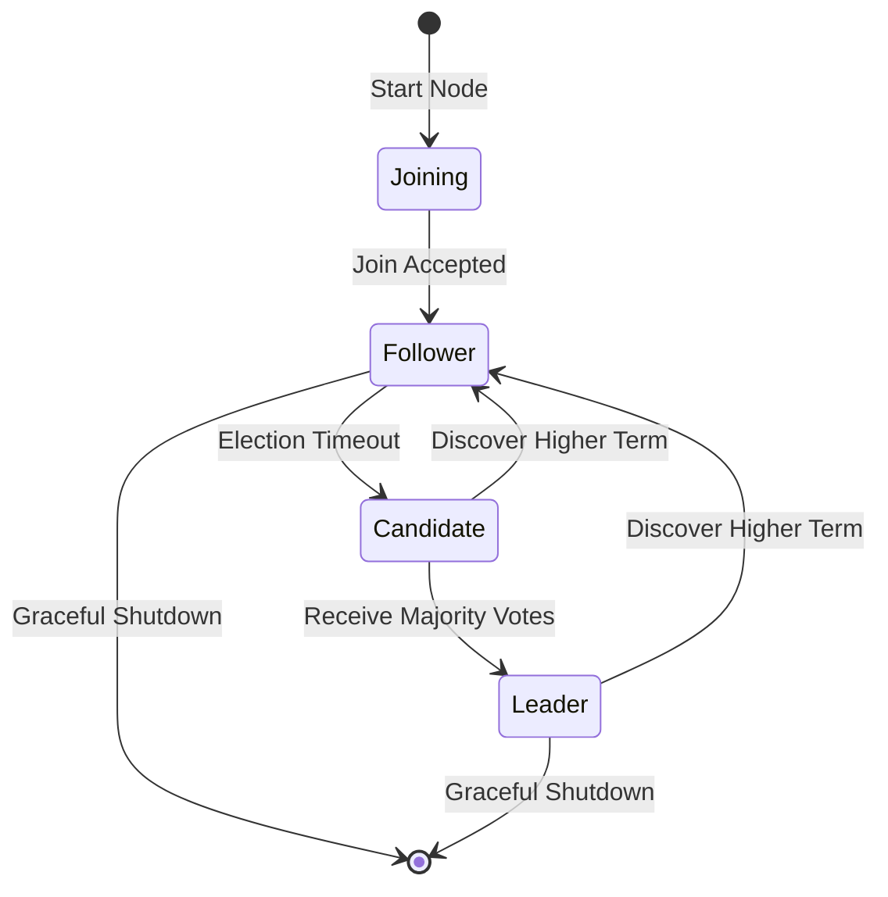

# RustyDB v0.5.1 - High Availability Guide

**Enterprise Database High Availability and Disaster Recovery**

Version: 0.5.1
Release Date: December 2025
Document Classification: Enterprise Production

---

## Table of Contents

1. [Executive Summary](#executive-summary)
2. [High Availability Overview](#high-availability-overview)
3. [Clustering Architecture](#clustering-architecture)
4. [Real Application Clusters (RAC)](#real-application-clusters-rac)
5. [Replication Systems](#replication-systems)
6. [Failover and Failback](#failover-and-failback)
7. [Geographic Distribution](#geographic-distribution)
8. [Load Balancing](#load-balancing)
9. [Monitoring High Availability](#monitoring-high-availability)
10. [Deployment Scenarios](#deployment-scenarios)
11. [Operational Procedures](#operational-procedures)
12. [Performance Tuning](#performance-tuning)
13. [Troubleshooting](#troubleshooting)
14. [Best Practices](#best-practices)

---

## Executive Summary

RustyDB v0.5.1 delivers enterprise-grade high availability capabilities comparable to Oracle RAC, PostgreSQL Patroni, and other tier-1 database platforms. The system is designed to minimize downtime and data loss through multiple layers of redundancy, automatic failover, and disaster recovery capabilities.

### Availability Targets

RustyDB supports multiple availability tiers based on deployment architecture:

| Tier | Availability | Downtime/Year | Configuration |
|------|-------------|---------------|---------------|
| **Standard** | 99.9% | 8.76 hours | Single instance with backup |
| **High** | 99.95% | 4.38 hours | Active-Passive with sync replication |
| **Very High** | 99.99% | 52.6 minutes | Multi-node cluster with failover |
| **Extreme** | 99.999% | 5.26 minutes | RAC cluster with geo-replication |

### Key Capabilities

- **Zero RPO**: Synchronous replication for zero data loss
- **Sub-5-Minute RTO**: Automatic failover with minimal downtime
- **Oracle RAC-like Architecture**: Shared-disk clustering with Cache Fusion
- **Multi-Master Replication**: CRDT-based conflict resolution
- **Geographic Distribution**: Cross-datacenter replication with WAN optimization
- **Automatic Failover**: Intelligent failure detection and recovery
- **Online Operations**: Rolling upgrades with zero downtime

---

## High Availability Overview

### Architecture Principles

RustyDB's high availability architecture follows these principles:

1. **No Single Point of Failure**: Multiple redundant components at every layer
2. **Automatic Recovery**: Self-healing systems that detect and recover from failures
3. **Data Protection**: Multiple copies of data with consistency guarantees
4. **Transparent Failover**: Application-transparent failover with minimal disruption
5. **Scalability**: Add capacity without downtime
6. **Geographic Distribution**: Survive datacenter-level failures

### Availability Components

```
┌─────────────────────────────────────────────────────────────┐
│                 High Availability Stack                      │
└─────────────────────────────────────────────────────────────┘

┌─────────────────────────────────────────────────────────────┐
│  Layer 7: Geographic Distribution                           │
│  - Multi-datacenter deployment                              │
│  - Cross-region replication                                 │
│  - Disaster recovery sites                                  │
└─────────────────────────────────────────────────────────────┘
                          │
┌─────────────────────────────────────────────────────────────┐
│  Layer 6: Load Balancing                                    │
│  - Connection routing                                       │
│  - Read/write splitting                                     │
│  - Service-based routing                                    │
└─────────────────────────────────────────────────────────────┘
                          │
┌─────────────────────────────────────────────────────────────┐
│  Layer 5: Automatic Failover                                │
│  - Health monitoring                                        │
│  - Failure detection                                        │
│  - Leader election                                          │
│  - Resource remastering                                     │
└─────────────────────────────────────────────────────────────┘
                          │
┌─────────────────────────────────────────────────────────────┐
│  Layer 4: Replication                                       │
│  - Synchronous/Asynchronous/Semi-synchronous                │
│  - Multi-master with conflict resolution                    │
│  - Logical replication with filtering                       │
└─────────────────────────────────────────────────────────────┘
                          │
┌─────────────────────────────────────────────────────────────┐
│  Layer 3: Clustering (Raft Consensus)                       │
│  - Leader election                                          │
│  - Distributed consensus                                    │
│  - Cluster membership management                            │
└─────────────────────────────────────────────────────────────┘
                          │
┌─────────────────────────────────────────────────────────────┐
│  Layer 2: RAC Engine (Optional)                             │
│  - Shared-disk clustering                                   │
│  - Cache Fusion                                             │
│  - Global Resource Directory                                │
│  - Instance recovery                                        │
└─────────────────────────────────────────────────────────────┘
                          │
┌─────────────────────────────────────────────────────────────┐
│  Layer 1: Storage & Backup                                  │
│  - Redundant storage (RAID, SAN, NAS)                       │
│  - Continuous backup                                        │
│  - Point-in-Time Recovery (PITR)                            │
│  - Snapshot management                                      │
└─────────────────────────────────────────────────────────────┘
```

### Recovery Objectives

#### Recovery Time Objective (RTO)

RTO defines the maximum acceptable time to restore service after a failure:

| Failure Type | RTO Target | Actual (Typical) |
|-------------|-----------|------------------|
| **Instance Crash** | < 1 minute | 30-60 seconds (RAC) |
| **Node Failure** | < 5 minutes | 30-90 seconds (auto failover) |
| **Datacenter Outage** | < 15 minutes | 5-10 minutes (geo-DR) |
| **Complete Disaster** | < 4 hours | 1-2 hours (restore from backup) |

#### Recovery Point Objective (RPO)

RPO defines the maximum acceptable amount of data loss measured in time:

| Replication Mode | RPO Target | Data Loss Risk |
|-----------------|-----------|----------------|
| **Synchronous** | 0 seconds | Zero data loss |
| **Semi-Synchronous** | < 5 seconds | Minimal loss (in-flight transactions) |
| **Asynchronous** | < 60 seconds | Up to 1 minute of data |
| **Backup-based** | < 24 hours | Last backup + WAL logs |

### Single Points of Failure Analysis

RustyDB eliminates single points of failure through redundancy:

| Component | Single-Instance Risk | HA Mitigation |
|-----------|---------------------|---------------|
| **Database Process** | Instance crash | RAC multi-instance or standby promotion |
| **Server Hardware** | Server failure | Cluster with multiple nodes |
| **Storage** | Disk failure | RAID + shared storage or replication |
| **Network** | Network partition | Redundant network paths + quorum |
| **Datacenter** | Site disaster | Geographic replication |
| **Power** | Power outage | UPS + generator + multi-site |

---

## Clustering Architecture

### Overview

RustyDB clustering provides distributed coordination, automatic failover, and horizontal scalability through Raft consensus protocol.

### Cluster Topology

```
┌─────────────────────────────────────────────────────────────┐
│                    Client Applications                       │
└──────────────────────┬──────────────────────────────────────┘
                       │
        ┌──────────────┴──────────────┐
        │     Load Balancer            │
        │   (HAProxy, F5, etc.)        │
        └──────────────┬──────────────┘
                       │
    ┌──────────────────┴──────────────────┐
    │      Cluster Coordinator             │
    │  - Leader Election (Raft)            │
    │  - Query Routing                     │
    │  - Health Monitoring                 │
    │  - Distributed Transactions          │
    └──────────────────┬──────────────────┘
                       │
    ┌──────────────────┴──────────────────┐
    │                                       │
┌───▼────┐  ┌────────┐  ┌────────┐  ┌────▼────┐
│ Node 1 │  │ Node 2 │  │ Node 3 │  │ Node N  │
│(Leader)│  │(Follower)│ │(Follower)│ │(Follower)│
│  Active│  │  Active │  │  Active │  │  Active │
└───┬────┘  └────┬───┘  └────┬───┘  └────┬────┘
    │            │            │            │
    └────────────┴────────────┴────────────┘
                 │
        ┌────────▼────────┐
        │  Shared Storage │
        │   (Optional)    │
        │   SAN / NAS     │
        └─────────────────┘
```

### Raft Consensus Protocol

RustyDB uses the Raft consensus algorithm for:

- **Leader Election**: Automatic leader election with randomized timeouts
- **Log Replication**: Strongly consistent log replication across nodes
- **Membership Changes**: Safe cluster membership updates via joint consensus
- **Snapshot & Compaction**: Log compaction to prevent unbounded growth

#### Key Features

**Election Process**:
- Randomized election timeouts (150-300ms default)
- Majority quorum required for leader election
- Automatic re-election on leader failure
- Split-brain prevention through term numbering

**Configuration**:
```rust
RaftConfig {
    node_id: "node-1",
    peers: vec!["node-2", "node-3"],
    election_timeout_min: Duration::from_millis(150),
    election_timeout_max: Duration::from_millis(300),
    heartbeat_interval: Duration::from_millis(50),
    max_entries_per_append: 100,
    snapshot_threshold: 10000,
    enable_batching: true,
}
```

**Performance Characteristics**:
- Throughput: ~50 TPS (synchronous I/O), 1000+ TPS with batching
- Election time: 150-300ms (one election timeout)
- Heartbeat interval: 50ms (configurable)
- Log replication latency: 1-5ms (local network)

#### Known Limitations

**Issue P0-4**: Synchronous Raft I/O
- Current synchronous I/O limits throughput to ~50 TPS
- Async batching implementation in progress (target: 500+ TPS)
- Workaround: Enable batching to achieve 1000+ TPS for batch workloads

**Issue P1-6**: Unbounded Uncommitted Log
- Uncommitted log can grow before commitment
- `MAX_UNCOMMITTED_LOG_ENTRIES`: 100,000 entries (~100MB)
- Implement backpressure when approaching limit

### Node Management

#### Node States



#### Adding a Node

```rust
// Add a new node to the cluster
let new_node = ClusterNode {
    node_id: "node-4",
    address: "192.168.1.104:5432",
    role: NodeRole::Follower,
    capacity: NodeCapacity {
        cpu_cores: 16,
        total_memory_gb: 64,
        network_bandwidth_mbps: 10000,
    },
    ..Default::default()
};

cluster.add_node(new_node).await?;
```

**Process**:
1. Node starts in `Joining` state
2. Contacts existing cluster members
3. Receives current cluster configuration
4. Downloads snapshot if needed
5. Begins receiving log entries
6. Transitions to `Follower` state
7. Participates in consensus

**Duration**: 30-120 seconds (depending on snapshot size)

#### Removing a Node

```rust
// Gracefully remove a node from the cluster
cluster.remove_node("node-4").await?;
```

**Process**:
1. Node marked for removal
2. Cluster configuration updated via Raft
3. Resources remastered to other nodes
4. Pending transactions completed
5. Node cleanly shuts down
6. Configuration change committed

**Duration**: 10-60 seconds

### Cluster Configuration

#### Minimum Cluster Size

For high availability, minimum cluster size is **3 nodes**:
- Tolerates 1 node failure (quorum: 2 out of 3)
- Prevents split-brain with majority voting
- Recommended: 3-5 nodes for production

For **5 nodes**:
- Tolerates 2 node failures (quorum: 3 out of 5)
- Better availability but higher network overhead
- Recommended for critical production systems

#### Quorum Requirements

```
Cluster Size     Quorum    Max Failures
─────────────────────────────────────────
     1             1            0
     2             2            0  (not recommended)
     3             2            1
     4             3            1
     5             3            2
     6             4            2
     7             4            3
```

**Note**: Even-numbered clusters (2, 4, 6) offer no advantage over N-1 cluster size. Always use odd numbers (3, 5, 7).

#### Network Requirements

**Bandwidth**:
- Minimum: 1 Gbps between cluster nodes
- Recommended: 10 Gbps for production
- RAC clusters: 10 Gbps or higher (40 Gbps for large deployments)

**Latency**:
- Same datacenter: < 1ms
- Same region: < 5ms
- Cross-region: < 50ms (asynchronous replication recommended)

**Connectivity**:
- Dedicated cluster interconnect (separate VLAN)
- Redundant network paths for failover
- Low-latency switches (non-blocking fabric)

---

## Real Application Clusters (RAC)

### RAC Architecture Overview

RustyDB RAC provides Oracle-like shared-disk clustering with Cache Fusion technology for extreme high availability and horizontal scalability.

```
┌──────────────────────────────────────────────────────────────┐
│                     RAC Architecture                          │
└──────────────────────────────────────────────────────────────┘

   Instance 1          Instance 2          Instance 3
   ┌─────────┐        ┌─────────┐        ┌─────────┐
   │ SQL     │        │ SQL     │        │ SQL     │
   │ Engine  │        │ Engine  │        │ Engine  │
   ├─────────┤        ├─────────┤        ├─────────┤
   │ Buffer  │        │ Buffer  │        │ Buffer  │
   │ Cache   │        │ Cache   │        │ Cache   │
   └────┬────┘        └────┬────┘        └────┬────┘
        │                  │                  │
        │ ◄────Cache Fusion (RDMA-like)─────►│
        │                  │                  │
   ┌────▼──────────────────▼──────────────────▼────┐
   │          Cluster Interconnect                 │
   │  (Low-latency message passing, heartbeats)    │
   └────┬──────────────────┬──────────────────┬────┘
        │                  │                  │
   ┌────▼────┐        ┌────▼────┐        ┌────▼────┐
   │  GRD    │        │  GRD    │        │  GRD    │
   │ Segment │        │ Segment │        │ Segment │
   └────┬────┘        └────┬────┘        └────┬────┘
        │                  │                  │
        └──────────────────┴──────────────────┘
                           │
                  ┌────────▼────────┐
                  │  Shared Storage │
                  │    (SAN/NAS)    │
                  │                 │
                  │ ┌─────┐ ┌─────┐│
                  │ │Data │ │Redo ││
                  │ │Files│ │Logs ││
                  │ └─────┘ └─────┘│
                  └─────────────────┘
```

### Availability Benefits

RAC provides the highest availability tier (99.999%):

- **Transparent Instance Failover**: < 1 second failover on instance failure
- **Zero Downtime Maintenance**: Rolling patches and upgrades
- **Load Distribution**: Automatic workload balancing across instances
- **Linear Scalability**: Add instances to increase capacity
- **Shared Storage**: Single source of truth eliminates replication lag

### Cache Fusion

Cache Fusion enables direct memory-to-memory block transfers between instances without disk I/O.

#### Block Transfer Modes

**Shared Mode (Read-Read)**:
```
Instance 1          Instance 2
    │                   │
    │  Request Block X  │
    │  (Shared Mode)    │
    ├──────────────────►│
    │                   │
    │◄──────────────────┤
    │   Block Copy      │
    │                   │
   [S] [Block X]      [S] [Block X]
```
Both instances have block in shared mode (read-only).

**Exclusive Mode (Read-Write)**:
```
Instance 1          Instance 2
    │                   │
   [X] [Block X]        │
    │                   │
    │  Request Block X  │
    │  (Exclusive)      │
    │◄──────────────────┤
    │                   │
    │  Transfer Block   │
    │  (with changes)   │
    ├──────────────────►│
    │                   │
   [N] (null)         [X] [Block X]
```
Block ownership transfers from Instance 1 to Instance 2.

**Past Image (PI) Transfer**:
```
Instance 1          Instance 2
    │                   │
   [X] [Block X v2]     │
    │                   │
    │  Request Block X  │
    │  (Shared Mode)    │
    │◄──────────────────┤
    │                   │
    │  Send PI (v1)     │
    │  Keep Current     │
    ├──────────────────►│
    │                   │
   [X] [Block X v2]   [S] [Block X v1]
```
Instance 1 sends past image to Instance 2 while retaining current version.

#### Global Cache Service (GCS)

**Configuration**:
```rust
GcsConfig {
    cache_size_mb: 4096,  // 4GB per instance
    max_block_transfers_per_sec: 100000,
    transfer_timeout: Duration::from_secs(30),
    enable_zero_copy: true,
    rdma_enabled: false,  // Set true if RDMA hardware available
}
```

**Performance Metrics**:
- Block transfer latency: < 1ms (local 10 Gbps network)
- Throughput: 100,000+ blocks/sec per instance
- Cache hit ratio: 90-95% (typical OLTP workload)
- Block coherency: Strict (no stale reads)

#### Global Enqueue Service (GES)

Distributed lock management across instances:

**Lock Types**:
- **Null (N)**: No access rights
- **Shared (S)**: Read-only access (multiple instances)
- **Exclusive (X)**: Read-write access (single instance)
- **Shared with Intent Exclusive (SIX)**: Shared + intent to upgrade
- **Protected Read (PR)**: Transitional state during ownership transfer
- **Protected Write (PW)**: Transitional state during ownership transfer

**Lock Conversion**:
```
Null (N) → Shared (S) → Exclusive (X)
             ↓              ↑
          SIX (S+IX) ───────┘
```

**Deadlock Detection**:
- Global deadlock detection across instances
- Victim selection based on transaction cost
- Automatic deadlock resolution

### Global Resource Directory (GRD)

GRD tracks resource ownership and master instance assignments.

#### Architecture

**Hash-Based Distribution**:
- 65,536 hash buckets
- Resources distributed across instances via consistent hashing
- Each instance is master for a subset of resources

**Affinity Tracking**:
- Monitors which instances access which resources
- Tracks access patterns and frequencies
- Automatically remasters resources to reduce remote access

**Configuration**:
```rust
GrdConfig {
    auto_remaster: true,
    affinity_enabled: true,
    remaster_threshold: 100,  // Remote accesses before remaster
    affinity_decay: 0.95,
    load_balance_interval: Duration::from_secs(300),
    consistent_hashing: true,
    virtual_nodes: 256,
    proactive_balancing: true,
    load_imbalance_threshold: 0.20,  // 20% variance triggers rebalance
}
```

#### Dynamic Remastering

**Example**:
```
Initial State:
  Resource R1 mastered on Instance 1
  Instance 2 accesses R1 remotely (100 times)

After Remaster:
  Resource R1 mastered on Instance 2
  Instance 2 accesses R1 locally (0ms latency)

Performance Improvement:
  Before: 100 accesses × 1ms = 100ms
  After:  100 accesses × 0.01ms = 1ms
  Speedup: 100x
```

**Remaster Triggers**:
1. Access count exceeds threshold (default: 100)
2. Periodic load balancing (default: every 5 minutes)
3. Instance join/leave (automatic rebalancing)
4. Manual remaster command

#### Known Issue

**Issue P0-2**: Unbounded GRD HashMap
- GRD can grow to 100+ GB in memory
- `MAX_GRD_ENTRIES`: 10,000,000 entries (~10GB max)
- Mitigation: LRU eviction for cold resources
- Monitoring: Alert at 80% threshold (8,000,000 entries)

### Cluster Interconnect

High-speed, low-latency network for instance communication.

**Configuration**:
```rust
InterconnectConfig {
    listen_address: "0.0.0.0:5000",
    heartbeat_interval: Duration::from_secs(1),
    heartbeat_timeout: Duration::from_secs(5),
    max_message_size: 65536,
    enable_compression: false,
    tcp_nodelay: true,
    enable_tls: true,  // Recommended for production
    require_client_cert: true,  // Mutual TLS
}
```

**Message Types**:
- **Heartbeat**: Instance health monitoring (every 1 second)
- **Block Transfer**: Cache Fusion block requests/responses
- **Lock Request/Grant**: GES lock operations
- **GRD Update**: Resource mastering changes
- **Control Messages**: Cluster membership, configuration

**Network Requirements**:
- Dedicated network (separate from client traffic)
- Low latency: < 1ms (preferably < 0.5ms)
- High bandwidth: 10 Gbps minimum, 40 Gbps recommended
- Redundant paths for failover
- RDMA support (optional, for ultra-low latency)

### Parallel Query Coordination

Execute queries in parallel across multiple instances.

**Example**:
```rust
// Execute parallel query across 3 instances, DOP=4 per instance
let results = cluster.execute_parallel_query(
    "SELECT customer_id, SUM(amount)
     FROM orders
     WHERE order_date >= '2025-01-01'
     GROUP BY customer_id",
    4  // Degree of parallelism per instance
).await?;
```

**Execution**:
1. Query parsed and optimized on coordinator instance
2. Plan fragments distributed to all instances
3. Each instance executes fragment with local DOP
4. Partial results aggregated at coordinator
5. Final results returned to client

**Performance**:
- Linear scaling up to 4-8 instances (OLAP queries)
- Network becomes bottleneck beyond 8 instances
- Use columnar storage for best results

### Instance Recovery

Automatic recovery when an instance fails.

**Recovery Phases**:

```
Phase 1: Failure Detection (5-30 seconds)
  - Heartbeat timeout detected
  - Instance marked as FAILED
  - Cluster quorum verified

Phase 2: Redo Log Recovery (variable, 10-300 seconds)
  - Read redo logs for failed instance
  - Apply uncommitted transactions
  - Roll back aborted transactions

Phase 3: Lock Reconfiguration (< 5 seconds)
  - Release locks held by failed instance
  - Grant waiting lock requests
  - Clear deadlock graph entries

Phase 4: Resource Remastering (< 10 seconds)
  - Reassign GRD resources to surviving instances
  - Update consistent hash ring
  - Redistribute load

Phase 5: Service Resumption (automatic)
  - Connections redirected to surviving instances
  - Application failover (transparent)
  - Normal operations resume

Total RTO: 30-90 seconds (typical)
```

**Configuration**:
```rust
RecoveryConfig {
    enable_automatic_recovery: true,
    recovery_timeout: Duration::from_secs(600),
    parallel_recovery_threads: 4,
    checkpoint_interval: Duration::from_secs(300),
}
```

**Monitoring**:
```rust
let recovery_stats = cluster.get_recovery_statistics();
println!("Recoveries performed: {}", recovery_stats.total_recoveries);
println!("Avg recovery time: {}s", recovery_stats.avg_recovery_time_seconds);
println!("Last recovery: {:?}", recovery_stats.last_recovery_timestamp);
```

---

## Replication Systems

### Replication Overview

RustyDB supports multiple replication modes for different availability and performance requirements:

| Mode | Consistency | Latency | Use Case |
|------|------------|---------|----------|
| **Synchronous** | Strong | High | Zero data loss, compliance |
| **Semi-Synchronous** | Eventual | Medium | Production workloads |
| **Asynchronous** | Eventual | Low | Read scaling, analytics |
| **Multi-Master** | Eventual | Medium | Geographic distribution |
| **Logical** | Eventual | Low | Selective replication |

### Synchronous Replication

**Characteristics**:
- Waits for replica confirmation before commit
- Zero data loss (RPO = 0)
- Higher latency (2-10ms additional)
- Requires low-latency network (< 5ms)

**Configuration**:
```rust
ReplicationConfig {
    mode: ReplicationMode::Synchronous,
    num_sync_replicas: 2,  // Wait for 2 replicas
    replication_timeout: Duration::from_secs(10),
    enable_compression: true,
    enable_encryption: true,
}
```

**Failure Handling**:
```
Primary commits transaction:
  1. Write to local WAL
  2. Send WAL to sync replicas (parallel)
  3. Wait for acknowledgment from num_sync_replicas
  4. If timeout: Abort transaction (or degrade to async)
  5. If success: Commit and return to client
```

**Performance**:
- Throughput: 50,000-100,000 TPS (SSD storage, 10 Gbps network)
- Latency overhead: 2-5ms (local network), 10-50ms (cross-region)
- CPU overhead: 10-20% (compression + encryption)

### Asynchronous Replication

**Characteristics**:
- Does not wait for replica confirmation
- Minimal latency overhead (< 1ms)
- Potential data loss (RPO > 0)
- Best for read scaling and analytics

**Configuration**:
```rust
ReplicationConfig {
    mode: ReplicationMode::Asynchronous,
    replication_timeout: Duration::from_secs(60),
    enable_compression: true,
    enable_encryption: true,
    batch_size: 1000,  // Batch WAL records
    batch_timeout: Duration::from_millis(100),
}
```

**Performance**:
- Throughput: 200,000+ TPS (limited by primary, not replication)
- Replication lag: 1-5 seconds (typical), up to 60 seconds under load
- CPU overhead: 5-10%

**Monitoring Replication Lag**:
```rust
let lag_stats = replication_manager.get_lag_stats();
for (replica_id, lag_ms) in lag_stats {
    if lag_ms > 5000 {
        eprintln!("WARNING: High replication lag on {}: {}ms", replica_id, lag_ms);
    }
}
```

### Semi-Synchronous Replication

**Characteristics**:
- Waits for at least one replica
- Balanced RPO and performance
- Fallback to async if replicas unavailable
- Recommended for production

**Configuration**:
```rust
ReplicationConfig {
    mode: ReplicationMode::SemiSync,
    num_sync_replicas: 1,  // Wait for at least 1 replica
    replication_timeout: Duration::from_secs(10),
    fallback_to_async: true,  // Degrade gracefully
    enable_compression: true,
    enable_encryption: true,
}
```

**Failure Scenarios**:

```
Scenario 1: All replicas healthy
  - Wait for fastest replica (1-5ms)
  - Other replicas catch up asynchronously
  - RPO: 0 (zero data loss)

Scenario 2: One replica slow/down
  - Wait for fastest healthy replica
  - Ignore slow/down replica
  - RPO: 0 (zero data loss)

Scenario 3: All replicas down/slow
  - After timeout (10s), fallback to async mode
  - Log warning, send alert
  - RPO: > 0 (potential data loss)
```

### Multi-Master Replication

**Architecture**:
```
    Site 1 (US)          Site 2 (EU)          Site 3 (APAC)
    ┌─────────┐         ┌─────────┐         ┌─────────┐
    │ Master  │◄───────►│ Master  │◄───────►│ Master  │
    │Database │  Bi-Dir │Database │  Bi-Dir │Database │
    └─────────┘  Repl   └─────────┘  Repl   └─────────┘
         │                    │                   │
    Local Writes         Local Writes        Local Writes
         │                    │                   │
         └────────────────────┴───────────────────┘
                              │
                    Conflict Resolution
                    (CRDT / LWW / Custom)
```

**Features**:
- Bidirectional replication between sites
- Local writes at each site (low latency)
- Automatic conflict detection and resolution
- Eventual consistency

**Configuration**:
```rust
let mm = MultiMasterReplication::new("site-us-east");

let group = ReplicationGroup {
    id: "global-db",
    name: "Global Replication",
    members: vec![],
    tables: vec!["users", "orders"],
    conflict_strategy: ConflictResolutionStrategy::LastWriterWins,
    write_quorum: 2,  // Require 2 sites to acknowledge
    read_quorum: 1,   // Read from local site
    created_at: SystemTime::now(),
};

mm.create_group(group)?;
```

**Conflict Resolution Strategies**:

**1. Last Writer Wins (LWW)**:
```rust
ConflictResolutionStrategy::LastWriterWins
```
- Use timestamp + site-ID for tie-breaking
- Simple and fast
- May lose concurrent updates

**2. First Writer Wins (FWW)**:
```rust
ConflictResolutionStrategy::FirstWriteWins
```
- First write always wins
- Predictable behavior
- May reject valid updates

**3. Primary Site Wins**:
```rust
ConflictResolutionStrategy::Primary
```
- Designated primary site wins
- Useful for master-master with priority
- Single point of truth

**4. Custom Resolution**:
```rust
ConflictResolutionStrategy::Custom
```
- Application-defined resolution logic
- Maximum flexibility
- Requires application code

**5. CRDT (Conflict-Free Replicated Data Types)**:
```rust
ConflictResolutionStrategy::CRDT
```
- Automatic convergence without conflicts
- Supported CRDTs: LWW-Register, G-Counter, PN-Counter, OR-Set
- Best for counters, sets, flags

**Known Issue**:

**Issue P0-5**: Unbounded Applied Operations
- Applied operations HashSet can grow to 64+ GB
- `MAX_APPLIED_OPERATIONS`: 1,000,000 operations (~64MB)
- Mitigation: Sliding window with periodic cleanup
- Monitoring: Alert at 800,000 operations (80% threshold)

### Logical Replication

Selective replication with row and column filtering.

**Features**:
- Column-level filtering
- Row-level filtering (WHERE clauses)
- Data masking and transformation
- Selective table replication
- DDL replication (optional)

**Example**:
```rust
let logical_repl = LogicalReplication::new();

let publication = Publication {
    name: "active_users_pub",
    tables: vec![TablePublication {
        table_name: "users",
        columns: Some(vec!["id", "email", "created_at"]),
        row_filter: Some("active = true AND deleted_at IS NULL"),
        transformations: vec![
            Transformation::Mask {
                column: "email",
                mask_type: MaskType::Hash,
            }
        ],
        replicate_insert: true,
        replicate_update: true,
        replicate_delete: false,  // Don't replicate deletes
    }],
    replicate_ddl: false,
    replicate_truncate: false,
    owner: "admin",
    created_at: SystemTime::now(),
};

logical_repl.create_publication(publication)?;
```

**Use Cases**:
- Replicate subset of data to analytics database
- Mask sensitive data for development environments
- Replicate only active records
- Filter by geography (GDPR compliance)

### CRDT-Based Replication

Conflict-free replicated data types for automatic convergence.

**Supported CRDTs**:

**1. LWW-Register** (Last-Writer-Wins):
```rust
// Automatically resolves conflicts using timestamps
let crdt = LWWRegister::new();
crdt.set("value1", timestamp1);
crdt.set("value2", timestamp2);
// Returns value with highest timestamp
```

**2. G-Counter** (Grow-Only Counter):
```rust
// Monotonically increasing counter
let counter = GCounter::new();
counter.increment();  // Only increases
```

**3. PN-Counter** (Positive-Negative Counter):
```rust
// Counter supporting increment and decrement
let counter = PNCounter::new();
counter.increment();
counter.decrement();
```

**4. OR-Set** (Observed-Remove Set):
```rust
// Set supporting concurrent add/remove
let set = ORSet::new();
set.add("item1");
set.remove("item1");
// Concurrent operations merge correctly
```

**Benefits**:
- No coordination required
- Automatic conflict resolution
- Strong eventual consistency
- Partition tolerance

---

## Failover and Failback

### Automatic Failover

RustyDB provides automatic failover with minimal downtime.

#### Failover Architecture

```
┌─────────────────────────────────────────────────────────────┐
│                  Automatic Failover System                   │
└─────────────────────────────────────────────────────────────┘

┌──────────────────┐
│ Health Monitor   │
│ - Heartbeat      │──► Missed Heartbeats ──► Failure Detection
│ - Network Checks │                                │
│ - Service Checks │                                │
└──────────────────┘                                │
                                                    │
                               ┌────────────────────▼────────┐
                               │  Failover Decision Engine   │
                               │  - Verify failure           │
                               │  - Check quorum             │
                               │  - Select replacement       │
                               └────────────────┬────────────┘
                                                │
                    ┌───────────────────────────┼───────────────────────┐
                    │                           │                       │
            ┌───────▼────────┐      ┌──────────▼────────┐   ┌─────────▼────────┐
            │ Leader Failover│      │Resource Remastering│   │Client Redirection│
            │ - Raft election│      │- GRD update       │   │- Update load bal.│
            │ - Promote node │      │- Lock reassign    │   │- DNS update      │
            └────────────────┘      └───────────────────┘   └──────────────────┘
```

#### Failover Process

**Phase 1: Failure Detection** (5-30 seconds)
```
1. Health monitor detects missed heartbeats
2. Retry health check (confirm failure)
3. Mark node as SUSPECTED
4. Wait for confirmation period (default: 3 heartbeat intervals)
5. Mark node as FAILED
```

**Phase 2: Quorum Check** (< 1 second)
```
1. Verify cluster has majority quorum
2. If no quorum: Reject failover (prevent split-brain)
3. If quorum: Proceed with failover
```

**Phase 3: Leader Election** (150-300ms for Raft)
```
1. Remaining nodes detect leader failure
2. Election timeout triggers
3. Candidates request votes
4. New leader elected with majority votes
5. New leader broadcasts heartbeats
```

**Phase 4: Resource Remastering** (1-5 seconds)
```
1. GRD resources reassigned from failed node
2. Locks released from failed node
3. Pending transactions aborted/committed
4. Buffer cache entries invalidated
```

**Phase 5: Client Reconnection** (automatic)
```
1. Load balancer detects node failure
2. Client connections redirected to healthy nodes
3. Applications reconnect automatically (if supported)
4. Transactions retried by application
```

**Total RTO**: 30-90 seconds (typical automatic failover)

#### Configuration

```rust
FailoverConfig {
    failure_timeout: Duration::from_secs(30),
    auto_failover_enabled: true,
    max_failover_attempts: 3,
    leader_election_timeout: Duration::from_secs(10),
    verify_quorum: true,
    min_quorum_nodes: 2,
}
```

#### Known Issue

**Issue P2-12**: Single-Threaded Failover
- Failover processing is single-threaded
- Slow recovery in large clusters (100+ nodes)
- Can delay recovery by several seconds
- Workaround: Limit cluster size to < 50 nodes
- Fix in progress: Parallelization (10x faster target)

### Manual Failover (Switchover)

Planned failover with zero data loss.

**Use Cases**:
- Planned maintenance
- Hardware upgrades
- Rolling software updates
- Testing failover procedures

**Procedure**:

```rust
// 1. Verify standby is healthy and caught up
let standby_status = dr_mgr.health_check("standby-1")?;
assert!(standby_status.is_healthy);
assert!(standby_status.replication_lag_seconds < 5);

// 2. Initiate switchover
let switchover_id = dr_mgr.switchover("standby-1")?;

// 3. Monitor progress
let status = dr_mgr.get_switchover_status(switchover_id)?;
println!("Switchover progress: {}%", status.progress_percentage);

// 4. Verify completion
assert_eq!(status.state, SwitchoverState::Completed);
```

**Switchover Process**:

```
Step 1: Pre-Switchover Checks (10-30 seconds)
  - Verify standby health
  - Check replication lag < threshold (default: 60s)
  - Verify disk space on standby
  - Test network connectivity

Step 2: Drain Primary (30-60 seconds)
  - Stop accepting new connections
  - Complete in-flight transactions
  - Flush all dirty buffers
  - Final WAL sync to standby

Step 3: Promote Standby (10-30 seconds)
  - Stop replication
  - Promote standby to primary
  - Update cluster configuration
  - Enable write mode

Step 4: Reconfigure Old Primary (10-30 seconds)
  - Demote old primary to standby
  - Start replication from new primary
  - Update connection parameters

Step 5: Update Clients (automatic)
  - Update load balancer
  - DNS updates (if used)
  - Client reconnect to new primary

Total Switchover Time: 60-180 seconds
Downtime: 30-60 seconds (connection interruption)
Data Loss: 0 (zero RPO)
```

### Failback Procedures

Return to original primary after failover.

**Scenario**: Failed primary is repaired and ready to resume role.

**Procedure**:

```rust
// 1. Repair failed primary
// 2. Sync with current primary
let sync_status = dr_mgr.sync_failed_primary("primary-1")?;
println!("Sync progress: {}%", sync_status.progress_percentage);

// 3. Verify sync complete
assert_eq!(sync_status.lag_seconds, 0);

// 4. Switchover back to original primary
let switchover_id = dr_mgr.switchover("primary-1")?;

// 5. Verify completion
let status = dr_mgr.get_switchover_status(switchover_id)?;
assert_eq!(status.state, SwitchoverState::Completed);
```

**Failback Process**:

```
Step 1: Repair Failed Node (variable time)
  - Fix hardware issue
  - Restore from backup if needed
  - Verify node health

Step 2: Catch-Up Replication (variable time)
  - Start replication from current primary
  - Apply all WAL since failure
  - Monitor replication lag

Step 3: Verify Consistency (5-10 minutes)
  - Compare data checksums
  - Verify no corruption
  - Run consistency checks

Step 4: Switchover (60-180 seconds)
  - Perform manual switchover (same as above)
  - Return to original configuration

Total Failback Time: Hours to days (depending on repair time)
```

### Split-Brain Prevention

**Issue P0-3**: No STONITH Fencing
- STONITH (Shoot The Other Node In The Head) not implemented
- Risk of split-brain during network partition
- Mitigation: Quorum-based failover

**Current Mitigation**:

```rust
// Quorum-based failover (prevents split-brain)
FailoverConfig {
    verify_quorum: true,
    min_quorum_nodes: 2,  // For 3-node cluster
    quorum_percentage: 0.5,  // Require majority
}
```

**Procedure for Split-Brain**:

```
Detection:
  1. Network partition occurs
  2. Both partitions attempt failover
  3. Partition without quorum aborts failover
  4. Partition with quorum proceeds

Resolution:
  1. Network partition heals
  2. Minority partition nodes detect higher term
  3. Minority nodes demote to follower
  4. Minority nodes sync from leader
  5. Cluster converges to consistent state
```

**Manual Split-Brain Resolution**:

```bash
# 1. Identify the correct primary (highest term, most recent data)
rustydb-cli cluster status --node node-1
rustydb-cli cluster status --node node-2

# 2. Stop incorrect primary
rustydb-cli node stop --node <incorrect-primary>

# 3. Rebuild from correct primary
rustydb-cli node rebuild --node <incorrect-primary> --from <correct-primary>

# 4. Restart cluster
rustydb-cli cluster start
```

---

## Geographic Distribution

### Geo-Replication Architecture

```
┌─────────────────────────────────────────────────────────────┐
│              Multi-Region Geo-Distributed                    │
└─────────────────────────────────────────────────────────────┘

  Region: US-EAST           Region: EU-WEST          Region: APAC
  ┌──────────────┐         ┌──────────────┐        ┌──────────────┐
  │  DC: us-e-1  │         │  DC: eu-w-1  │        │  DC: ap-1    │
  │              │         │              │        │              │
  │ ┌──────────┐ │         │ ┌──────────┐ │        │ ┌──────────┐ │
  │ │Primary DB│ │◄───────►│ │Standby DB│ │◄──────►│ │Standby DB│ │
  │ └──────────┘ │  Async  │ └──────────┘ │ Async  │ └──────────┘ │
  │              │  Repl   │              │  Repl  │              │
  │   Latency:   │         │   Latency:   │        │   Latency:   │
  │   < 1ms      │         │   ~50ms      │        │   ~200ms     │
  └──────────────┘         └──────────────┘        └──────────────┘
        │                         │                        │
        │ Local Clients           │ EU Clients             │ APAC Clients
        ▼                         ▼                        ▼
```

### Configuration

```rust
let config = GeoReplicationConfig {
    local_dc: "us-east-1",
    conflict_resolution: ConflictResolution::VectorClock,
    default_consistency: ConsistencyLevel::Local,
    enable_compression: true,
    batch_size: 1000,
    batch_timeout: Duration::from_millis(100),
    auto_failover: true,
    ..Default::default()
};

let geo_mgr = GeoReplicationManager::new(config);

// Add datacenters
geo_mgr.add_datacenter(Datacenter::new(
    "us-east-1",
    "us-east",
    "az-1a",
    "east.db.example.com:5432"
))?;

geo_mgr.add_datacenter(Datacenter::new(
    "eu-west-1",
    "eu-west",
    "az-1b",
    "west.db.example.com:5432"
))?;

geo_mgr.add_datacenter(Datacenter::new(
    "ap-southeast-1",
    "apac",
    "az-1c",
    "apac.db.example.com:5432"
))?;
```

### Consistency Levels

**1. Local**:
```rust
ConsistencyLevel::Local
```
- Read from local datacenter only
- Lowest latency (< 5ms)
- May read stale data
- Best for: Session data, caches

**2. Regional**:
```rust
ConsistencyLevel::Regional
```
- Read from nearby datacenters
- Medium latency (5-50ms)
- Read recent data (within region)
- Best for: Regional dashboards

**3. Global**:
```rust
ConsistencyLevel::Global
```
- Read from any datacenter
- Variable latency (50-500ms)
- Eventual consistency
- Best for: Analytics

**4. Strong**:
```rust
ConsistencyLevel::Strong
```
- Linearizable consistency
- High latency (wait for quorum)
- Guaranteed fresh reads
- Best for: Financial transactions

### Active-Passive DR

**Architecture**:
```
Primary DC (US-EAST)              DR DC (EU-WEST)
┌──────────────────┐             ┌──────────────────┐
│   Active         │             │   Passive        │
│                  │             │                  │
│ ┌──────────────┐ │             │ ┌──────────────┐ │
│ │ Primary DB   │ │─────────────│►│ Standby DB   │ │
│ │ (Read/Write) │ │  Async/Sync │ │ (Read-Only)  │ │
│ └──────────────┘ │  Replication│ └──────────────┘ │
│                  │             │                  │
│ Client Traffic   │             │ No Client Traffic│
│       100%       │             │                  │
└──────────────────┘             └──────────────────┘

After Failover:
Primary DC (US-EAST)              DR DC (EU-WEST)
┌──────────────────┐             ┌──────────────────┐
│   Passive        │             │   Active         │
│   (Failed)       │             │                  │
│ ┌──────────────┐ │             │ ┌──────────────┐ │
│ │   OFFLINE    │ │             │ │ Primary DB   │ │
│ │              │ │             │ │ (Read/Write) │ │
│ └──────────────┘ │             │ └──────────────┘ │
│                  │             │                  │
│ No Traffic       │             │ Client Traffic   │
│                  │             │       100%       │
└──────────────────┘             └──────────────────┘
```

**Configuration**:
```rust
let standby_config = StandbyConfig {
    standby_name: "dr-standby",
    standby_address: "eu-west.db.example.com:5432",
    primary_address: "us-east.db.example.com:5432",
    replication_mode: ReplicationMode::Asynchronous,
    apply_delay_seconds: 0,
    max_lag_tolerance_seconds: 300,  // 5 minutes
    auto_failover_enabled: true,
    switchover_timeout_seconds: 300,
    health_check_interval_seconds: 5,
};

let dr_mgr = DisasterRecoveryManager::new(
    standby_config,
    RtoConfig {
        target_seconds: 300,  // 5 minutes
        max_acceptable_seconds: 600,
        test_frequency_days: 30,
    },
    RpoConfig {
        target_seconds: 60,  // 1 minute
        max_acceptable_data_loss_seconds: 300,
        backup_frequency_seconds: 3600,
    }
);
```

**RTO/RPO**:
- RTO: < 5 minutes (automatic failover)
- RPO: 5-60 seconds (async replication lag)

### Active-Active Configuration

**Architecture**:
```
Primary DC (US-EAST)              Primary DC (EU-WEST)
┌──────────────────┐             ┌──────────────────┐
│   Active         │             │   Active         │
│                  │             │                  │
│ ┌──────────────┐ │             │ ┌──────────────┐ │
│ │ Master DB    │ │◄───────────►│ │ Master DB    │ │
│ │ (Read/Write) │ │  Bi-Direct  │ │ (Read/Write) │ │
│ └──────────────┘ │  Multi-Mstr │ └──────────────┘ │
│                  │             │                  │
│ US Clients       │             │ EU Clients       │
│   (Local Writes) │             │   (Local Writes) │
└──────────────────┘             └──────────────────┘
         │                                │
         └────────────┬───────────────────┘
                      │
              Conflict Resolution
              (CRDT / LWW / Custom)
```

**Configuration**:
```rust
let mm = MultiMasterReplication::new("site-us-east");

let group = ReplicationGroup {
    id: "global-active-active",
    name: "Global Active-Active",
    members: vec![],
    tables: vec!["users", "orders", "products"],
    conflict_strategy: ConflictResolutionStrategy::CRDT,
    write_quorum: 2,  // Require 2 sites
    read_quorum: 1,   // Local reads
    created_at: SystemTime::now(),
};

mm.create_group(group)?;

mm.add_site_to_group("global-active-active", SiteInfo {
    site_id: "site-eu-west",
    name: "EU West",
    address: "eu-west.db.example.com:5432",
    priority: 1,
    region: "eu-west-1",
    active: true,
    last_heartbeat: SystemTime::now(),
})?;
```

**Benefits**:
- Low latency writes at each site
- Active workload at all sites (resource utilization)
- Survive site failure with no failover
- Read scaling across sites

**Challenges**:
- Conflict resolution required
- Higher complexity
- Network bandwidth for replication

### Network Considerations

**WAN Optimization**:

```rust
GeoReplicationConfig {
    enable_compression: true,       // Reduce bandwidth by 70%
    compression_level: 6,           // Balance CPU vs compression ratio
    batch_size: 10000,              // Large batches for WAN
    batch_timeout: Duration::from_millis(50),
    tcp_window_size: 524288,        // 512KB for high BDP
    enable_tcp_keepalive: true,
    keepalive_interval: Duration::from_secs(30),
    ..Default::default()
}
```

**Bandwidth Planning**:

```
Formula: Bandwidth = TPS × Avg_Transaction_Size × Replication_Factor × Overhead

Example:
  TPS: 10,000
  Avg Transaction: 1 KB
  Replication Factor: 2 (primary + 1 standby)
  Overhead: 1.3 (headers, retransmissions)

  Required Bandwidth = 10,000 × 1KB × 2 × 1.3 = 26 MB/s = 208 Mbps

Recommendation: 500 Mbps (2.4x headroom)
```

**Latency Impact**:

| Distance | Latency | Sync Replication | Async Replication |
|----------|---------|------------------|-------------------|
| **Same AZ** | < 1ms | Recommended | Not needed |
| **Same Region** | 1-5ms | Recommended | Optional |
| **Cross-Region (US)** | 20-50ms | Possible | Recommended |
| **Cross-Continent** | 100-300ms | Not recommended | Required |

---

## Load Balancing

### Connection Load Balancing

Distribute client connections across cluster nodes.

**Architecture**:
```
                    ┌───────────────┐
                    │ Load Balancer │
                    │  (HAProxy)    │
                    └───────┬───────┘
                            │
        ┌───────────────────┼───────────────────┐
        │                   │                   │
    ┌───▼────┐          ┌───▼────┐          ┌───▼────┐
    │ Node 1 │          │ Node 2 │          │ Node 3 │
    │  25%   │          │  35%   │          │  40%   │
    │ Load   │          │ Load   │          │ Load   │
    └────────┘          └────────┘          └────────┘
```

**HAProxy Configuration**:
```
frontend rustydb_frontend
    bind *:5432
    mode tcp
    default_backend rustydb_cluster

backend rustydb_cluster
    mode tcp
    balance leastconn
    option tcp-check
    tcp-check connect
    server node1 192.168.1.101:5432 check inter 2s fall 3 rise 2
    server node2 192.168.1.102:5432 check inter 2s fall 3 rise 2
    server node3 192.168.1.103:5432 check inter 2s fall 3 rise 2
```

**Load Balancing Algorithms**:

1. **Round Robin**:
   - Distribute connections evenly
   - Simple, predictable
   - Doesn't account for node load

2. **Least Connections**:
   - Route to node with fewest connections
   - Better for long-lived connections
   - Accounts for connection imbalance

3. **Weighted Round Robin**:
   - Assign weights based on node capacity
   - `node1:weight=2, node2:weight=1` = 2:1 ratio
   - Good for heterogeneous hardware

4. **IP Hash**:
   - Route based on client IP hash
   - Session affinity (same client → same node)
   - Good for caching

### Read/Write Splitting

Route read queries to replicas, write queries to primary.

**Architecture**:
```
Application
     │
     │  Read Queries ────────┐
     │                       │
     │  Write Queries        │
     │        │              │
     │        ▼              ▼
     │   ┌─────────┐   ┌──────────┐
     │   │ Primary │   │ Replica  │
     │   │(Write)  │──►│ (Read)   │
     │   └─────────┘   └──────────┘
     │                       │
     │                       ▼
     │                 ┌──────────┐
     │                 │ Replica  │
     │                 │ (Read)   │
     │                 └──────────┘
```

**Implementation**:

**Option 1: Application-Level**:
```rust
// Application handles routing
let primary_conn = pool.get_primary_connection().await?;
let replica_conn = pool.get_replica_connection().await?;

// Write query
primary_conn.execute("INSERT INTO users VALUES (?)", params).await?;

// Read query
let rows = replica_conn.query("SELECT * FROM users WHERE id = ?", params).await?;
```

**Option 2: Proxy-Level** (pgpool-II, ProxySQL):
```sql
-- Proxy automatically routes based on query type
-- Writes → Primary
INSERT INTO users VALUES (1, 'Alice');

-- Reads → Replica
SELECT * FROM users WHERE id = 1;
```

**Benefits**:
- Offload read traffic from primary (90% of queries are reads)
- Scale reads horizontally (add more replicas)
- Reduce primary load, improve write throughput

**Challenges**:
- Replication lag (read-after-write consistency)
- Application complexity (connection management)
- Failover handling (replica promotion)

### Service-Based Routing

Route connections based on service type.

**Architecture**:
```
┌────────────────────────────────────────────────────────────┐
│                     Service Router                         │
└────────────────────────────────────────────────────────────┘
         │                  │                  │
         │                  │                  │
    ┌────▼─────┐      ┌────▼─────┐      ┌────▼─────┐
    │  OLTP    │      │  OLAP    │      │  Batch   │
    │ Service  │      │ Service  │      │ Service  │
    │          │      │          │      │          │
    │ Node 1,2 │      │ Node 3,4 │      │ Node 5   │
    │ (Low     │      │ (High    │      │ (Low     │
    │  Latency)│      │  Memory) │      │  Priority)│
    └──────────┘      └──────────┘      └──────────┘
```

**Configuration**:
```rust
RacConfig {
    service_placement: true,
    services: vec![
        Service {
            name: "oltp",
            preferred_instances: vec!["node-1", "node-2"],
            workload_type: WorkloadType::OLTP,
            min_instances: 1,
            max_connections: 1000,
        },
        Service {
            name: "olap",
            preferred_instances: vec!["node-3", "node-4"],
            workload_type: WorkloadType::OLAP,
            min_instances: 1,
            max_connections: 100,
        },
        Service {
            name: "batch",
            preferred_instances: vec!["node-5"],
            workload_type: WorkloadType::Batch,
            min_instances: 0,  // Can be stopped
            max_connections: 10,
        },
    ],
    ..Default::default()
}
```

**Connection String**:
```
# OLTP service (low latency)
postgresql://cluster.example.com:5432/mydb?service=oltp

# OLAP service (high memory, parallel queries)
postgresql://cluster.example.com:5432/mydb?service=olap

# Batch service (low priority)
postgresql://cluster.example.com:5432/mydb?service=batch
```

**Benefits**:
- Resource isolation (OLTP doesn't interfere with OLAP)
- Workload-specific tuning (memory, parallelism)
- Flexible scaling (scale OLTP and OLAP independently)

---

## Monitoring High Availability

### Health Checks

**Cluster Health**:
```rust
let health = cluster.check_health();

println!("Cluster State: {:?}", health.state);
println!("Has Quorum: {}", health.has_quorum);
println!("Healthy Nodes: {}/{}", health.healthy_nodes, health.total_nodes);
println!("Leader: {:?}", health.current_leader);
println!("Active Recoveries: {}", health.active_recoveries);
```

**Node Health**:
```rust
for node in cluster.get_all_nodes()? {
    let health = cluster.check_node_health(&node.id)?;

    println!("Node: {}", node.id);
    println!("  Status: {:?}", health.status);
    println!("  CPU: {}%", health.cpu_usage);
    println!("  Memory: {}%", health.memory_usage);
    println!("  Disk: {}%", health.disk_usage);
    println!("  Network: {} Mbps", health.network_throughput_mbps);
    println!("  Connections: {}", health.active_connections);
    println!("  Last Heartbeat: {:?}", health.last_heartbeat);
}
```

### Replication Lag Monitoring

**Monitor Lag**:
```rust
// Get replication lag for all replicas
let lag_stats = replication_manager.get_lag_stats();

for (replica_id, lag_ms) in lag_stats {
    println!("Replica: {}", replica_id);
    println!("  Lag: {}ms", lag_ms);

    if lag_ms > 10000 {
        eprintln!("CRITICAL: Replication lag > 10s");
        send_alert(Alert::critical(
            format!("Replica {} lag: {}ms", replica_id, lag_ms)
        ));
    } else if lag_ms > 5000 {
        eprintln!("WARNING: Replication lag > 5s");
        send_alert(Alert::warning(
            format!("Replica {} lag: {}ms", replica_id, lag_ms)
        ));
    }
}
```

**Lag Breakdown**:
```rust
let detailed_lag = replication_manager.get_detailed_lag("replica-1")?;

println!("Network Lag: {}ms", detailed_lag.network_lag_ms);
println!("Apply Lag: {}ms", detailed_lag.apply_lag_ms);
println!("Total Lag: {}ms", detailed_lag.total_lag_ms);
println!("Lag Bytes: {} MB", detailed_lag.lag_bytes / 1_000_000);
println!("Apply Rate: {} MB/s", detailed_lag.apply_rate_mbps);
```

### Cluster Status Monitoring

**Raft Status**:
```rust
let raft_stats = raft_node.get_statistics()?;

println!("Term: {}", raft_stats.current_term);
println!("State: {:?}", raft_stats.state);
println!("Leader: {:?}", raft_stats.leader_id);
println!("Last Log Index: {}", raft_stats.last_log_index);
println!("Commit Index: {}", raft_stats.commit_index);
println!("Applied Index: {}", raft_stats.last_applied);
println!("Uncommitted Entries: {}",
    raft_stats.last_log_index - raft_stats.commit_index);
```

**RAC Statistics**:
```rust
let rac_stats = cluster.get_statistics();

println!("Cache Fusion:");
println!("  Total Transfers: {}", rac_stats.cache_fusion.total_transfers);
println!("  Avg Latency: {}μs", rac_stats.cache_fusion.avg_transfer_latency_us);
println!("  PI Transfers: {}", rac_stats.cache_fusion.pi_transfers);

println!("GRD:");
println!("  Total Resources: {}", rac_stats.grd.total_resources);
println!("  Remasters: {}", rac_stats.grd.total_remasters);
println!("  Affinity Score: {:.2}", rac_stats.grd.avg_affinity_score);

println!("Interconnect:");
println!("  Messages Sent: {}", rac_stats.interconnect.total_messages_sent);
println!("  Avg Latency: {}μs", rac_stats.interconnect.avg_message_latency_us);
println!("  Heartbeat Failures: {}", rac_stats.interconnect.heartbeat_failures);
```

### Alerting Configuration

**Define Alert Rules**:
```rust
// Replication lag alert
if lag_ms > 10000 {
    send_alert(Alert {
        severity: AlertSeverity::Critical,
        component: "Replication",
        message: format!("Replication lag exceeds 10s: {}ms", lag_ms),
        metric: MetricType::ReplicationLag,
        threshold: 10000,
        current_value: lag_ms as f64,
        timestamp: SystemTime::now(),
    });
}

// Cluster quorum alert
if !cluster.has_quorum()? {
    send_alert(Alert {
        severity: AlertSeverity::Critical,
        component: "Cluster",
        message: "Cluster has lost quorum!".to_string(),
        metric: MetricType::ClusterQuorum,
        threshold: 0.5,
        current_value: 0.0,
        timestamp: SystemTime::now(),
    });
}

// Failover event alert
for event in failover_history {
    if !event.success {
        send_alert(Alert {
            severity: AlertSeverity::Critical,
            component: "Failover",
            message: format!("Failover failed: {}", event.details),
            metric: MetricType::FailoverEvent,
            threshold: 1.0,
            current_value: 0.0,
            timestamp: event.timestamp,
        });
    }
}

// RTO/RPO violations
if !rto_config.is_within_target() {
    send_alert(Alert {
        severity: AlertSeverity::High,
        component: "DR",
        message: "RTO target not met".to_string(),
        metric: MetricType::RTO,
        threshold: rto_config.target_seconds as f64,
        current_value: rto_config.measured_recovery_time_seconds.last().unwrap_or(&0.0),
        timestamp: SystemTime::now(),
    });
}
```

**Prometheus Metrics** (for external monitoring):
```
# Replication lag
rustydb_replication_lag_seconds{replica="replica-1"} 2.5

# Cluster nodes
rustydb_cluster_nodes_total 5
rustydb_cluster_nodes_healthy 4

# Failover events
rustydb_failover_events_total 3
rustydb_failover_events_success_total 2
rustydb_failover_events_failure_total 1

# RAC statistics
rustydb_rac_cache_fusion_transfers_total 1000000
rustydb_rac_cache_fusion_latency_microseconds 500
rustydb_rac_grd_remasters_total 150
```

---

## Deployment Scenarios

### Scenario 1: Active-Passive HA (99.95%)

**Configuration**:
```
Primary (US-East)     Standby (US-West)
┌──────────────┐     ┌──────────────┐
│   Active     │────►│   Passive    │
│  Read/Write  │ Sync│  Read-Only   │
└──────────────┘     └──────────────┘
```

**Setup**:
```rust
let standby_config = StandbyConfig {
    standby_name: "standby-west",
    standby_address: "10.20.30.40:5432",
    primary_address: "10.10.10.10:5432",
    replication_mode: ReplicationMode::Synchronous,
    auto_failover_enabled: true,
    max_lag_tolerance_seconds: 60,
    health_check_interval_seconds: 5,
    ..Default::default()
};

let dr_mgr = DisasterRecoveryManager::new(
    standby_config,
    RtoConfig { target_seconds: 300, ..Default::default() },
    RpoConfig { target_seconds: 0, ..Default::default() }
);

dr_mgr.register_standby("standby-west")?;
```

**Characteristics**:
- **RTO**: 30-90 seconds
- **RPO**: 0 seconds
- **Availability**: 99.95%
- **Cost**: Low (2 servers)

### Scenario 2: RAC Cluster HA (99.999%)

**Configuration**:
```
Node 1 (Active)    Node 2 (Active)    Node 3 (Active)
┌─────────────┐    ┌─────────────┐    ┌─────────────┐
│ Instance 1  │    │ Instance 2  │    │ Instance 3  │
│ Read/Write  │◄──►│ Read/Write  │◄──►│ Read/Write  │
└──────┬──────┘    └──────┬──────┘    └──────┬──────┘
       │                  │                  │
       └──────────────────┴──────────────────┘
                          │
                   ┌──────▼──────┐
                   │Shared Storage│
                   └─────────────┘
```

**Setup**:
```rust
let rac_config = RacConfig {
    cluster_name: "production_rac",
    listen_address: "0.0.0.0:5000",
    cache_fusion: GcsConfig {
        cache_size_mb: 8192,
        max_block_transfers_per_sec: 100000,
        enable_zero_copy: true,
        rdma_enabled: true,
        ..Default::default()
    },
    grd: GrdConfig {
        auto_remaster: true,
        affinity_enabled: true,
        consistent_hashing: true,
        ..Default::default()
    },
    recovery: RecoveryConfig {
        enable_automatic_recovery: true,
        parallel_recovery_threads: 4,
        ..Default::default()
    },
    auto_load_balance: true,
    connection_load_balancing: true,
    ..Default::default()
};

let cluster = RacCluster::new("production_rac", rac_config).await?;

for i in 1..=3 {
    cluster.add_node(ClusterNode {
        node_id: format!("node-{}", i),
        address: format!("10.0.1.{}:5000", 10 + i),
        role: NodeRole::Standard,
        capacity: NodeCapacity {
            cpu_cores: 32,
            total_memory_gb: 256,
            network_bandwidth_mbps: 40000,
        },
        ..Default::default()
    }).await?;
}

cluster.start().await?;
```

**Characteristics**:
- **RTO**: < 1 second
- **RPO**: 0 seconds
- **Availability**: 99.999%
- **Cost**: High (3+ servers + SAN storage)

### Scenario 3: Multi-Region Geo-DR (99.99%)

**Configuration**:
```
Primary (US-East)     Standby (EU-West)    Standby (APAC)
┌──────────────┐     ┌──────────────┐     ┌──────────────┐
│   Active     │────►│   Passive    │     │   Passive    │
│  Read/Write  │Async│  Read-Only   │◄────│  Read-Only   │
└──────────────┘     └──────────────┘     └──────────────┘
```

**Setup**:
```rust
let geo_config = GeoReplicationConfig {
    local_dc: "us-east-1",
    conflict_resolution: ConflictResolution::VectorClock,
    default_consistency: ConsistencyLevel::Local,
    enable_compression: true,
    batch_size: 10000,
    batch_timeout: Duration::from_millis(50),
    auto_failover: true,
    ..Default::default()
};

let geo_mgr = GeoReplicationManager::new(geo_config);

geo_mgr.add_datacenter(Datacenter::new(
    "us-east-1", "us-east", "az-1a",
    "us-east.db.example.com:5432"
))?;

geo_mgr.add_datacenter(Datacenter::new(
    "eu-west-1", "eu-west", "az-1b",
    "eu-west.db.example.com:5432"
))?;

geo_mgr.add_datacenter(Datacenter::new(
    "ap-southeast-1", "apac", "az-1c",
    "apac.db.example.com:5432"
))?;
```

**Characteristics**:
- **RTO**: 5-10 minutes
- **RPO**: 5-60 seconds
- **Availability**: 99.99% per region
- **Cost**: Very high (multi-region infrastructure)

### Scenario 4: Multi-Master Global (99.9%)

**Configuration**:
```
Master (US)         Master (EU)         Master (APAC)
┌─────────────┐    ┌─────────────┐    ┌─────────────┐
│Read/Write   │◄──►│Read/Write   │◄──►│Read/Write   │
│Local Clients│    │Local Clients│    │Local Clients│
└─────────────┘    └─────────────┘    └─────────────┘
```

**Setup**:
```rust
let mm = MultiMasterReplication::new("site-us");

let group = ReplicationGroup {
    id: "global-multi-master",
    name: "Global Multi-Master",
    members: vec![],
    tables: vec!["users", "orders", "products"],
    conflict_strategy: ConflictResolutionStrategy::CRDT,
    write_quorum: 2,
    read_quorum: 1,
    created_at: SystemTime::now(),
};

mm.create_group(group)?;

mm.add_site_to_group("global-multi-master", SiteInfo {
    site_id: "site-eu",
    name: "EU",
    address: "eu.db.example.com:5432",
    priority: 1,
    region: "eu-west-1",
    active: true,
    last_heartbeat: SystemTime::now(),
})?;

mm.add_site_to_group("global-multi-master", SiteInfo {
    site_id: "site-apac",
    name: "APAC",
    address: "apac.db.example.com:5432",
    priority: 1,
    region: "ap-southeast-1",
    active: true,
    last_heartbeat: SystemTime::now(),
})?;
```

**Characteristics**:
- **RTO**: < 1 second (no failover needed)
- **RPO**: 1-5 seconds (replication lag)
- **Availability**: 99.9% (conflict resolution complexity)
- **Cost**: Very high (multi-master infrastructure + complexity)

---

## Operational Procedures

### Daily Operations

**Health Check Routine**:
```bash
#!/bin/bash
# Daily health check script

# Check cluster status
rustydb-cli cluster status

# Check replication lag
rustydb-cli replication lag --all

# Check failover history
rustydb-cli failover history --last 24h

# Check disk usage
rustydb-cli stats disk

# Check backup status
rustydb-cli backup list --last 7d

# Generate health report
rustydb-cli health report --output /var/log/rustydb/health-$(date +%Y%m%d).txt
```

### Planned Maintenance

**Rolling Upgrade Procedure** (Zero Downtime):

```bash
# 1. Verify cluster is healthy
rustydb-cli cluster status
# Ensure: all nodes healthy, quorum present, no active recoveries

# 2. Upgrade standby/follower nodes first
for node in node-2 node-3; do
    echo "Upgrading $node..."

    # Drain connections (wait for completion)
    rustydb-cli node drain $node --timeout 300s

    # Stop node gracefully
    rustydb-cli node stop $node

    # Upgrade software
    ssh $node "sudo systemctl stop rustydb && \
               sudo apt-get update && \
               sudo apt-get install -y rustydb=0.5.1 && \
               sudo systemctl start rustydb"

    # Wait for node to rejoin cluster
    rustydb-cli node wait-healthy $node --timeout 300s

    echo "$node upgraded successfully"
    sleep 60  # Wait before next node
done

# 3. Upgrade primary/leader last
echo "Upgrading node-1 (leader)..."

# Trigger manual failover to node-2
rustydb-cli failover promote node-2

# Wait for failover to complete
rustydb-cli cluster wait-leader node-2 --timeout 300s

# Upgrade old leader (now follower)
rustydb-cli node drain node-1 --timeout 300s
rustydb-cli node stop node-1
ssh node-1 "sudo systemctl stop rustydb && \
            sudo apt-get install -y rustydb=0.5.1 && \
            sudo systemctl start rustydb"
rustydb-cli node wait-healthy node-1 --timeout 300s

# 4. Verify all nodes upgraded
rustydb-cli cluster status --show-versions

echo "Rolling upgrade complete!"
```

**Total Downtime**: 0 seconds (transparent to applications)

### Backup Procedures

**Automated Backup Schedule**:
```rust
// Full backup weekly
let full_backup_schedule = tokio::spawn(async move {
    let mut interval = tokio::time::interval(Duration::from_secs(7 * 86400));
    loop {
        interval.tick().await;

        let backup_id = backup_mgr.create_full_backup("production_db")?;
        println!("Full backup created: {}", backup_id);

        // Verify backup
        verification_mgr.verify_backup(
            backup_id,
            backup_path,
            VerificationType::Standard
        )?;

        // Upload to cloud
        cloud_mgr.upload_backup(backup_id).await?;
    }
});

// Incremental backup daily
let incremental_schedule = tokio::spawn(async move {
    let mut interval = tokio::time::interval(Duration::from_secs(86400));
    loop {
        interval.tick().await;

        let backup_id = backup_mgr.create_incremental_backup(
            "production_db",
            base_backup_id,
            false  // differential
        )?;
        println!("Incremental backup created: {}", backup_id);

        cloud_mgr.upload_backup(backup_id).await?;
    }
});
```

**Manual Backup**:
```bash
# Create full backup
rustydb-cli backup create --type full --database production_db

# Create incremental backup
rustydb-cli backup create --type incremental --base <backup-id>

# List backups
rustydb-cli backup list

# Verify backup
rustydb-cli backup verify <backup-id>

# Restore from backup
rustydb-cli backup restore <backup-id> --target /data/restore
```

### Disaster Recovery Testing

**Monthly DR Drill** (recommended):

```bash
#!/bin/bash
# DR drill script - test failover to DR site

echo "Starting DR drill..."

# 1. Verify DR standby is healthy
echo "Checking DR standby health..."
rustydb-cli dr check-standby dr-standby
if [ $? -ne 0 ]; then
    echo "ERROR: DR standby unhealthy, aborting drill"
    exit 1
fi

# 2. Verify replication lag is acceptable
LAG=$(rustydb-cli replication lag dr-standby --format seconds)
if [ $LAG -gt 60 ]; then
    echo "WARNING: Replication lag high: ${LAG}s"
    echo "Waiting for lag to decrease..."
    sleep 60
fi

# 3. Trigger DR failover (test mode - doesn't affect production)
echo "Triggering DR failover (test mode)..."
START_TIME=$(date +%s)
rustydb-cli dr failover dr-standby --test-mode

# 4. Measure RTO
END_TIME=$(date +%s)
RTO=$((END_TIME - START_TIME))
echo "RTO: ${RTO} seconds"

# 5. Verify DR site is operational
echo "Verifying DR site..."
rustydb-cli --host dr-standby query "SELECT 1"

# 6. Rollback (restore primary)
echo "Rolling back to primary..."
rustydb-cli dr failback primary

# 7. Generate report
echo "Generating DR drill report..."
rustydb-cli dr report --drill-id $(date +%Y%m%d) > /var/log/rustydb/dr-drill-$(date +%Y%m%d).txt

echo "DR drill complete! RTO: ${RTO}s"
```

---

## Performance Tuning

### Raft Performance Tuning

**Increase Throughput**:
```rust
// Optimize for high throughput
raft_config.max_entries_per_append = 1000;  // Larger batches
raft_config.enable_batching = true;
raft_config.batch_timeout = Duration::from_millis(10);  // Short timeout

// Expected: 100 TPS → 1000+ TPS
```

**Reduce Failover Time**:
```rust
// Faster leader election
raft_config.election_timeout_min = Duration::from_millis(100);
raft_config.election_timeout_max = Duration::from_millis(200);
raft_config.heartbeat_interval = Duration::from_millis(25);

// Expected: 300ms → 150ms election time
```

### RAC Performance Tuning

**Cache Fusion Optimization**:
```rust
// Larger cache for better hit ratio
gcs_config.cache_size_mb = 16384;  // 16GB

// Enable RDMA if available
gcs_config.rdma_enabled = true;
gcs_config.enable_zero_copy = true;

// Expected: 80% → 95% cache hit ratio, 1ms → 0.1ms transfer latency
```

**GRD Tuning**:
```rust
// Reduce remaster frequency
grd_config.remaster_threshold = 1000;  // Higher threshold
grd_config.load_balance_interval = Duration::from_secs(600);  // Less frequent

// Expected: 10x reduction in remaster events
```

### Replication Performance Tuning

**Asynchronous Replication**:
```rust
// Larger batches for higher throughput
geo_repl_config.batch_size = 10000;
geo_repl_config.batch_timeout = Duration::from_millis(50);
geo_repl_config.enable_compression = true;

// Expected: 10,000 ops/sec → 100,000 ops/sec
```

**Synchronous Replication**:
```rust
// Reduce latency overhead
repl_config.num_sync_replicas = 1;  // Wait for fastest replica only
repl_config.replication_timeout = Duration::from_secs(5);  // Shorter timeout

// Expected: 10ms → 5ms latency overhead
```

---

## Troubleshooting

### High Replication Lag

**Symptoms**:
- Replication lag > 60 seconds
- Increasing lag over time
- Replica falling behind

**Diagnosis**:
```rust
let lag_stats = geo_mgr.get_lag_stats();
let standby = dr_mgr.get_standby_statuses()[0];

println!("Lag: {} seconds", standby.replication_lag_seconds);
println!("Lag bytes: {} MB", standby.lag_bytes / 1_000_000);
println!("Apply rate: {} MB/s", standby.apply_rate_mbps);
println!("Network throughput: {} Mbps", network_stats.throughput_mbps);
```

**Solutions**:

1. **Network Bandwidth**:
   ```bash
   # Check network utilization
   iftop -i eth0

   # Increase bandwidth or enable compression
   ```
   ```rust
   geo_repl_config.enable_compression = true;
   geo_repl_config.compression_level = 6;
   ```

2. **Increase Batch Size**:
   ```rust
   geo_repl_config.batch_size = 10000;  // Larger batches
   geo_repl_config.batch_timeout = Duration::from_millis(50);
   ```

3. **Increase Apply Workers**:
   ```rust
   repl_config.parallel_apply_workers = 8;  // More workers
   ```

4. **Check Disk I/O**:
   ```bash
   iostat -x 1
   # Look for high %util on standby disks
   ```

### Failover Failures

**Symptoms**:
- Automatic failover not triggered
- Failover completes but clients cannot connect
- Split-brain scenario

**Diagnosis**:
```rust
let history = dr_mgr.get_failover_history();
for event in history {
    if !event.success {
        println!("Failed failover: {:?}", event);
        println!("Reason: {}", event.details);
    }
}
```

**Solutions**:

1. **Verify Standby Health**:
   ```rust
   let health = dr_mgr.health_check("standby-1")?;
   assert!(health.is_healthy);
   assert!(health.replication_lag_seconds < 60);
   ```

2. **Check Quorum**:
   ```rust
   let cluster_health = cluster.check_health();
   assert!(cluster_health.has_quorum);
   ```

3. **Verify Network Connectivity**:
   ```bash
   ping standby-node
   telnet standby-node 5432
   ```

4. **Review Logs**:
   ```bash
   tail -f /var/log/rustydb/failover.log
   grep "ERROR" /var/log/rustydb/cluster.log
   ```

5. **Manual Switchover**:
   ```rust
   // If auto-failover fails, try manual switchover
   dr_mgr.switchover("standby-1")?;
   ```

### Split-Brain Scenario

**Symptoms**:
- Multiple nodes claiming to be primary
- Data divergence between nodes
- Clients seeing different data

**Diagnosis**:
```bash
# Check cluster view on each node
rustydb-cli cluster status --node node-1
rustydb-cli cluster status --node node-2
rustydb-cli cluster status --node node-3

# Compare term numbers and commit indexes
```

**Resolution**:

**CRITICAL: Stop all nodes immediately**
```bash
for node in node-1 node-2 node-3; do
    rustydb-cli node stop $node --force
done
```

**Identify correct primary**:
```bash
# Check which node has:
# - Highest term number
# - Most recent commit index
# - Most client connections before split

rustydb-cli node info node-1 --show-term
rustydb-cli node info node-2 --show-term
rustydb-cli node info node-3 --show-term
```

**Rebuild from correct primary**:
```bash
# Assume node-1 is correct primary
rustydb-cli node start node-1

# Rebuild node-2 and node-3 from node-1
rustydb-cli node rebuild node-2 --from node-1
rustydb-cli node rebuild node-3 --from node-1

# Restart cluster
rustydb-cli cluster start
```

**Prevention**:
- Implement STONITH fencing (Issue P0-3)
- Use quorum-based failover
- Deploy on separate network segments
- Monitor network partitions

---

## Best Practices

### High Availability Design

1. **Always Use Odd Number of Nodes**
   - 3, 5, or 7 nodes (not 2, 4, 6)
   - Enables majority quorum
   - Better fault tolerance

2. **Separate Cluster Interconnect**
   - Dedicated network for cluster traffic
   - Isolate from client traffic
   - Redundant network paths

3. **Geographic Distribution**
   - Primary and DR in different availability zones
   - Multi-region for disaster recovery
   - Consider latency for synchronous replication

4. **Regular Testing**
   - Monthly DR drills
   - Test failover procedures
   - Verify backups can be restored

5. **Monitoring and Alerting**
   - Comprehensive health checks
   - Replication lag alerts
   - Failover event notifications
   - RTO/RPO compliance monitoring

### Replication Best Practices

1. **Choose Appropriate Replication Mode**
   - Synchronous: Mission-critical, zero data loss
   - Semi-synchronous: Production workloads, balanced
   - Asynchronous: Analytics, read scaling

2. **Monitor Replication Lag**
   - Set alerts at 5s (warning), 10s (critical)
   - Investigate lag > 60s
   - Plan for lag during peak loads

3. **Bandwidth Planning**
   - Provision 2-3x expected bandwidth
   - Enable compression for WAN
   - Consider burst capacity

4. **Conflict Resolution**
   - Use CRDT for counters and sets
   - LWW for user profiles
   - Custom resolution for business logic

### Backup and Recovery Best Practices

1. **3-2-1 Backup Rule**
   - 3 copies of data
   - 2 different media types
   - 1 offsite copy

2. **Regular Backup Testing**
   - Monthly restore tests
   - Verify backup integrity
   - Measure restore time

3. **Retention Policy**
   - Daily backups: 7 days
   - Weekly backups: 4 weeks
   - Monthly backups: 12 months
   - Yearly backups: 3-7 years (compliance)

4. **PITR (Point-in-Time Recovery)**
   - Keep WAL logs for PITR window (e.g., 7 days)
   - Create restore points before major changes
   - Test PITR recovery regularly

### Operational Best Practices

1. **Change Management**
   - Use rolling upgrades for zero downtime
   - Test upgrades in staging first
   - Have rollback plan ready

2. **Capacity Planning**
   - Monitor growth trends
   - Plan for 2x expected load
   - Add capacity before limits

3. **Documentation**
   - Document runbooks for common scenarios
   - Keep topology diagrams up-to-date
   - Record configuration changes

4. **Security**
   - Enable TLS for all replication traffic
   - Use mutual TLS authentication
   - Encrypt backups
   - Restrict cluster network access

---

## Appendix: Configuration Reference

### Complete RacConfig

```rust
RacConfig {
    cluster_name: "production_rac",
    listen_address: "0.0.0.0:5000",

    cache_fusion: GcsConfig {
        cache_size_mb: 8192,
        max_block_transfers_per_sec: 100000,
        transfer_timeout: Duration::from_secs(30),
        enable_zero_copy: true,
        rdma_enabled: true,
    },

    grd: GrdConfig {
        auto_remaster: true,
        affinity_enabled: true,
        remaster_threshold: 1000,
        affinity_decay: 0.95,
        load_balance_interval: Duration::from_secs(300),
        consistent_hashing: true,
        virtual_nodes: 256,
        proactive_balancing: true,
        load_imbalance_threshold: 0.20,
    },

    interconnect: InterconnectConfig {
        listen_address: "0.0.0.0:5000",
        heartbeat_interval: Duration::from_secs(1),
        heartbeat_timeout: Duration::from_secs(5),
        max_message_size: 65536,
        enable_compression: false,
        tcp_nodelay: true,
        enable_tls: true,
        require_client_cert: true,
    },

    recovery: RecoveryConfig {
        enable_automatic_recovery: true,
        recovery_timeout: Duration::from_secs(600),
        parallel_recovery_threads: 4,
        checkpoint_interval: Duration::from_secs(300),
    },

    parallel_query: ParallelQueryConfig {
        default_dop: 4,
        max_dop: 32,
        enable_adaptive_dop: true,
    },

    auto_load_balance: true,
    load_balance_interval: Duration::from_secs(300),
    service_placement: true,
    connection_load_balancing: true,
    quorum_percentage: 0.5,
}
```

### Complete DR Configuration

```rust
DisasterRecoveryConfig {
    standby: StandbyConfig {
        standby_name: "dr-standby",
        standby_address: "10.20.30.40:5432",
        primary_address: "10.10.10.10:5432",
        replication_mode: ReplicationMode::Synchronous,
        apply_delay_seconds: 0,
        max_lag_tolerance_seconds: 60,
        auto_failover_enabled: true,
        switchover_timeout_seconds: 300,
        health_check_interval_seconds: 5,
    },

    rto: RtoConfig {
        target_seconds: 300,
        max_acceptable_seconds: 600,
        test_frequency_days: 30,
    },

    rpo: RpoConfig {
        target_seconds: 0,
        max_acceptable_data_loss_seconds: 60,
        backup_frequency_seconds: 3600,
    },
}
```

---

## Document History

| Version | Date | Changes | Author |
|---------|------|---------|--------|
| 0.5.1 | 2025-12-27 | Initial high availability guide | Documentation Agent 5 |

---

## References

- [RustyDB Clustering & HA Documentation](CLUSTERING_HA.md)
- [RustyDB Architecture Documentation](../../docs/ARCHITECTURE.md)
- [Raft Consensus Algorithm](https://raft.github.io/)
- [Oracle RAC Documentation](https://docs.oracle.com/en/database/oracle/oracle-database/21/racad/)
- [PostgreSQL High Availability Documentation](https://www.postgresql.org/docs/current/high-availability.html)

---

**End of Document**

For additional assistance, contact: support@rustydb.io
Documentation version: 0.5.1
Last updated: December 27, 2025
