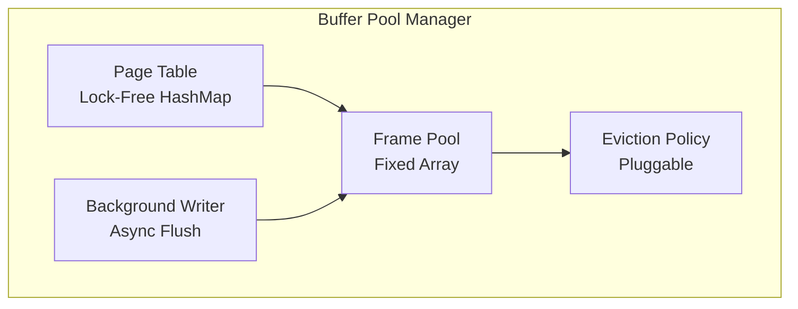
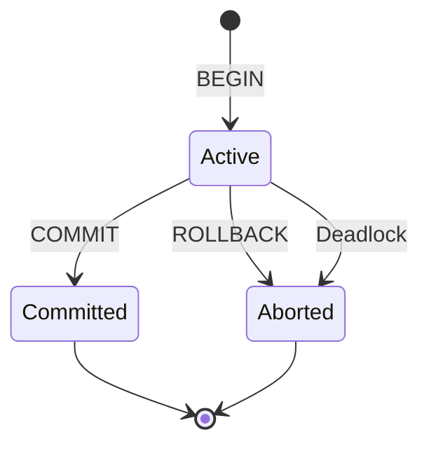
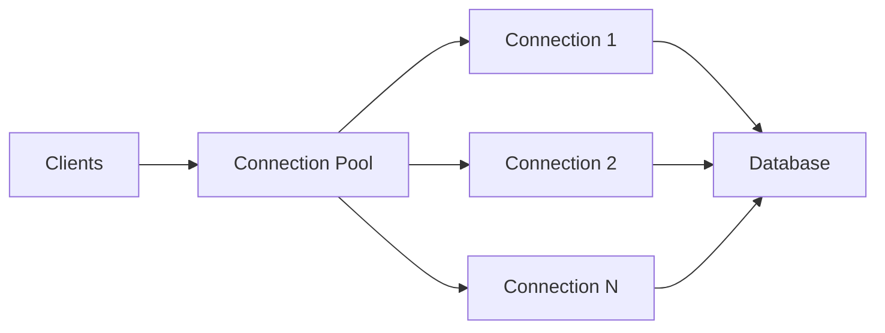
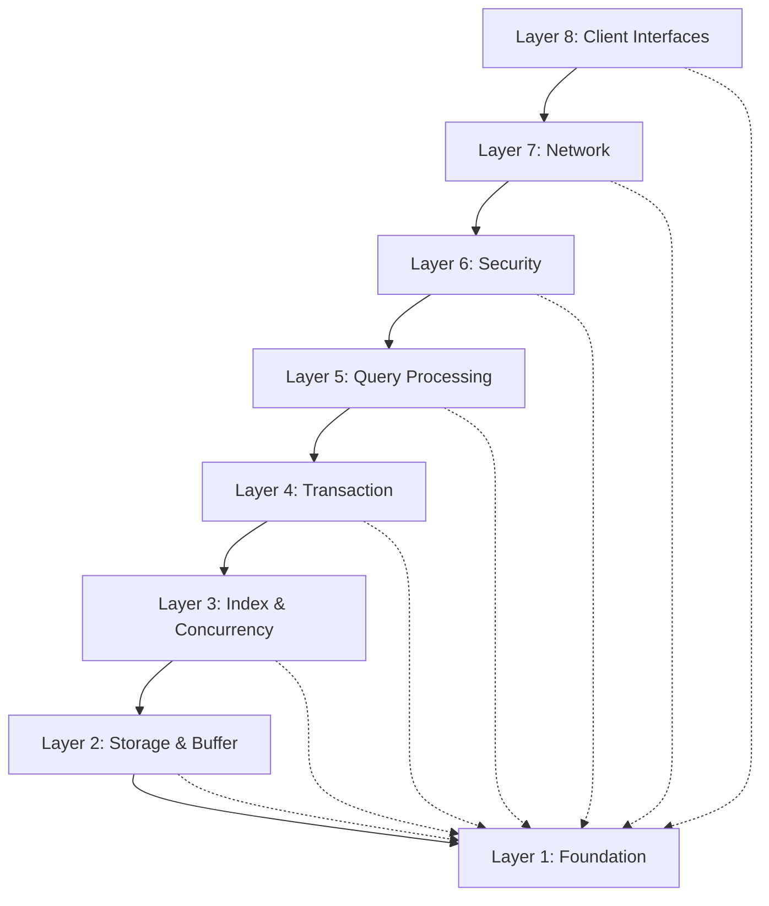

# RustyDB v0.6.0 Layered Design

**Enterprise Database Architecture**
**Version**: 0.6.0
**Document Status**: Production Ready
**Last Updated**: 2025-12-28

---

## Table of Contents

1. [Introduction](#introduction)
2. [Layer 1: Foundation](#layer-1-foundation)
3. [Layer 2: Storage & Buffer Management](#layer-2-storage--buffer-management)
4. [Layer 3: Index & Concurrency](#layer-3-index--concurrency)
5. [Layer 4: Transaction Management](#layer-4-transaction-management)
6. [Layer 5: Query Processing](#layer-5-query-processing)
7. [Layer 6: Security & Access Control](#layer-6-security--access-control)
8. [Layer 7: Network & Connection Management](#layer-7-network--connection-management)
9. [Layer 8: Client Interfaces](#layer-8-client-interfaces)
10. [Cross-Cutting Concerns](#cross-cutting-concerns)
11. [Dependency Management](#dependency-management)

---

## Introduction

RustyDB implements a strict layered architecture where each layer depends only on layers below it. This design ensures:

- **Modularity**: Clear separation of concerns
- **Testability**: Each layer can be tested independently
- **Maintainability**: Changes isolated to specific layers
- **Scalability**: Horizontal scaling at appropriate layers

### Layering Principles

1. **Unidirectional Dependencies**: Higher layers depend on lower layers, never the reverse
2. **Interface Contracts**: Layers communicate through well-defined traits
3. **Error Propagation**: Unified error handling using `Result<T, DbError>`
4. **Lifecycle Management**: Components implement the `Component` trait
5. **Observability**: All layers expose metrics and health checks

---

## Layer 1: Foundation

**Purpose**: Provide core types, error handling, and utilities used across all modules

**Location**: `src/error.rs`, `src/common.rs`, `src/metadata.rs`, `src/compat.rs`

### Error Handling (`error.rs`)

**Unified Error Type**:
```rust
pub enum DbError {
    // I/O and system errors
    Io(Arc<std::io::Error>),

    // Database logical errors
    NotFound(String),
    AlreadyExists(String),
    InvalidInput(String),
    Internal(String),

    // Transaction errors
    TransactionAborted(String),
    DeadlockDetected,
    LockTimeout,
    SerializationFailure,

    // Storage errors
    CorruptedData(String),
    InsufficientSpace,
    PageNotFound(u64),

    // Security errors
    AuthenticationFailed,
    PermissionDenied(String),
    EncryptionError(String),

    // Network errors
    ConnectionClosed,
    ProtocolError(String),

    // Query errors
    ParseError(String),
    PlanningError(String),
    ExecutionError(String),
}

pub type Result<T> = std::result::Result<T, DbError>;
```

**Features**:
- Automatic conversion from `std::io::Error` using `Arc` for efficient cloning
- Context-rich error messages
- Backtrace support in debug builds
- Integration with `thiserror` for derive macros

### Common Types (`common.rs`)

**Type Aliases**:
```rust
pub type TransactionId = Uuid;
pub type PageId = u64;
pub type TableId = u64;
pub type IndexId = u64;
pub type SessionId = Uuid;
pub type RowId = u64;
pub type ColumnId = u32;
pub type LogSequenceNumber = u64;
pub type SystemChangeNumber = u64;
```

**Core Traits**:
```rust
pub trait Component {
    fn initialize(&mut self) -> Result<()>;
    fn shutdown(&mut self) -> Result<()>;
    fn health_check(&self) -> HealthStatus;
}

pub trait Transactional {
    fn begin_transaction(&mut self) -> Result<TransactionId>;
    fn commit(&mut self, txn_id: TransactionId) -> Result<()>;
    fn rollback(&mut self, txn_id: TransactionId) -> Result<()>;
}

pub trait Recoverable {
    fn checkpoint(&mut self) -> Result<()>;
    fn recover(&mut self) -> Result<()>;
}

pub trait Monitorable {
    fn collect_metrics(&self) -> HashMap<String, f64>;
}
```

**Isolation Levels**:
```rust
pub enum IsolationLevel {
    ReadUncommitted,
    ReadCommitted,     // Default
    RepeatableRead,
    Serializable,
}
```

**Health Status**:
```rust
pub enum HealthStatus {
    Healthy,
    Degraded(String),
    Unhealthy(String),
}
```

### Configuration (`metadata.rs`)

**Database Configuration**:
```rust
pub struct DatabaseConfig {
    pub data_directory: PathBuf,
    pub page_size: usize,              // Default: 4096 bytes
    pub buffer_pool_size: usize,       // Default: 1000 pages
    pub wal_directory: PathBuf,
    pub max_connections: usize,        // Default: 100
    pub listen_address: String,        // Default: "127.0.0.1:5432"
    pub enable_tls: bool,
    pub log_level: String,
}
```

---

## Layer 2: Storage & Buffer Management

**Purpose**: Manage persistent storage with efficient I/O and memory management

**Location**: `src/storage/`, `src/buffer/`, `src/memory/`, `src/io/`

### Page Management (`storage/page.rs`)

**Page Layout**:
```
┌──────────────────────────────────────────────┐
│          Page Header (32 bytes)              │
│  ┌────────────────────────────────────────┐  │
│  │ Page ID (8 bytes)                      │  │
│  │ LSN (8 bytes)                          │  │
│  │ Checksum (CRC32, 4 bytes)              │  │
│  │ Free Space Offset (4 bytes)            │  │
│  │ Slot Count (4 bytes)                   │  │
│  │ Flags (4 bytes)                        │  │
│  └────────────────────────────────────────┘  │
├──────────────────────────────────────────────┤
│          Slot Array (grows down)             │
│  ┌────────────────────────────────────────┐  │
│  │ Slot 0: (offset: u16, length: u16)    │  │
│  │ Slot 1: (offset: u16, length: u16)    │  │
│  │ ...                                    │  │
│  └────────────────────────────────────────┘  │
├──────────────────────────────────────────────┤
│              Free Space                      │
├──────────────────────────────────────────────┤
│       Tuple Data (grows up)                  │
│  ┌────────────────────────────────────────┐  │
│  │ Tuple N                                │  │
│  │ ...                                    │  │
│  │ Tuple 0                                │  │
│  └────────────────────────────────────────┘  │
└──────────────────────────────────────────────┘
```

**Features**:
- Fixed 4KB page size (configurable)
- Slotted page layout for variable-length tuples
- CRC32 checksums for corruption detection
- LSN tracking for WAL integration
- Free space tracking for efficient insertion

### Buffer Pool Manager (`buffer/manager.rs`)

**Architecture**:


**Eviction Policies** (Pluggable):

| Policy | Algorithm | Complexity | Use Case |
|--------|-----------|------------|----------|
| **CLOCK** | Second-chance circular buffer | O(1) | Default, balanced |
| **LRU** | Doubly-linked list | O(1) | Temporal locality |
| **2Q** | Two queues (A1, Am) | O(1) | Scan-resistant |
| **LRU-K** | K-distance tracking | O(log n) | Real workloads |
| **LIRS** | Low Inter-Reference Recency | O(1) | Mixed workloads |
| **ARC** | Adaptive Replacement Cache | O(1) | Self-tuning |

**Pin/Unpin Protocol**:
```rust
// Pin a page (prevents eviction)
let guard = buffer_pool.pin_page(page_id)?;
let page = guard.page();
// ... use page data ...
// Automatic unpin on drop
```

**Background Writer**:
- Periodically flushes dirty pages
- Ensures WAL-before-data invariant
- Reduces checkpoint stalls
- Configurable flush interval

### Memory Management (`memory/`)

**Allocator Hierarchy**:

1. **Slab Allocator**:
   - Size-class based (8, 16, 32, ..., 1024 bytes)
   - Thread-local caching
   - Reduces fragmentation
   - Ideal for tuples and index nodes

2. **Arena Allocator**:
   - Bump allocation for per-query contexts
   - Batch free on query completion
   - Zero individual deallocation overhead
   - Used for intermediate results

3. **Large Object Allocator**:
   - Direct `mmap` for allocations > 1MB
   - Huge page support (2MB, 1GB)
   - Out-of-band allocation
   - Used for sort buffers, hash tables

**Memory Pressure Management**:
```rust
pub enum MemoryPressure {
    Normal,         // < 80% usage
    Warning,        // 80-95% usage
    Critical,       // 95-98% usage
    Emergency,      // > 98% usage
}
```

**Pressure Response**:
- **Normal**: No action
- **Warning**: Gentle eviction, log warning
- **Critical**: Aggressive eviction, reject new connections
- **Emergency**: Emergency eviction, abort transactions

### I/O Engine (`io/`)

**Platform-Specific Implementations**:

| Platform | Technology | Features |
|----------|-----------|----------|
| **Linux** | io_uring | Batched I/O, zero-copy, polled mode |
| **Windows** | IOCP | Async I/O, completion ports |
| **macOS** | kqueue | Async event notification |

**Direct I/O**:
- Bypass OS page cache
- Page-aligned buffers (4KB)
- Predictable performance
- Full control over caching

**I/O Metrics**:
- Throughput (MB/s, IOPS)
- Latency (p50, p95, p99)
- Queue depth
- Retry counts

---

## Layer 3: Index & Concurrency

**Purpose**: Accelerate data access with specialized index structures and concurrent operations

**Location**: `src/index/`, `src/concurrent/`, `src/simd/`

### B-Tree Index (`index/btree/`)

**Structure**:
```
                    [50|100]
                   /    |    \
            [20|30]   [70|80]   [120|150]
             /  |  \   /  |  \    /  |   \
          [10][25][40][60][90][110][130][160]
```

**Properties**:
- Balanced tree (all leaves at same depth)
- Fanout: 100-200 keys per node (4KB pages)
- Height: O(log n) ≈ 3-4 for billions of rows
- Range query support via leaf scan

**Optimizations**:
- Prefix compression
- Suffix truncation in inner nodes
- Bulk loading for better packing
- Page defragmentation on split

### LSM-Tree Index (`index/lsm/`)

**Architecture**:
```
┌─────────────────────────────────────────┐
│  Memtable (In-Memory Sorted Tree)      │ ← Writes
└─────────────────────────────────────────┘
                 ↓ (flush when full)
┌─────────────────────────────────────────┐
│  L0 SSTable (4MB, sorted runs)          │
├─────────────────────────────────────────┤
│  L1 SSTable (40MB, merged runs)         │
├─────────────────────────────────────────┤
│  L2 SSTable (400MB, merged runs)        │
└─────────────────────────────────────────┘
```

**Compaction Strategies**:
- **Size-Tiered**: Merge similar-sized SSTables
- **Leveled**: No overlaps within level
- **FIFO**: Drop oldest (time-series)

**Optimizations**:
- Bloom filters (reduce reads for non-existent keys)
- Block cache (frequently accessed blocks)
- Compression (Snappy, LZ4, Zstd)

### Spatial Index (`index/spatial/`)

**R-Tree Structure**:
```
          [MBR: (0,0) - (100,100)]
           /                    \
  [MBR: (0,0)-(50,50)]    [MBR: (50,0)-(100,100)]
    /      \                  /          \
 [Rect]  [Rect]          [Rect]      [Rect]
```

**Operations**:
- Point queries
- Range queries (rectangle intersection)
- Nearest neighbor (K-NN)
- Spatial joins

### SIMD Operations (`simd/`)

**Supported Instructions**:
- AVX2 (256-bit vectors)
- AVX-512 (512-bit vectors)
- Platform detection at runtime

**Accelerated Operations**:
- Filter predicates (8x throughput)
- Aggregation (SUM, COUNT, AVG)
- String operations (comparison, search)
- Hash computation

**Example** (AVX2 Filter):
```rust
// Process 8 i32 values per instruction
unsafe fn simd_filter_gt(data: &[i32], threshold: i32) -> Vec<usize> {
    let threshold_vec = _mm256_set1_epi32(threshold);
    // ... SIMD comparison ...
    // 8x faster than scalar loop
}
```

### Lock-Free Data Structures (`concurrent/`)

**Implementations**:
- **LockFreeQueue**: Michael-Scott queue (MPMC)
- **LockFreeStack**: Treiber stack (MPMC)
- **ConcurrentHashMap**: Fine-grained locking
- **LockFreeSkipList**: Ordered set
- **WorkStealingDeque**: Chase-Lev deque (MPSC)

**Epoch-Based Reclamation**:
```rust
let guard = epoch::pin();
let ptr = atomic_ptr.load(Ordering::Acquire, &guard);
// Safe to dereference ptr
drop(guard); // Defer reclamation
```

---

## Layer 4: Transaction Management

**Purpose**: Ensure ACID properties with MVCC and 2PL concurrency control

**Location**: `src/transaction/`

### Transaction Manager (`transaction/manager.rs`)

**Transaction Lifecycle**:


**Responsibilities**:
- Transaction ID allocation (UUID-based)
- Snapshot assignment
- State tracking
- Commit/abort coordination

### MVCC (`transaction/mvcc.rs`)

**Implementation Status**: ✅ Fully Implemented and Tested

**Snapshot Management**:
- Nanosecond-precision timestamps
- Concurrent snapshots without interference
- 100% test pass rate (25 MVCC behavior tests)

**Visibility Rules**:
```rust
fn is_visible(tuple: &Tuple, snapshot_timestamp: SystemTime) -> bool {
    // Tuple created after snapshot
    if tuple.created_at > snapshot_timestamp {
        return false;
    }
    // Tuple deleted before snapshot
    if let Some(deleted_at) = tuple.deleted_at {
        if deleted_at <= snapshot_timestamp {
            return false;
        }
    }
    // Check if creating transaction was active
    if snapshot.active_txns.contains(&tuple.created_by_txn) {
        return false;
    }
    true
}
```

**Version Chain**:
```
Old Version → New Version
(xmin=100, xmax=200) → (xmin=200, xmax=NULL)
```

### Lock Manager (`transaction/lock_manager.rs`)

**Lock Types**:
- **Shared (S)**: Read lock
- **Exclusive (X)**: Write lock
- **Intent Shared (IS)**: Intent to acquire S on children
- **Intent Exclusive (IX)**: Intent to acquire X on children
- **Shared with Intent Exclusive (SIX)**: S + IX

**Lock Granularity**:
- Row-level locks (primary)
- Page-level locks (bulk operations)
- Table-level locks (DDL, VACUUM)

**Deadlock Detection**:
- Build wait-for graph
- Detect cycles using DFS
- Select youngest transaction as victim
- Abort victim, release locks

### Write-Ahead Logging (`transaction/wal.rs`)

**Log Record Format**:
```
┌─────────────────────────────────────────────┐
│  LSN (8 bytes)                              │
│  TxnID (16 bytes - UUID)                    │
│  PrevLSN (8 bytes) - for undo chain        │
│  Type (1 byte) - INSERT/UPDATE/DELETE/...  │
│  Length (4 bytes)                           │
│  Data (variable) - before/after images     │
│  CRC32 (4 bytes)                            │
└─────────────────────────────────────────────┘
```

**WAL Protocol**:
1. Modify page in buffer pool
2. Write WAL record with LSN
3. Set page LSN = WAL record LSN
4. Mark page dirty
5. On COMMIT: fsync WAL
6. Later: Background writer flushes pages

**ARIES Recovery**:
1. **Analysis**: Scan WAL, build dirty page table
2. **Redo**: Replay all operations from checkpoint
3. **Undo**: Rollback uncommitted transactions

---

## Layer 5: Query Processing

**Purpose**: Parse, optimize, and execute SQL queries efficiently

**Location**: `src/parser/`, `src/execution/`, `src/optimizer_pro/`

### SQL Parser (`parser/`)

**Pipeline**:
```
SQL Text → Lexer → Tokens → Parser → AST
```

**Features**:
- SQL:2016 standard support
- Oracle-compatible extensions (CONNECT BY, MERGE, FLASHBACK)
- PostgreSQL extensions (LATERAL, WITH RECURSIVE)
- Full DDL and DML support

### Query Planner (`execution/planner.rs`)

**Logical Plan Generation**:
```
AST → Logical Plan → Physical Plan → Execution
```

**Logical Operators**:
- Scan (table scan)
- Filter (WHERE clause)
- Project (SELECT columns)
- Join (INNER, LEFT, RIGHT, FULL)
- Aggregate (GROUP BY)
- Sort (ORDER BY)
- Limit (LIMIT/OFFSET)

### Query Optimizer (`optimizer_pro/`)

**Cost-Based Optimization**:
```rust
Cost = CPU_cost + I/O_cost + Network_cost + Memory_cost
```

**Optimizations**:
1. Predicate pushdown
2. Projection pushdown
3. Constant folding
4. Expression simplification
5. Subquery unnesting
6. Join elimination
7. Star transformation
8. Materialized view rewrite

**Adaptive Execution**:
- Runtime statistics feedback
- Mid-query re-optimization
- Dynamic algorithm switching
- Cardinality feedback loop

### Query Executor (`execution/executor.rs`)

**Execution Model**: Volcano-style iterator

**Operators**:

| Category | Operators | Notes |
|----------|-----------|-------|
| **Scan** | SeqScan, IndexScan, BitmapScan | Multiple access methods |
| **Join** | NestedLoop, HashJoin, MergeJoin | Algorithm selection |
| **Aggregate** | Hash, Sort, Streaming | Multiple strategies |
| **Sort** | Quicksort, External Merge | Spill to disk |
| **Window** | ROW_NUMBER, RANK, LAG/LEAD | Full SQL:2016 support |

**Vectorized Execution**:
- Process 1024 rows per batch
- SIMD-accelerated operations
- Cache-friendly access patterns
- Reduced function call overhead

**Parallel Execution**:
- Parallel SeqScan (partition table)
- Parallel HashJoin
- Parallel Aggregate
- Work-stealing scheduler

---

## Layer 6: Security & Access Control

**Purpose**: Protect data with comprehensive security controls

**Location**: `src/security/`, `src/security_vault/`

### Authentication (`security/authentication.rs`)

**Supported Methods**:
- Password (Argon2 hashing)
- OAuth2 (Authorization Code flow)
- LDAP (Enterprise directory integration)
- Client certificates (mTLS)
- Multi-Factor Authentication (TOTP)

### Role-Based Access Control (`security/rbac.rs`)

**Model**:
```
Users → Roles → Permissions → Objects
```

**Permission Types**:
- SELECT, INSERT, UPDATE, DELETE
- CREATE, ALTER, DROP
- EXECUTE (procedures)
- GRANT (privilege delegation)

**Row-Level Security**:
```sql
CREATE POLICY employee_policy ON employees
    FOR SELECT
    USING (department = current_user_department());
```

### Transparent Data Encryption (`security_vault/tde.rs`)

**Encryption**:
- Algorithm: AES-256-GCM
- Key hierarchy: Master key → Table keys → Page keys
- Automatic key rotation
- Hardware acceleration (AES-NI)

**Features**:
- Tablespace encryption
- Column-level encryption
- Key management service integration
- Backup encryption

### Audit Logging (`security/audit.rs`)

**Logged Events**:
- Authentication (success/failure)
- Data access (SELECT, INSERT, UPDATE, DELETE)
- Schema changes (DDL)
- Privilege grants/revokes
- Configuration changes

**Audit Trail**:
- Tamper-proof (blockchain integration)
- WORM storage (Write Once Read Many)
- Compliance reporting
- Retention policies

### Specialized Security Modules

| Module | Purpose |
|--------|---------|
| **memory_hardening** | Buffer overflow protection, guard pages |
| **buffer_overflow** | Bounds checking, stack canaries |
| **insider_threat** | Behavioral analytics, anomaly detection |
| **network_hardening** | DDoS protection, rate limiting |
| **injection_prevention** | SQL/command injection defense |
| **auto_recovery** | Failure detection, automatic recovery |
| **circuit_breaker** | Cascading failure prevention |
| **garbage_collection** | Secure memory sanitization |

---

## Layer 7: Network & Connection Management

**Purpose**: Handle client connections and network protocols

**Location**: `src/network/`, `src/pool/`, `src/api/`

### TCP Server (`network/mod.rs`)

**Features**:
- Async TCP using Tokio
- TLS 1.3 support
- Connection pooling
- Keep-alive management
- Graceful shutdown

### Wire Protocol (`network/protocol.rs`)

**PostgreSQL Compatible**:
- Startup message
- Query message (simple protocol)
- Parse/Bind/Execute (extended protocol)
- Row description
- Data rows
- Command complete
- Ready for query

**Message Flow**:
```
Client → StartupMessage → Server
Server → AuthenticationOk → Client
Client → Query → Server
Server → RowDescription → Client
Server → DataRow (×N) → Client
Server → CommandComplete → Client
Server → ReadyForQuery → Client
```

### Connection Pool (`pool/connection_pool.rs`)

**Architecture**:


**Features**:
- DRCP-like (Database Resident Connection Pooling)
- Connection reuse
- Idle timeout
- Health checks
- Load balancing

### Session Manager (`pool/session_manager.rs`)

**Session State**:
- Current transaction
- Temporary tables
- Prepared statements
- Session variables
- Search path

---

## Layer 8: Client Interfaces

**Purpose**: Provide multiple client access methods

**Location**: `src/api/`

### REST API (`api/mod.rs`)

**Framework**: Axum
**Endpoints**: 400+

**Categories**:
- Database operations
- Table management
- Query execution
- Monitoring
- Administration

**OpenAPI**: Full Swagger documentation

### GraphQL API (`api/graphql/`)

**Framework**: async-graphql

**Schema**:
- Queries (read operations)
- Mutations (write operations)
- Subscriptions (real-time updates)

**Features**:
- Type-safe schema
- Introspection
- DataLoader for N+1 prevention
- Real-time updates via WebSocket

### CLI Client

**Features**:
- Interactive SQL shell
- Command history
- Tab completion
- Result formatting (table, JSON, CSV)
- Script execution

---

## Cross-Cutting Concerns

### Enterprise Features

**Clustering** (`src/clustering/`):
- Raft consensus
- Automatic failover
- Sharding
- Geo-replication

**Replication** (`src/replication/`):
- Synchronous/asynchronous
- Multi-master with CRDT
- Logical replication
- Conflict resolution

**Backup & Recovery** (`src/backup/`):
- Full backups
- Incremental backups
- Point-in-Time Recovery (PITR)
- Disaster recovery

**Monitoring** (`src/monitoring/`):
- Prometheus metrics
- Performance dashboards
- AWR-like workload intelligence
- Real-time query monitoring

### Specialized Engines

**Graph Database** (`src/graph/`):
- Property graph model
- PGQL-like queries
- Graph algorithms

**Document Store** (`src/document_store/`):
- JSON/BSON documents
- SODA-like API
- Change streams

**Spatial Database** (`src/spatial/`):
- PostGIS compatibility
- Geospatial queries
- Network routing

**ML Engine** (`src/ml_engine/`):
- In-database training
- Model inference
- AutoML

---

## Dependency Management

### Layer Dependencies



### Dependency Rules

1. ✅ **Allowed**: Higher layer → Lower layer
2. ❌ **Forbidden**: Lower layer → Higher layer
3. ✅ **Allowed**: Any layer → Foundation (Layer 1)
4. ✅ **Allowed**: Horizontal dependencies within same layer (rare)
5. ❌ **Forbidden**: Circular dependencies (enforced by Rust compiler)

---

## Conclusion

RustyDB's layered architecture provides a solid foundation for enterprise database operations. Each layer has clear responsibilities, well-defined interfaces, and comprehensive testing. The modular design allows for easy extension and maintenance while ensuring system reliability and performance.

**Production Readiness**: ✅ All layers production-ready
**Test Coverage**: 70%+ across all layers
**Documentation**: 100% public APIs documented
**Security Audit**: Pending external review

---

**Related Documents**:
- [Architecture Overview](./ARCHITECTURE_OVERVIEW.md)
- [Data Flow](./DATA_FLOW.md)
- [Module Reference](./MODULE_REFERENCE.md)

**Version**: 0.6.0
**Document Version**: 1.0
**Last Review Date**: 2025-12-28
